# Descrição
[<u>**libft.h**</u>](#libft-h) - O libft.h é o cabeçalho público da biblioteca. Ele tem o header guard, os includes que minhas funções usam (stddef.h, stdlib.h, unistd.h), a definição da struct t_list da Parte 3, e os protótipos de todas as funções da libft, divididos em três blocos: libc, adicionais e lista ligada.

[<u>**Makefile**</u>](#makefile) - Makefile define NAME = libft.a, lista todos os .c, gera os .o com cc -Wall -Wextra -Werror -c, e empacota com ar rcs na regra $(NAME). As regras all, clean, fclean e re estão presentes e marcadas como .PHONY. O %.o: %.c libft.h garante que se eu alterar o header, tudo recompila, e que arquivos não modificados não são recompilados, evitando relink desnecessário

[<u>**ft_isalpha**</u>](#ft-isalpha-c) - A função [ft_isalpha](#ft-isalpha-c) verifica se o caractere recebido está no intervalo das letras maiúsculas ('A' a 'Z') ou minúsculas ('a' a 'z'). Como o enunciado da 42 exige retorno exatamente 1 ou 0, eu uso um if com os dois intervalos ligados por || e retorno 1 se entrar, 0 caso contrário.

[<u>**ft_isdigit**</u>](#ft-isdigit-c) - A função [ft_isdigit](#ft-isdigit-c) verifica se o caractere recebido é um dígito decimal. Em ASCII, os dígitos '0' a '9' ocupam posições consecutivas (48 a 57), então basta um if checando se c está nesse intervalo. Retorno 1 se for dígito, 0 caso contrário, conforme o enunciado da 42 exige.

[<u>**ft_isalnum**</u>](#ft-isalnum-c) - A função [ft_isalnum](#ft-isalnum-c) verifica se o caractere é alfanumérico, ou seja, letra ou dígito. Eu reaproveito as funções [ft_isalpha](#ft-isalpha-c) e [ft_isdigit](#ft-isdigit-c) que já escrevi, ligando-as com ||. Se alguma das duas retorna 1, é alfanumérico, então retorno 1; caso contrário, retorno 0.

[<u>**ft_isascii**</u>](#ft-isascii-c) - A função [ft_isascii](#ft-isascii-c) verifica se o valor recebido cabe na tabela ASCII padrão, que vai de 0 a 127. Um if simples checa esse intervalo e retorno 1 se estiver dentro, 0 caso contrário. É a função mais direta do bloco — nenhum caractere específico, só o intervalo numérico da tabela inteira.

[<u>**ft_isprint**</u>](#ft-isprint-c) - A função [ft_isprint](#ft-isprint-c) verifica se o caractere recebido é imprimível, ou seja, se aparece visualmente na tela. Em ASCII, os imprimíveis vão do espaço ' ' (32) até o til '~' (126), um bloco contínuo. Um if checa esse intervalo: retorno 1 se está dentro, 0 caso contrário. Importante: o espaço entra como imprimível, e o DEL (127) e os caracteres de controle (0 a 31) ficam de fora.

[<u>**ft_strlen**</u>](#ft-strlen-c) - A função [ft_strlen](#ft-strlen-c) retorna o tamanho de uma string, sem contar o \0 final. Eu uso um contador i que começa em 0 e um while (s[i]) que avança enquanto o caractere não é nulo — como \0 vale 0 e zero é falso em C, o loop para sozinho no terminador. No final, i tem exatamente o número de caracteres lidos, e é o que eu retorno.

[<u>**ft_memset**</u>](#ft-memset-c) - A função [ft_memset](#ft-memset-c) preenche len bytes a partir do endereço b com o valor c. Como o ponteiro chega como void *, eu converto para unsigned char * para conseguir acessar a memória byte a byte. Faço um loop de 0 até len - 1, escrevendo (unsigned char)c em cada posição, e no final devolvo o ponteiro original b, seguindo a convenção da família mem* da libc.

[<u>**ft_bzero**</u>](#ft-bzero-c) - A função [ft_bzero](#ft-bzero-c) zera n bytes a partir do ponteiro s. Como o comportamento é equivalente a memset(s, 0, n), eu reaproveito o [ft_memset](#ft-memset-c) que já escrevi, passando 0 como o byte de preenchimento. Não retorno nada porque o protótipo é void, igual ao da libc

[<u>**ft_memcpy**</u>](#ft-memcpy-c) - A função [ft_memcpy](#ft-memcpy-c) copia n bytes de src para dst, byte a byte. Como os ponteiros chegam como void *, eu converto ambos para unsigned char * (com const no de origem, para preservar constância). Faço uma proteção contra o caso dst e src serem ambos NULL, retornando NULL nesse caso. Senão, percorro de 0 até n - 1 copiando s[i] em d[i] e devolvo dst no final. Importante: memcpy não trata sobreposição — para isso existe o memmove.

[<u>**ft_memmove**</u>](#ft-memmove-c) - A função [ft_memmove](#ft-memmove-c) copia len bytes de src para dst lidando com sobreposição. A ideia é simples: comparo os endereços. Se o destino vem antes da fonte (d < s), copio do começo para o final, normal. Se vem depois (d >= s), copio de trás para frente, para não sobrescrever bytes da fonte antes de lê-los. Uso unsigned char * para trabalhar byte a byte, faço a proteção contra dst e src ambos NULL, e devolvo dst no final. Para o loop decrescente, uso i = len e decremento i antes de usar, evitando o problema de size_t nunca ser negativo.

[<u>**ft_strlcpy**</u>](#ft-strlcpy-c) - A função [ft_strlcpy](#ft-strlcpy-c) copia src para dst respeitando o tamanho do buffer e sempre fechando com \0. Trato primeiro o caso dstsize == 0, retornando direto o tamanho da fonte sem escrever nada — isso evita o underflow de dstsize - 1 em size_t. Senão, um while copia enquanto há caractere na fonte e ainda há espaço (i < dstsize - 1, deixando 1 byte para o terminador). No final, escrevo o \0 na posição onde o loop parou e retorno [ft_strlen](#ft-strlen-c)(src) — esse retorno permite ao chamador detectar truncamento.

[<u>**ft_strlcat**</u>](#ft-strlcat-c) - A função [ft_strlcat](#ft-strlcat-c) concatena src no final de dst, respeitando o tamanho do buffer e sempre fechando com \0. Primeiro calculo dst_len e src_len reusando [ft_strlen](#ft-strlen-c). Trato o caso patológico em que dstsize <= dst_len: aqui dst não tem \0 dentro do buffer informado, então retorno direto dstsize + src_len sem mexer em nada. Senão, percorro src escrevendo em dst[dst_len + i] enquanto há caractere e enquanto dst_len + i < dstsize - 1, para deixar espaço pro terminador. Fecho com \0 e retorno dst_len + src_len — o tamanho que a string teria se coubesse, padrão BSD que permite detectar truncamento.

[<u>**ft_toupper**</u>](#ft-toupper-c) - A função [ft_toupper](#ft-toupper-c) converte uma letra minúscula para maiúscula, e devolve qualquer outro caractere inalterado. Em ASCII, as minúsculas vão de 97 a 122 e as maiúsculas de 65 a 90 — sempre 32 a menos. Então um if testa se c está no intervalo das minúsculas; se está, retorno c - 32, senão retorno c direto. O parâmetro é int para manter compatibilidade com EOF, igual à libc.

[<u>**ft_tolower**</u>](#ft-tolower-c) - A função [ft_tolower](#ft-tolower-c) converte uma letra maiúscula em minúscula, e devolve qualquer outro caractere inalterado. Como a distância ASCII entre maiúsculas (65–90) e minúsculas (97–122) é sempre 32, um if testa o intervalo das maiúsculas e, se entrar, retorno c + 32. Senão, retorno c direto. É o espelho do [ft_toupper](#ft-toupper-c): muda só o intervalo testado e o sinal da operação

[<u>**ft_strchr**</u>](#ft-strchr-c) - A função [ft_strchr](#ft-strchr-c) busca a primeira ocorrência do caractere c na string s. Eu percorro com um while (s[i]) e, a cada passo, comparo s[i] com (char)c. O cast para char é importante porque c chega como int por compatibilidade com EOF. Se acho, retorno (char *)&s[i], com cast para tirar a constância imposta pelo const char *s. Saí do loop e não achei? Trato o caso especial: se c for \0, retorno o endereço do terminador (porque o \0 é considerado parte da string para strchr). Senão, retorno NULL.

[<u>**ft_strrchr**</u>](#ft-strrchr-c) - A função [ft_strrchr](#ft-strrchr-c) busca a última ocorrência de c em s. Em vez de percorrer do final para frente, eu percorro do começo pro final e mantenho um ponteiro last que vai sendo atualizado sempre que acho c. Quando o loop termina, o last aponta naturalmente para a última ocorrência. Para cobrir o caso especial em que c == '\0', eu uso while (1) e testo a comparação com c antes de checar se cheguei no \0 — assim o \0 final também é considerado como um caractere válido na busca. Se nada casar, last continua NULL e é o que retorno.

[<u>**ft_strncmp**</u>](#ft-strncmp-c) - A função [ft_strncmp](#ft-strncmp-c) compara duas strings byte a byte até no máximo n caracteres. O while continua enquanto i < n e enquanto pelo menos uma das strings ainda tem caractere (s1[i] || s2[i]). Se acho diferença, retorno (unsigned char)s1[i] - (unsigned char)s2[i] — o cast para unsigned char é importante porque o man exige comparação como bytes não sinalizados, evitando que valores acima de 127 sejam interpretados como negativos e quebrem o sinal do retorno. Se chego ao final sem diferença, retorno 0.

[<u>**ft_memchr**</u>](#ft-memchr-c) - A função [ft_memchr](#ft-memchr-c) procura o primeiro byte igual a c dentro dos primeiros n bytes do bloco apontado por s. Converto s para const unsigned char * para acessar byte a byte preservando a constância, e comparo cada byte com (unsigned char)c. Diferente do strchr, o memchr não para no \0 — ele trabalha com memória bruta, percorrendo exatamente n bytes. Se acho, retorno o endereço como void * (com cast); se chego ao final sem achar, retorno NULL.

[<u>**ft_memcmp**</u>](#ft-memcmp-c) - A função [ft_memcmp](#ft-memcmp-c) compara dois blocos de memória byte a byte, exatamente n bytes. Converto os dois ponteiros para const unsigned char * — preservando a constância e garantindo que a comparação seja como bytes não sinalizados, conforme o man. Diferente do strncmp, não paro no \0: o memcmp é puro byte-a-byte. Quando acho a primeira diferença, retorno p1[i] - p2[i] (a subtração entre unsigned char dá o sinal correto). Se percorro n bytes sem diferença, retorno 0.

[<u>**ft_strnstr**</u>](#ft-strnstr-c) - A função [ft_strnstr](#ft-strnstr-c) procura a primeira ocorrência de needle dentro dos primeiros len bytes de haystack. Trato primeiro o caso clássico de needle vazia, retornando o próprio haystack. Senão, calculo needle_len com [ft_strlen](#ft-strlen-c) e percorro haystack com um índice i, parando quando chego no \0 ou quando i + needle_len > len (a needle não caberia mais inteira). Em cada posição, comparo needle_len bytes com [ft_strncmp](#ft-strncmp-c); se forem iguais, retorno &haystack[i] com cast. Se nada bate, retorno NULL.

[<u>**ft_atoi**</u>](#ft-atoi-c) - A função [ft_atoi](#ft-atoi-c) converte uma string em int seguindo três fases: primeiro pula whitespace (os 6 caracteres clássicos do man atoi: espaço, \t, \n, \v, \f, \r); depois lê opcionalmente um sinal + ou - — apenas uma vez, sem aceitar múltiplos sinais; e finalmente acumula dígitos com a fórmula result = result * 10 + (str[i] - '0'), parando no primeiro caractere não-dígito. No final, retorno result * sign. Uso 3 variáveis além do parâmetro: índice i, sign e result. Sigo o padrão da libft de não tratar overflow, que é comportamento indefinido segundo o man. Mas para tratar seria possível colocando um if para verificar se o resultado (* 10 + dígito) ultrapassa o MAX_INT possível.

[<u>**ft_calloc**</u>](#ft-calloc-c) - A função [ft_calloc](#ft-calloc-c) aloca um bloco de count * size bytes e o zera com [ft_bzero](#ft-bzero-c). Antes de chamar malloc, faço proteção contra overflow: se count > (size_t)-1 / size, retorno NULL direto. Uso (size_t)-1 porque em C atribuir -1 a um tipo unsigned dá o valor máximo do tipo, garantido pelo padrão — é equivalente a SIZE_MAX, mas sem precisar incluir <stdint.h>. Testo size != 0 antes para evitar divisão por zero. Quando count ou size é 0, deixo o malloc(0) do sistema lidar — ele retorna um ponteiro único válido para free, conforme o enunciado da 42 pede.
Eu uso (size_t)-1 em vez de SIZE_MAX por dois motivos: primeiro, é o mesmo valor — em C, atribuir -1 a um tipo unsigned dá o valor máximo do tipo, garantido pelo padrão. Segundo, evito um include a mais. A lógica é: se count * size daria overflow, isto é, se count > (size_t)-1 / size, retorno NULL antes de chamar malloc. Testo size != 0 primeiro para evitar divisão por zero

[<u>**ft_strdup**</u>](#ft-strdup-c) - A função [ft_strdup](#ft-strdup-c) cria uma cópia da string s1 em memória nova. Primeiro calculo o tamanho com [ft_strlen](#ft-strlen-c) e alloco len + 1 bytes — o +1 é para o terminador \0. Se o malloc falha, retorno NULL. Senão, copio os len bytes com um while, escrevo o \0 na posição len e retorno o ponteiro novo. O usuário é responsável por liberar com free.

[<u>**ft_substr**</u>](#ft-substr-c) - A função [ft_substr](#ft-substr-c) extrai uma substring de s, começando em start, com no máximo len caracteres. Trato dois casos: primeiro, se start >= strlen(s), retorno uma string vazia alocada via [ft_strdup](#ft-strdup-c)("") — substring válida porém vazia. Segundo, se len é maior do que o que sobra após start, ajusto len = strlen(s) - start para não passar do final. Depois aloco len + 1 bytes, copio com um while, coloco o \0 e retorno. Esse +1 é sempre para o terminador.

[<u>**ft_strjoin**</u>](#ft-strjoin-c) - A função [ft_strjoin](#ft-strjoin-c) cria uma nova string concatenando s1 e s2. Aloco com malloc o tamanho total mais 1 byte para o \0. Depois faço dois loops simples: o primeiro copia s1 para o começo do buffer, deixando i igual ao tamanho de s1; o segundo copia s2 começando na posição i + j. No final, escrevo \0 em i + j, que é a posição exata do terminador. Se o malloc falhar, retorno NULL.

[<u>**ft_strtrim**</u>](#ft-strtrim-c) - A função [ft_strtrim](#ft-strtrim-c) cria uma nova string baseada em s1 removendo das pontas todos os caracteres que aparecem em set. Uso um helper static chamado is_in_set que diz se um caractere está no set. Depois movo dois índices: start avança enquanto o caractere estiver no set; end começa no \0 e recua testando s1[end - 1]. A condição end > start no segundo loop é essencial para não passar do começo quando a string inteira é do set. No final, alloco end - start + 1 bytes, copio com [ft_strlcpy](#ft-strlcpy-c) (que já fecha com \0) e retorno.

[<u>**ft_split**</u>](#ft-split-c) - A função [ft_split](#ft-split-c) divide uma string em pedaços usando um caractere delimitador, retornando um array de strings terminado em NULL. Eu uso 4 helpers static: count_words conta quantos pedaços tem (com dois whiles aninhados: um pula separadores, outro pula não-separadores); word_len mede o tamanho do próximo pedaço; copy_word aloca e copia uma palavra individualmente; e free_all libera tudo se algum malloc interno falhar. Na função principal, alloco (n+1) * sizeof(char *) para o array (o +1 é para o NULL sentinela), percorro a string pulando separadores e copiando palavras uma a uma. Se qualquer alocação falhar, libero o que já tinha alocado e retorno NULL — sem leaks.

[<u>**ft_itoa**</u>](#ft-itoa-c) - A função [ft_itoa](#ft-itoa-c) converte um int em string decimal. Primeiro chamo count_digits que conta quantos caracteres a string vai ter, incluindo o '-' se n for negativo — para isso uso o truque if (n <= 0) count = 1 que cobre o sinal e também o caso n == 0. Depois alloco len + 1 bytes. O passo crítico é copiar n para uma variável long: isso permite fazer -nb mesmo quando n == INT_MIN, em que o valor absoluto não caberia em int. Trato o sinal, trato o caso n == 0, e preencho de trás para frente usando nb % 10 + '0' para cada dígito. O \0 vai na última posição antes do loop começar.

[<u>**ft_strmapi**</u>](#ft-strmapi-c) - "A função [ft_strmapi](#ft-strmapi-c) cria uma nova string aplicando uma função f a cada caractere de s, passando também o índice. Alloco [ft_strlen](#ft-strlen-c)(s) + 1 bytes e itero com unsigned int i — mesmo tipo que f espera no contrato, sem nenhuma conversão. Uso while (s[i]) para parar no \0, o que dispensa uma variável separada para o tamanho. No final, escrevo \0 e retorno o ponteiro.

[<u>**ft_striteri**</u>](#ft-striteri-c) - A função [ft_striteri](#ft-striteri-c) aplica f a cada caractere de s in-place, passando o índice e o endereço do caractere. Como f recebe char *, ela pode modificar diretamente a string original — não preciso alocar nada nem retornar nova string. Uso unsigned int i para o índice, alinhado com o tipo que f espera no contrato — evito downcast silencioso. O loop usa while (s[i]), parando no \0

[<u>**ft_putchar_fd**</u>](#ft-putchar-fd-c) - A função [ft_putchar_fd](#ft-putchar-fd-c) escreve um caractere no file descriptor indicado, usando a syscall write. Como write espera um ponteiro para o buffer, passo &c — o endereço do caractere local. O tamanho é 1 byte. A função é void: ignoro o retorno do write, que normalmente indica quantos bytes foram escritos.

[<u>**ft_putstr_fd**</u>](#ft-putstr-fd-c) - A função [ft_putstr_fd](#ft-putstr-fd-c) escreve uma string inteira no file descriptor usando write. Em vez de fazer um loop chamando [ft_putchar_fd](#ft-putchar-fd-c) para cada caractere, faço uma única chamada a write passando o tamanho calculado por [ft_strlen](#ft-strlen-c) — uma syscall em vez de várias, mais eficiente. O s já é char *, então não precisa de cast. O retorno de write é ignorado conforme o protótipo void do enunciado.

[<u>**ft_putendl_fd**</u>](#ft-putendl-fd-c) - A função [ft_putendl_fd](#ft-putendl-fd-c) escreve uma string no file descriptor seguida por uma quebra de linha. Reaproveito as duas funções já prontas: [ft_putstr_fd](#ft-putstr-fd-c)(s, fd) para a string completa, depois [ft_putchar_fd](#ft-putchar-fd-c)('\n', fd) para o \n. É o exemplo clássico de composição na libft — funções pequenas que se encaixam em outras maiores.

[<u>**ft_putnbr_fd**</u>](#ft-putnbr-fd-c) - A função [ft_putnbr_fd](#ft-putnbr-fd-c) escreve um inteiro no file descriptor de forma recursiva. Primeiro copio n para uma variável long, o que me permite tratar INT_MIN sem overflow ao calcular -n. Se é negativo, imprimo - e inverto o sinal. Depois, se nb >= 10, faço recursão com nb / 10 — isso imprime os dígitos mais à esquerda primeiro. No final de cada nível, imprimo o dígito atual com (nb % 10) + '0'. O cast (int) na recursão é explícito porque nb / 10 é long, mas depois da divisão o valor cabe em int com folga.

[<u>**ft_lstnew**</u>](#ft-lstnew-c) - A função [ft_lstnew](#ft-lstnew-c) cria um nó novo da lista ligada. Alloco sizeof(t_list) bytes — o tamanho exato da struct — e checo se o malloc falhou. Depois preencho os dois campos: content recebe o ponteiro genérico passado, e next recebe NULL para indicar que o nó está solto. Esse next = NULL é essencial: sem ele, ficaria lixo, e qualquer operação posterior na lista seguiria por um endereço inválido.

[<u>**ft_lstadd_front**</u>](#ft-lstadd-front-c) - A função [ft_lstadd_front](#ft-lstadd-front-c) adiciona um nó no começo da lista. Recebo um ponteiro duplo t_list **lst para poder modificar o ponteiro de cabeça do chamador. Faço duas atribuições na ordem certa: primeiro new->next = *lst (o novo nó aponta para a antiga cabeça), depois *lst = new (a cabeça da lista vira o novo nó). A ordem importa: se invertesse, eu faria new->next = new, criando uma auto-referência. Protejo contra lst ou new serem NULL.

[<u>**ft_lstsize**</u>](#ft-lstsize-c) - A função [ft_lstsize](#ft-lstsize-c) percorre a lista contando nós. Uso um ponteiro current inicializado com lst e um contador count = 0. O while (current) avança enquanto não chegou ao final — cada iteração incrementa count e faz current = current->next. Quando current vira NULL, saio e retorno count. Se a lista é vazia (lst == NULL), o loop não entra e retorno 0 naturalmente, sem precisar de if extra.

[<u>**ft_lstlast**</u>](#ft-lstlast-c) - A função [ft_lstlast](#ft-lstlast-c) retorna o último nó da lista. Inicializo current = lst e avanço com um while (current && current->next). A condição é importante: primeiro testo current para não desreferenciar NULL em lista vazia (graças ao curto-circuito do &&); depois testo current->next para ver se ainda há próximo. Quando o loop sai, current aponta para o último nó (ou continua sendo NULL se a lista estava vazia). Retorno current direto — cobre os dois casos

[<u>**ft_lstadd_back**</u>](#ft-lstadd-back-c) - A função [ft_lstadd_back](#ft-lstadd-back-c) adiciona um nó no final da lista. Trato dois casos: se a lista está vazia (*lst == NULL), o new vira a cabeça com *lst = new — preciso do ponteiro duplo justamente para modificar o ponteiro de cabeça do chamador. Se a lista tem nós, reaproveito [ft_lstlast](#ft-lstlast-c) para achar o último e faço ultimo->next = new. Sem o caso especial da lista vazia, [ft_lstlast](#ft-lstlast-c) retornaria NULL e tentar acessar NULL->next segfaltaria.

[<u>**ft_lstdelone**</u>](#ft-lstdelone-c) - A função [ft_lstdelone](#ft-lstdelone-c) libera um único nó. Chamo del(lst->content) para liberar o conteúdo (a função foi passada pelo usuário porque a libft não sabe o tipo do content), e depois free(lst) para liberar a struct do nó. Não toco em lst->next — o nome delone diz isso explicitamente; a responsabilidade do resto da lista é de outra função ([ft_lstclear](#ft-lstclear-c)). A ordem importa: liberar content primeiro, depois o nó, para não usar memória já liberada.

[<u>**ft_lstclear**</u>](#ft-lstclear-c) - A função [ft_lstclear](#ft-lstclear-c) libera toda a lista. O detalhe crítico é guardar current->next em uma variável antes de chamar [ft_lstdelone](#ft-lstdelone-c)(current, del) — depois do free, acessar current->next é use-after-free. Reaproveito o [ft_lstdelone](#ft-lstdelone-c) que já faz del(content) + free(nó) para cada nó. No final, faço *lst = NULL para deixar o ponteiro do chamador limpo e indicar lista vazia.

[<u>**ft_lstiter**</u>](#ft-lstiter-c) - A função [ft_lstiter](#ft-lstiter-c) aplica uma função f ao content de cada nó da lista. Inicializo current = lst e percorro com while (current), chamando f(current->content) em cada iteração e depois avançando com current = current->next. Como content é void * e f recebe void *, a chamada é direta sem cast. A função f pode modificar o conteúdo apontado, mas a estrutura da lista não muda — número de nós e encadeamento permanecem iguais. Faço proteção contra lst ou f NULL no início.

[<u>**ft_lstmap**</u>](#ft-lstmap-c) - A função [ft_lstmap](#ft-lstmap-c) cria uma nova lista aplicando f a cada content da lista original. Para cada nó: calculo new_content = f(content), crio um nó novo com [ft_lstnew](#ft-lstnew-c)(new_content) e ligo no final da nova lista com [ft_lstadd_back](#ft-lstadd-back-c). O ponto crítico é o tratamento de erro: se [ft_lstnew](#ft-lstnew-c) falhar, eu já tenho new_content recém-criado por f que precisa ser liberado com del, e uma lista parcial que precisa ser destruída com [ft_lstclear](#ft-lstclear-c). Só assim evito leaks no caminho de falha. Reaproveito quatro funções da própria libft — lstnew, lstadd_back, lstclear e implicitamente lstdelone via lstclear.

## Navegação rápida

### Setup

- [`libft.h`](#libft-h)
- [`Makefile`](#makefile)

### Parte 1 — Libc functions

- [`ft_isalpha.c`](#ft_isalpha-c)
- [`ft_isdigit.c`](#ft_isdigit-c)
- [`ft_isalnum.c`](#ft_isalnum-c)
- [`ft_isascii.c`](#ft_isascii-c)
- [`ft_isprint.c`](#ft_isprint-c)
- [`ft_strlen.c`](#ft_strlen-c)
- [`ft_memset.c`](#ft_memset-c)
- [`ft_bzero.c`](#ft_bzero-c)
- [`ft_memcpy.c`](#ft_memcpy-c)
- [`ft_memmove.c`](#ft_memmove-c)
- [`ft_strlcpy.c`](#ft_strlcpy-c)
- [`ft_strlcat.c`](#ft_strlcat-c)
- [`ft_toupper.c`](#ft_toupper-c)
- [`ft_tolower.c`](#ft_tolower-c)
- [`ft_strchr.c`](#ft_strchr-c)
- [`ft_strrchr.c`](#ft_strrchr-c)
- [`ft_strncmp.c`](#ft_strncmp-c)
- [`ft_memchr.c`](#ft_memchr-c)
- [`ft_memcmp.c`](#ft_memcmp-c)
- [`ft_strnstr.c`](#ft_strnstr-c)
- [`ft_atoi.c`](#ft_atoi-c)
- [`ft_calloc.c`](#ft_calloc-c)
- [`ft_strdup.c`](#ft_strdup-c)

### Parte 2 — Funções adicionais

- [`ft_substr.c`](#ft_substr-c)
- [`ft_strjoin.c`](#ft_strjoin-c)
- [`ft_strtrim.c`](#ft_strtrim-c)
- [`ft_split.c`](#ft_split-c)
- [`ft_itoa.c`](#ft_itoa-c)
- [`ft_strmapi.c`](#ft_strmapi-c)
- [`ft_striteri.c`](#ft_striteri-c)
- [`ft_putchar_fd.c`](#ft_putchar-fd-c)
- [`ft_putstr_fd.c`](#ft_putstr-fd-c)
- [`ft_putendl_fd.c`](#ft_putendl-fd-c)
- [`ft_putnbr_fd.c`](#ft_putnbr-fd-c)

### Parte 3 — Lista ligada

- [`ft_lstnew.c`](#ft_lstnew-c)
- [`ft_lstadd_front.c`](#ft_lstadd-front-c)
- [`ft_lstsize.c`](#ft_lstsize-c)
- [`ft_lstlast.c`](#ft_lstlast-c)
- [`ft_lstadd_back.c`](#ft_lstadd-back-c)
- [`ft_lstdelone.c`](#ft_lstdelone-c)
- [`ft_lstclear.c`](#ft_lstclear-c)
- [`ft_lstiter.c`](#ft_lstiter-c)
- [`ft_lstmap.c`](#ft_lstmap-c)

# Parte 1
<a id="libft-h"></a>
## libft.h

Arquivo de cabeçalho público da Libft.

Ele serve para mostrar pro compilador quais funções existem, quais includes sao usados e como a struct `t_list` funciona.

O cabeçalho não tem a lógica das funções. Ele somente declara os protótipos.

`#ifndef / # define / #endif` e o header guard.
Ele evita que o mesmo arquivo seja incluido mais de uma vez.

`<stddef.h>` libera `size_t`, pois faz parte dos protótipos do man, usar o size_t que é um unsigned long

`<stdlib.h>` libera `malloc` e `free`.

`<unistd.h>` libera `write`.

A `struct s_list` representa um no de lista ligada.

Ela tem `content`, que guarda o conteudo, e `next`, que aponta pro proximo no.

Dentro da struct usamos `struct s_list *next` porque `t_list` ainda não existe naquele momento.

Pontos de atenção: não esquecer `#endif`, manter os `const`, declarar todos os protótipos e cuidar da Norminette com 'norminette -R CheckDefine'

Teste possível:
```bash
cc -Wall -Wextra -Werror -c libft.h
```
---
<a id="makefile"></a>
## `Makefile`

O `Makefile` automatiza a compilação da Libft e gera o arquivo final `libft.a`.

### Conceito

`make` é uma ferramenta criada para compilar projetos sem você precisar rodar todos os comandos na mao. Compara as datas dos arquivos e somente recompila o que mudou.

### Como surgiu / porque existe

Em C, projetos grandes tem varios `.c`, `.h` e `.o`.
Compilar todos os arquivos manualmente seria trabalhoso e aumentaria a chance de erros.
O `Makefile` existe para escrever as regras uma vez e depois somente rodar `make`.

### Lógica

`NAME = libft.a` define o nome da biblioteca final.

`CC = cc`  compilador exigido.

`CFLAGS = -Wall -Wextra -Werror` sao as flags que temos que usar.

`SRCS` guarda todos os arquivos `.c`.

`OBJS = $(SRCS:.c=.o)` troca cada `.c` por `.o`.

`all: $(NAME)` diz quem o alvo principal e gera a lib.

`$(NAME): $(OBJS)` cria o `libft.a` a partir dos objetos.

`ar rcs` junta os `.o` dentro da biblioteca estatica. r = replace, c = create, s = sort(cria índice).

`%.o: %.c libft.h` diz como transformar qualquer `.c` em `.o`.

`$<` representa o arquivo de entrada, normalmente o `.c`.

`$@` representa o arquivo de saida, normalmente o `.o`.

### Fluxo
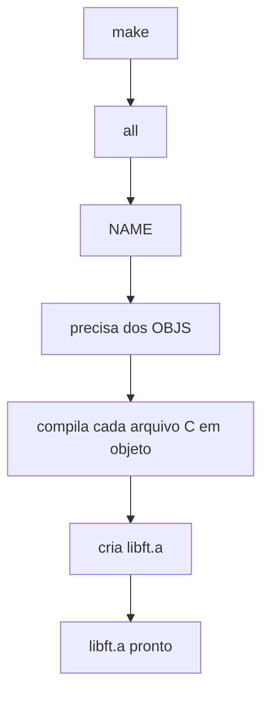
```mermaid
flowchart TD
	A["make"] --> B["all"]
	B --> C["NAME"]
	C --> D["precisa dos OBJS"]
	D --> E["compila cada arquivo C em objeto"]
	E --> F["cria libft.a"]
	F --> G["libft.a pronto"]
```

### Pontos de atenção

Comandos precisam comecar com TAB real, não espaco.

Se faltar TAB, aparece erro tipo `missing separator`.

Não use `gcc` se o enunciado pede `cc`.

Colocar `libft.h` na dependencia faz recompilar quando o header muda.

`.PHONY` evita conflito com arquivos chamados `clean`, `fclean`, `all` ou `re`.

### Testes
```bash
make
make
make clean
make fclean
make re
```

No segundo `make`, se nada foi alterado, ele não deve recompilar tudo.

<a id="ft-isalpha-c"></a>
## `ft_isalpha.c`

`ft_isalpha` verifica se o caractere recebido é uma letra.

Retorna `1` se for letra maiúscula ou minúscula, e `0` se não for.

### Conceito

A função trabalha com a tabela ASCII.

Em C, caracteres também sao números, entao da para comparar `'A'`, `'Z'`, `'a'` e `'z'` direto.

### Como surgiu / porque existe

Essa função vem da libc original, usada para testar se um caractere é alfabetico.

A versao da Libft recria esse comportamento, mas a 42 pede retorno exato: `1` ou `0`.

### Lógica

`int c` recebe o caractere como inteiro, como na libc.

`c >= 'A' && c <= 'Z'` testa se é letra maiúscula.

`c >= 'a' && c <= 'z'` testa se é letra minúscula.

`||` significa OU, entao basta estar em um dos dois intervalos.

Se cair em algum intervalo, retorna `1`.

Se não cair, retorna `0`.

Não da para escrever `'A' <= c <= 'Z'` em C, porque isso não funciona como na matematica.

### Fluxo
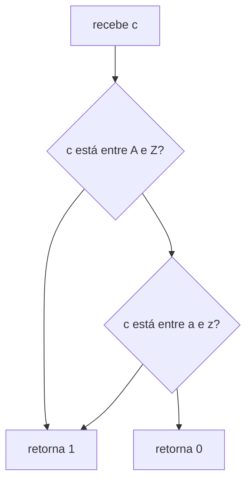
```mermaid
flowchart TD
	A["recebe c"] --> B{"c está entre A e Z?"}
	B --> C["retorna 1"]
	B --> D{"c está entre a e z?"}
	D --> C
	D --> E["retorna 0"]
```

### Pontos de atenção

Usar `&&` para testar intervalo.

Usar `||` para juntar maiúscula ou minúscula.

Não usar `|`, porque isso é operador bit a bit.

Retornar exatamente `1` ou `0`.

Incluir `libft.h` para manter o protótipo certo.

### Testes

Testar letras maiúsculas, minúsculas, números, simbolos e limites.
```bash
cc -Wall -Wextra -Werror ft_isalpha.c main.c -o test
./test
```

Exemplos: `'A'`, `'z'`, `'g'` devem retornar `1`; `'5'`, `'!'`, `0` e `127` devem retornar `0`.

<a id="ft-isdigit-c"></a>
## `ft_isdigit.c`

`ft_isdigit` verifica se o caractere recebido é um número de `0` a `9`.

Retorna `1` se for dígito decimal, e `0` se não for.

### Conceito

A função usa a tabela ASCII.

Em ASCII, os caracteres `'0'` até `'9'` ficam em sequencia.

Por isso da para testar se `c` está dentro desse intervalo.

### Como surgiu / porque existe

Essa função vem da libc original e serve para identificar se um caractere é um dígito.

Na Libft, recriamos esse comportamento, mas seguindo a regra da 42: retornar exatamente `1` ou `0`.

### Lógica

`int c` recebe o caractere como inteiro, como na libc.

`c >= '0' && c <= '9'` testa se `c` está entre os dígitos.

`&&` significa E, entao as duas condicoes precisam ser verdadeiras.

Se estiver entre `'0'` e `'9'`, retorna `1`.

Se não estiver, retorna `0`.

Usar `'0'` e `'9'` é melhor que usar `48` e `57`, porque fica mais legivel.

### Fluxo
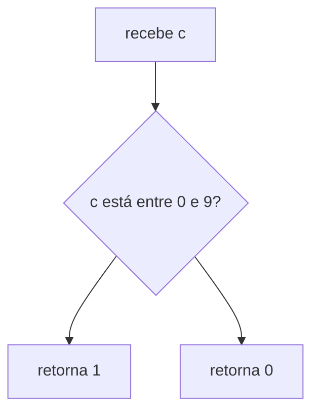
```mermaid
flowchart TD
	A["recebe c"] --> B{"c está entre 0 e 9?"}
	B --> C["retorna 1"]
	B --> D["retorna 0"]
```

### Pontos de atenção

Não confundir `'0'` com `0`.

`'0'` é o caractere zero, valor ASCII 48.

`0` é o byte nulo, usado como final de string.

Não escrever `c >= 0 && c <= 9`, porque isso testa caracteres de controle, não números visuais.

Não escrever `0 <= c <= 9`, porque em C não funciona como na matematica.

Retornar exatamente `1` ou `0`.

### Testes

Testar inicio, final, meio do intervalo e caracteres fora dele.
```bash
cc -Wall -Wextra -Werror ft_isdigit.c main.c -o test
./test
```

Exemplos: `'0'`, `'5'`, `'9'` devem retornar `1`; `'a'`, `'Z'`, `' '`, `0` devem retornar `0`.

<a id="ft-isalnum-c"></a>
## `ft_isalnum.c`

`ft_isalnum` verifica se o caractere recebido é letra ou número.

Retorna `1` se for letra ou dígito, e `0` se não for.

### Conceito

`alnum` vem de `alpha` + `numeric`.

Ou seja, a função junta a ideia de `ft_isalpha` com `ft_isdigit`.

### Como surgiu / porque existe

Essa função vem da libc e serve para testar se um caractere é alfanumerico.

Na Libft, a ideia é recriar esse comportamento reaproveitando funções que já existem.

### Lógica

`ft_isalpha(c)` testa se `c` é letra.

`ft_isdigit(c)` testa se `c` é número de `0` a `9`.

`||` significa OU, entao basta uma das duas funções retornar `1`.

Se for letra ou dígito, retorna `1`.

Se não for nenhum dos dois, retorna `0`.

O `||` tem curto-circuito: se `ft_isalpha(c)` já for verdadeiro, o C nem precisa chamar `ft_isdigit(c)`.

### Fluxo
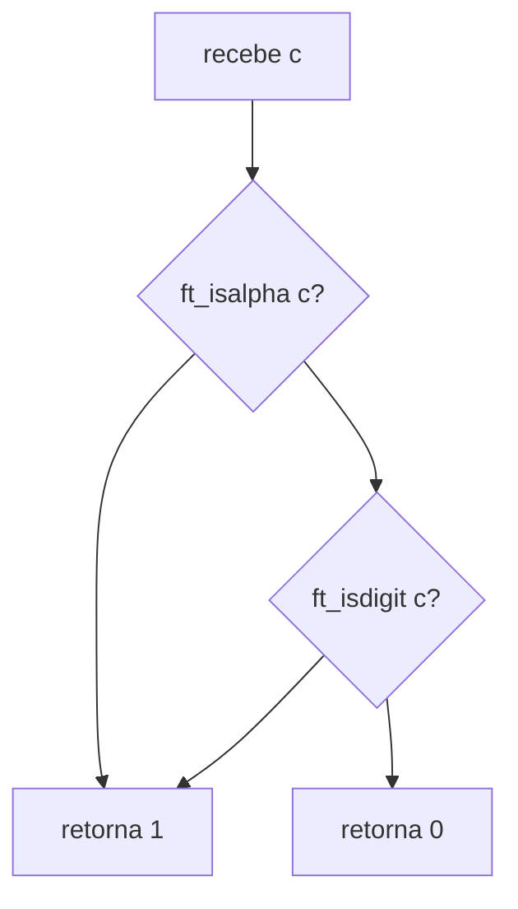
```mermaid
flowchart TD
	A["recebe c"] --> B{"ft_isalpha c?"}
	B --> C["retorna 1"]
	B --> D{"ft_isdigit c?"}
	D --> C
	D --> E["retorna 0"]
```

### Pontos de atenção

Reaproveitar `ft_isalpha` e `ft_isdigit` deixa o codigo mais limpo.

Usar `||`, não `|`.

Não retornar `ft_isalpha(c) + ft_isdigit(c)`, porque a ideia aqui é lógica, não soma.

Incluir `libft.h` para enxergar os protótipos.

Garantir que `ft_isalpha` e `ft_isdigit` estejam funcionando antes.

### Testes

Testar letras, números, simbolos, espaco e valores fora do ASCII visível.
```bash
cc -Wall -Wextra -Werror ft_isalnum.c ft_isalpha.c ft_isdigit.c main.c -o test
./test
```

Exemplos: `'A'`, `'z'`, `'5'` devem retornar `1`; `'!'`, `' '`, `0` e `127` devem retornar `0`.

<a id="ft-isascii-c"></a>
## `ft_isascii.c`

`ft_isascii` verifica se o valor recebido faz parte da tabela ASCII padrao.

Retorna `1` se estiver entre `0` e `127`, e `0` se não estiver.

### Conceito

ASCII é uma tabela que transforma caracteres em números.

Ela tem 128 valores, indo de `0` até `127`.

Isso inclui letras, números, simbolos, espaco e caracteres de controle.

### Como surgiu / porque existe

ASCII surgiu para padronizar como computadores representam texto.

Antes disso, sistemas diferentes podiam usar codigos diferentes pros mesmos caracteres.

Na Libft, essa função serve para dizer se um valor pertence ao ASCII puro.

### Lógica

`int c` recebe o valor a ser testado.

`c >= 0 && c <= 127` verifica se `c` está dentro da tabela ASCII.

`&&` significa E, entao as duas condicoes precisam ser verdadeiras.

Se `c` estiver entre `0` e `127`, retorna `1`.

Se for menor que `0` ou maior que `127`, retorna `0`.

ASCII não é a mesma coisa que caractere imprimivel.

### Fluxo
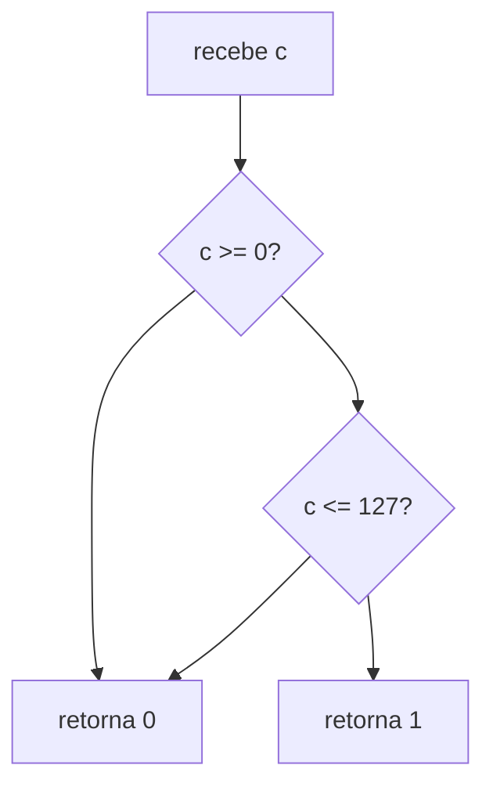
```mermaid
flowchart TD
	A["recebe c"] --> B{"c >= 0?"}
	B --> C["retorna 0"]
	B --> D{"c <= 127?"}
	D --> E["retorna 1"]
	D --> C
```

### Pontos de atenção

ASCII vai de `0` a `127`, não de `1` a `128`.

Não confundir com `ft_isprint`, que vai de `32` a `126`.

`0` é valido em ASCII, mesmo sendo caractere nulo.

`127` também é valido, mesmo sendo DEL.

Valores negativos não sao ASCII.

Retornar exatamente `1` ou `0`.

### Curiosidade
Por que usar int e não char? Protótipo pede, e também Por que o char é pode ser char de -128 a 128 se signed e de 0 a 255 de for unsigned. EOF é uma constante definida por -1. se usarmos char unsigned, o -1 vira 255 e haveria conflito con o caracter -1 (Preto 0xFF). usar int cobre essa excecao. Tabela estendida (negativos ou > 127), cobrem outros caracteres como trema, letra é, fracao, etc.

### Testes

Testar os limites e valores fora deles.
```bash
cc -Wall -Wextra -Werror ft_isascii.c main.c -o test
./test
```

Exemplos: `0`, `65`, `127` e `'A'` devem retornar `1`; `-1`, `128` e `255` devem retornar `0`.


<a id="ft-strlen-c"></a>
## `ft_strlen.c`

`ft_strlen` conta quantos caracteres uma string tem.

Ela retorna o tamanho da string sem contar o `\0` final.

### Conceito

String em C é um array de `char` que termina com `\0`.

O `\0` marca onde a string acaba.

`size_t` é o tipo usado para representar tamanhos em C.

### Como surgiu / porque existe

Essa função vem da libc e é uma das bases para trabalhar com strings.

Como C não guarda o tamanho da string automaticamente, a função precisa contar até achar o `\0`.

### Lógica

`const char *s` recebe a string sem permitir modificacao.

`size_t i` é o contador.

`i = 0` comeca no primeiro caractere.

`while (s[i])` continua enquanto o caractere não for `\0`.

`i++` avanca para o proximo caractere.

Quando encontra `\0`, o loop para e retorna `i`.

Não conta o `\0`, porque ele somente marca o final da string.

### Fluxo
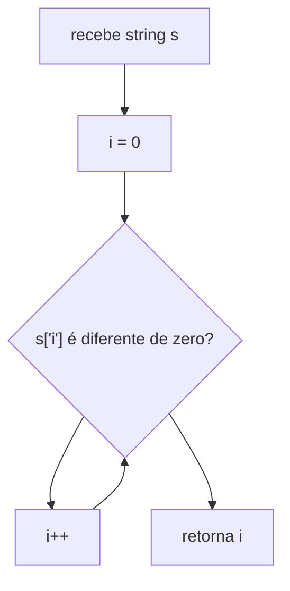
```mermaid
flowchart TD
	A["recebe string s"] --> B["i = 0"]
	B --> C{"s['i'] é diferente de zero?"}
	C --> D["i++"]
	D --> C
	C --> E["retorna i"]
```

### Pontos de atenção

Usar `size_t`, não `int`.

Não contar o `\0`.

Não esquecer o `i++`, senao vira loop infinito.

`while (s[i])` para porque `\0` vale zero.

Não precisa tratar `NULL`, porque `strlen` original também não trata.

Na Norminette, declare `i` primeiro e atribua depois.

### Testes

Testar string vazia, string com 1 char e strings maiores.
```bash
cc -Wall -Wextra -Werror ft_strlen.c main.c -o test
./test
```

Exemplos: `""` deve retornar `0`; `"a"` deve retornar `1`; `"hello"` deve retornar `5`.


<a id="ft-memset-c"></a>
## `ft_memset.c`

`ft_memset` preenche um bloco de memória com o mesmo byte varias vezes.

Ela escreve o valor `c` em `len` bytes e retorna o ponteiro original `b`.

### Conceito

Memória em C pode ser tratada byte por byte.

`void *` é um ponteiro genérico, entao pode apontar para qualquer tipo.

Para mexer em bytes, a gente converte para `unsigned char *`.

### Como surgiu / porque existe

Essa função vem da libc e serve para inicializar ou sobrescrever blocos de memória.

É muito usada para zerar buffers, preencher arrays ou preparar memória antes de usar.

### Lógica

`void *b` é o bloco de memória que vai ser preenchido.

`int c` é o valor recebido, mas somente 1 byte dele importa.

`size_t len` diz quantos bytes serao alterados.

`ptr = (unsigned char *)b` permite acessar a memória byte a byte.

`ptr[i] = (unsigned char)c` escreve o byte na posição atual.

O loop roda enquanto `i < len`.

No final, retorna `b`, como na libc.

### Fluxo
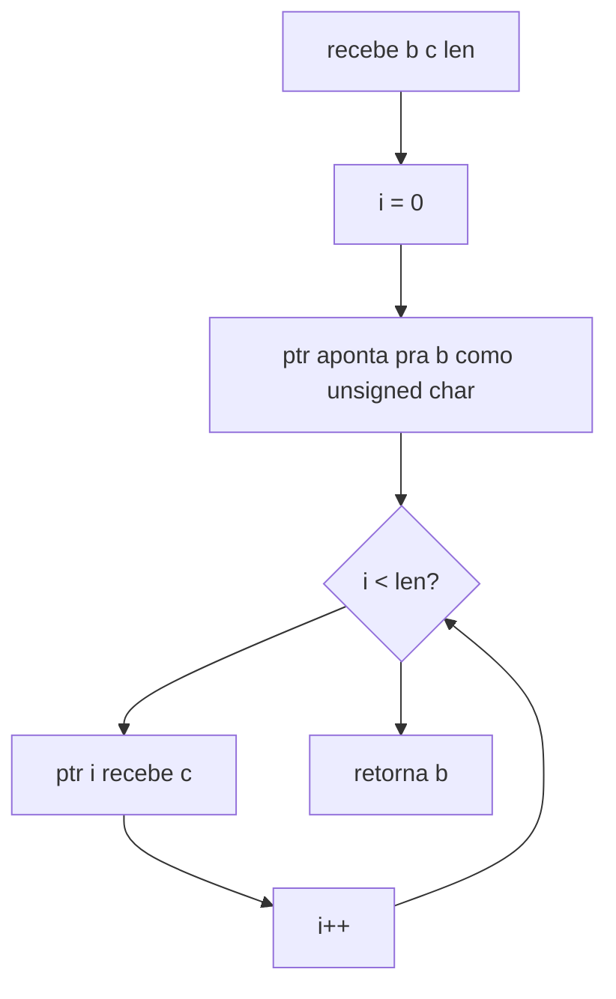
```mermaid
flowchart TD
	A["recebe b c len"] --> B["i = 0"]
	B --> C["ptr aponta pra b como unsigned char"]
	C --> D{"i < len?"}
	D --> E["ptr i recebe c"]
	E --> F["i++"]
	F --> D
	D --> G["retorna b"]
```

### Pontos de atenção

Não da para fazer `b[i]` direto, porque `void *` não tem tamanho definido.

Usar `unsigned char *` para manipular memória byte a byte.

Fazer cast de `c` para `unsigned char`, porque `c` chega como `int`.

Não tratar `NULL`, porque `memset` original também não trata.

Se `len = 0`, não muda nada e retorna `b`.

Não confundir com `ft_bzero`, que somente preenche com zero.

### Testes

Testar preenchendo com letra, com zero e com `len = 0`.

### Curiosidade
Por que fazer cast com unsigned char *? Não podiamos usar im int *?
resposta principal é granulariadade, porque o memset "seta" o endereco, byte a byte e sizeof(int) = 4.
Mas por outro lado temos essa curiosidade:```
A CPU lê a memória RAM de forma mais eficiente quando os dados estão alinhados com o tamanho da palavra do sistema. Um ponteiro do tipo int * geralmente exige que o endereço de memória seja múltiplo de 4.

Se o usuário passar para o seu memset um endereço que comece em um byte ímpar (como 0x003 vindo de um substring ou um struct desalinhado) e você tentar fazer um cast para int * e manipular a memória nessa posição, algumas arquiteturas de processador (como ARM) vão disparar uma exceção de hardware imediatamente, resultando em um Bus Error. O tipo unsigned char * tem alinhamento de 1 byte, o que significa que ele pode apontar com segurança para qualquer endereço da memória sem nunca quebrar o processador.
```
```bash
cc -Wall -Wextra -Werror ft_memset.c main.c -o test
./test
```

Exemplos: preencher `buf` com `'A'`, comparar com `memset`, e testar se os bytes viraram o valor esperado.

<a id="ft-bzero-c"></a>
## `ft_bzero.c`

`ft_bzero` zera um bloco de memória.

Ela preenche `n` bytes com `0` a partir do ponteiro `s`.

### Conceito

`bzero` é basicamente um `memset` especifico para zero.

Em vez de preencher com qualquer valor, ela sempre coloca byte `0`.

Serve para limpar memória, buffers ou arrays antes de usar.

### Como surgiu / porque existe

`bzero` veio da BSD libc e é uma função antiga.

Hoje ela é considerada meio obsoleta, porque da para fazer a mesma coisa com `memset(s, 0, n)`.

Na Libft, ela aparece pois faz parte das funções que a 42 pede para recriar.

### Lógica

`s` é o bloco de memória que vai ser zerado.

`n` é a quantidade de bytes que serao alterados.

Como `ft_memset` já preenche memória com um byte especifico, basta chamar ela com `0`.

`ft_memset(s, 0, n)` escreve zero nos primeiros `n` bytes.

A função não retorna nada, porque o protótipo é `void`.

### Fluxo
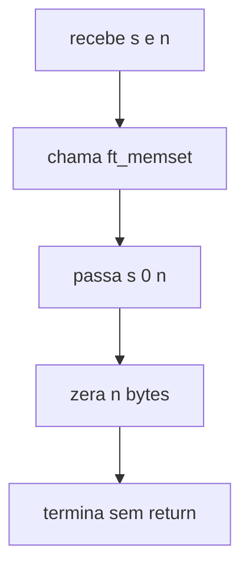
```mermaid
flowchart TD
	A["recebe s e n"] --> B["chama ft_memset"]
	B --> C["passa s 0 n"]
	C --> D["zera n bytes"]
	D --> E["termina sem return"]
```

### Pontos de atenção

Não retornar nada, porque a função é `void`.

Não confundir a ordem: `bzero(s, n)` tem somente 2 parametros.

`memset(s, 0, n)` tem 3 parametros.

Reaproveitar `ft_memset` evita repetir loop.

Não precisa tratar `NULL`, porque a original também não trata.

Se `n = 0`, nada muda.

### Testes

Testar zerando parte de um buffer e vendo se o resto ficou igual.
```bash
cc -Wall -Wextra -Werror ft_bzero.c ft_memset.c main.c -o test
./test
```

Exemplo: buffer com `10` chars `X`, chamar `ft_bzero(buf, 5)` e conferir se somente os 5 primeiros viraram `0`.


<a id="ft-memcpy-c"></a>
## `ft_memcpy.c`

`ft_memcpy` copia `n` bytes de um bloco de memória para outro.

Ela copia de `src` para `dst` e retorna o ponteiro original `dst`.

### Conceito

`memcpy` trabalha com memória bruta, não com string.

Por isso ela copia bytes, incluindo `\0`, se ele estiver dentro dos `n` bytes.

Como recebe `void *`, precisa converter para `unsigned char *` para acessar byte por byte.

### Como surgiu / porque existe

Essa função vem da libc e existe para copiar blocos de memória de forma direta.

Ela é usada quando você sabe exatamente quantos bytes quer copiar.

Mas ela não foi feita para lidar com sobreposição de memória.

### Lógica

`dst` é o destino, onde os bytes serao escritos.

`src` é a origem, de onde os bytes serao lidos.

`n` é a quantidade de bytes copiados.

`d = (unsigned char *)dst` permite escrever byte a byte.

`s = (const unsigned char *)src` permite ler byte a byte sem alterar a origem.

`d[i] = s[i]` copia cada byte da origem pro destino.

Se `dst` e `src` forem `NULL`, retorna `dst` sem mexer em nada.

### Observação:```
if (!dst && !src)
	return (dst);
```
trata o caso que as duas entradas sao nulas e retorna nulo, mas não trato diretamente o caso
se um ou o outro forem nulos, porque o memcpy da libc não trata e da erro de segfail.

### Fluxo
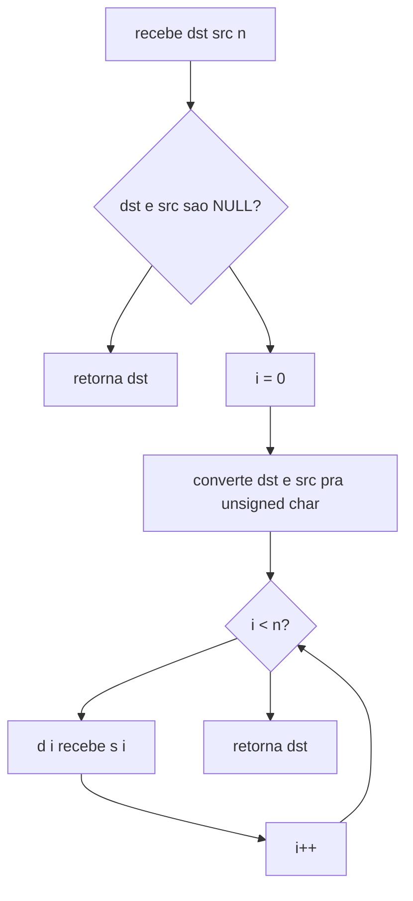
```mermaid
flowchart TD
	A["recebe dst src n"] --> B{"dst e src sao NULL?"}
	B --> C["retorna dst"]
	B --> D["i = 0"]
	D --> E["converte dst e src pra unsigned char"]
	E --> F{"i < n?"}
	F --> G["d i recebe s i"]
	G --> H["i++"]
	H --> F
	F --> I["retorna dst"]
```

### Pontos de atenção

A ordem é `dst, src, n`, igual ideia de `dst = src`.

Não usar `memcpy` se as regioes de memória se sobrepoem.

Para sobreposição, use `memmove`.

Não da para indexar `void *` direto.

Manter `const` no ponteiro da origem.

Não trocar `if (!dst && !src)` por `if (!dst || !src)`.

Se `n = 0`, não copia nada e retorna `dst`.

### Testes

Testar copia normal, copia com `n = 0` e comparar com `memcpy`.
```bash
cc -Wall -Wextra -Werror ft_memcpy.c main.c -o test
./test
```

Exemplos: copiar `"hello"` com `n = 6`, copiar array de `int` como bytes e testar `ft_memcpy(NULL, NULL, 10)`.


<a id="ft-memmove-c"></a>
## `ft_memmove.c`

`ft_memmove` copia `len` bytes de `src` para `dst`.

A diferenca pro `memcpy` é que ela funciona mesmo quando as regioes de memória se sobrepoem.

### Conceito

Sobreposição acontece quando `src` e `dst` dividem parte da mesma memória.

Se copiar na direcao errada, você pode sobrescrever um byte antes de ler ele.

Por isso `memmove` escolhe se copia do comeco ou do final.

### Como surgiu / porque existe

`memcpy` é rapido, mas não protege contra overlap.

`memmove` existe para copiar memória com seguranca quando origem e destino podem se cruzar.

A ideia é agir como se copiasse primeiro para um buffer temporario.

### Lógica

`dst` é onde os bytes serao escritos.

`src` é de onde os bytes serao lidos.

`len` é a quantidade de bytes copiados.

Se `dst` e `src` forem `NULL`, retorna `dst`.

Converte `dst` e `src` para `unsigned char *` para mexer byte a byte.

Se `d < s`, copia do comeco pro final.

Se `d >= s`, copia do final pro comeco.

Isso evita sobrescrever bytes da origem antes de ler.

### Fluxo
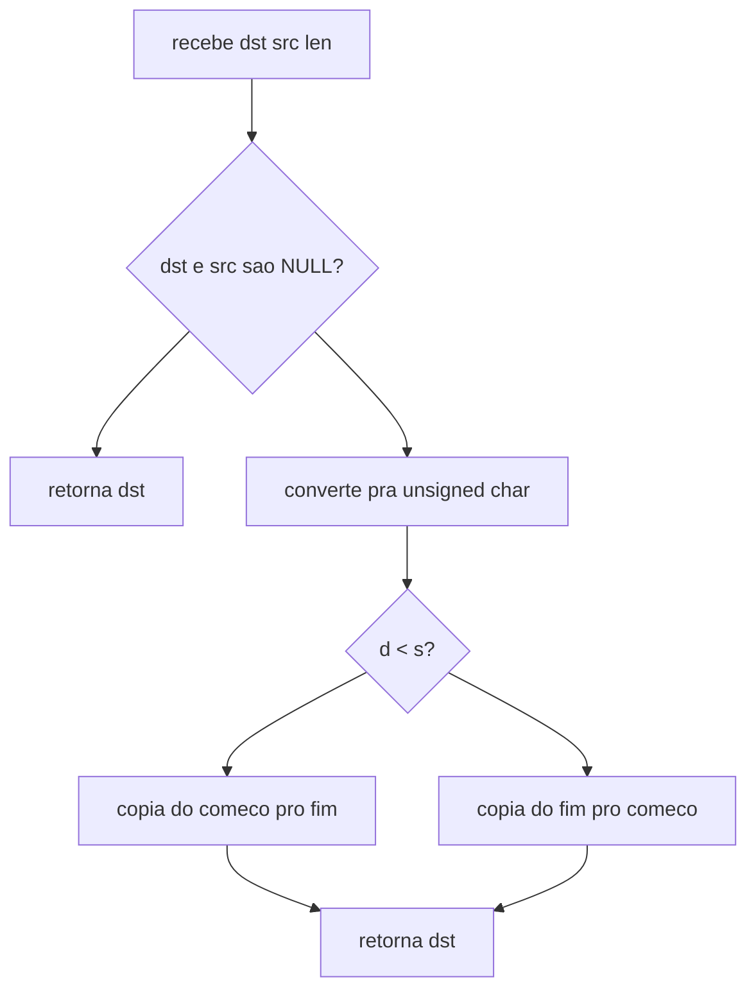
```mermaid
flowchart TD
	A["recebe dst src len"] --> B{"dst e src sao NULL?"}
	B --> C["retorna dst"]
	B --> D["converte pra unsigned char"]
	D --> E{"d < s?"}
	E --> F["copia do comeco pro fim"]
	E --> G["copia do fim pro comeco"]
	F --> H["retorna dst"]
	G --> H
```

### Pontos de atenção

Não escrever igual `memcpy`, porque vai falhar com overlap.

Usar `unsigned char *` para copiar byte por byte.

Não usar `while (i >= 0)` com `size_t`, porque ele nunca fica negativo.

No loop reverso, usar `i = len` e decrementar antes de acessar.

Não trocar `if (!dst && !src)` por `if (!dst || !src)`.

A ordem dos parametros é `dst, src, len`.


### Observações
Poderiamos calcular o se realmente existe overlap e memória, usando src+len ou dst+len
mas usando esse atalho eficiente de  d < s, já tratamos os casos possiveis já que se d está
antes de , não sobrescreve s antes e o caso inverso do do d estar após o s.

### Testes

Testar sem overlap, com `dst > src`, com `dst < src`, `len = 0` e `NULL + NULL`.
```bash
cc -Wall -Wextra -Werror ft_memmove.c main.c -o test
./test
```

Exemplos: `ft_memmove(str + 2, str, 4)` em `"abcdef"` deve gerar `"ababcd"`.


<a id="ft-strlcpy-c"></a>
## `ft_strlcpy.c`

`ft_strlcpy` copia uma string para `dst` respeitando o tamanho do buffer.

Ela copia no maximo `dstsize - 1`, fecha com `\0` e retorna o tamanho de `src`.

### Conceito

String em C precisa terminar com `\0`.

`strlcpy` é uma copia mais segura porque tenta evitar overflow.

Ela usa `dstsize` como tamanho total do buffer, incluindo espaco pro `\0`.

### Como surgiu / porque existe

`strcpy` pode estourar o buffer porque copia sem saber o tamanho do destino.

`strncpy` limita a copia, mas pode não colocar `\0`.

`strlcpy` surgiu para copiar com limite, garantir `\0` e ainda avisar se truncou.

### Lógica

`dst` é o buffer de destino.

`src` é a string de origem.

`dstsize` é o tamanho total de `dst`.

Se `dstsize == 0`, não escreve nada e retorna `ft_strlen(src)`.

O loop copia enquanto `src[i]` existe e `i < dstsize - 1`.

`dstsize - 1` deixa uma posição livre pro `\0`.

Depois do loop, faz `dst[i] = '\0'`.

O retorno é sempre `ft_strlen(src)`, não a quantidade copiada.

### Fluxo
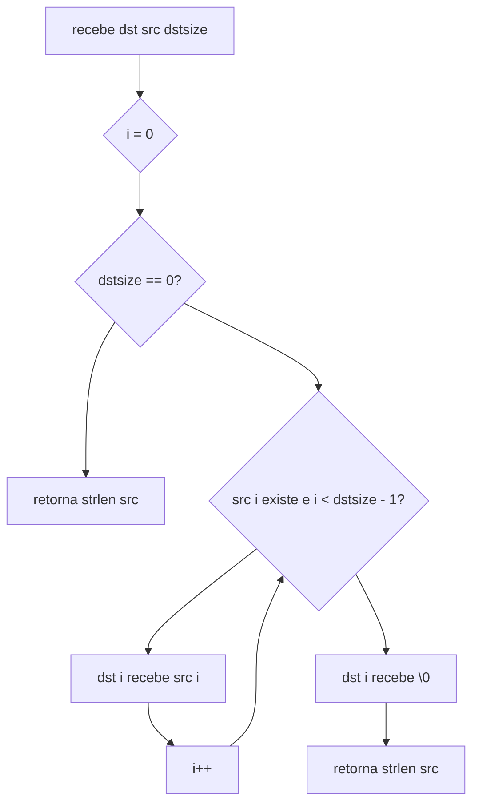
```mermaid
flowchart TD
	A["recebe dst src dstsize"] --> B{"i = 0"}
	B --> C{"dstsize == 0?"}
	C --> D["retorna strlen src"]
	C --> E{"src i existe e i < dstsize - 1?"}
	E --> F["dst i recebe src i"]
	F --> G["i++"]
	G --> E
	E --> H["dst i recebe \0"]
	H --> I["retorna strlen src"]
```

### Pontos de atenção

Retorno é o tamanho de `src`, não quantos chars foram copiados.

Se retorno `>= dstsize`, a string foi truncada.

Precisa tratar `dstsize == 0` para evitar underflow em `size_t`.

Não esquecer o `\0` final.

Não usar `i <= dstsize - 1`, porque pode não deixar espaco pro `\0`.

Não precisa tratar `src == NULL`, porque a original também não trata.

### Testes

Testar buffer pequeno, buffer grande, `dstsize = 1` e `dstsize = 0`.
```bash
cc -Wall -Wextra -Werror ft_strlcpy.c ft_strlen.c main.c -o test
./test
```

Exemplos: copiar `"Hello World"` em buffer 5 deve gerar `"Hell"` e retornar `11`.


<a id="ft-strlcat-c"></a>
## `ft_strlcat.c`

`ft_strlcat` adiciona `src` no final de `dst`, respeitando o tamanho total do buffer.

Ela sempre tenta fechar com `\0` e retorna o tamanho que a string teria se coubesse.

### Conceito

`strlcat` é uma concatenacao segura.

Ela não recebe somente quantos chars copiar, mas sim o tamanho total do buffer `dst`.

Isso ajuda a evitar overflow e permite saber se a string foi cortada.

### Como surgiu / porque existe

`strcat` concatena sem saber o tamanho do destino e pode estourar memória.

`strncat` limita a origem, mas não controla bem o tamanho total do buffer.

`strlcat` surgiu para concatenar com limite, fechar com `\0` e detectar truncamento.

### Lógica

`dst` já tem uma string dentro.

`src` é a string que vai ser adicionada no final.

`dstsize` é o tamanho total do buffer `dst`.

`dst_len = ft_strlen(dst)` acha onde `dst` termina.

`src_len = ft_strlen(src)` calcula o tamanho da origem.

Se `dstsize <= dst_len`, não tem espaco seguro e retorna `dstsize + src_len`.

O loop copia `src[i]` para `dst[dst_len + i]`.

A condicao `dst_len + i < dstsize - 1` deixa espaco pro `\0`.

No final, fecha com `\0` e retorna `dst_len + src_len`.

### Fluxo
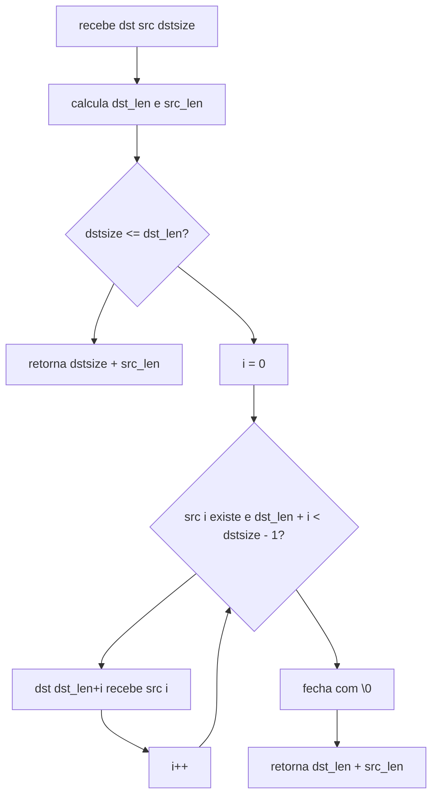
```mermaid
flowchart TD
	A["recebe dst src dstsize"] --> B["calcula dst_len e src_len"]
	B --> C{"dstsize <= dst_len?"}
	C --> D["retorna dstsize + src_len"]
	C --> E["i = 0"]
	E --> F{"src i existe e dst_len + i < dstsize - 1?"}
	F --> G["dst dst_len+i recebe src i"]
	G --> H["i++"]
	H --> F
	F --> I["fecha com \0"]
	I --> J["retorna dst_len + src_len"]
```

### Pontos de atenção

Retorno não é quantos chars foram copiados.

Retorno é o tamanho que a string tentaria ter.

Se retorno `>= dstsize`, truncou.

Não esquecer o caso `dstsize <= dst_len`.

Não esquecer de somar `dst_len + i`, senao você sobrescreve o comeco de `dst`.

Não esquecer o `\0` final.

Não precisa tratar `NULL`, porque a original também não trata.

### Testes

Testar quando cabe tudo, quando trunca e quando `dstsize <= dst_len`.
```bash
cc -Wall -Wextra -Werror ft_strlcat.c ft_strlen.c main.c -o test
./test
```

Exemplos: `"Hi "` + `"World"` com buffer 20 deve virar `"Hi World"` e retornar `8`.


<a id="ft-toupper-c"></a>
## `ft_toupper.c`

`ft_toupper` transforma letra minúscula em maiúscula.

Se não for minúscula, retorna o proprio caractere sem mudar.

### Conceito

A função usa a tabela ASCII.

Em ASCII, letras minúsculas e maiúsculas ficam separadas por `32`.

Exemplo: `'a'` vale `97` e `'A'` vale `65`.

### Como surgiu / porque existe

Essa função vem da libc e serve para normalizar caracteres.

Ela é util quando você quer comparar ou tratar texto sem diferenciar minúscula de maiúscula.

Na Libft, recriamos o comportamento da função original.

### Lógica

`int c` recebe o caractere como inteiro, como na libc.

`c >= 'a' && c <= 'z'` testa se é letra minúscula.

Se for minúscula, retorna `c - 32`.

Subtrair `32` leva a letra pro equivalente maiusculo.

Se não for minúscula, retorna `c` sem alterar.

Não usa `ft_isalpha`, porque maiúsculas não devem ser convertidas.

### Fluxo
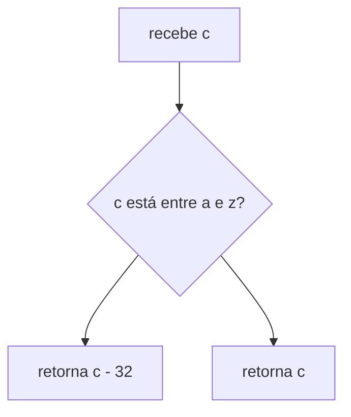
```mermaid
flowchart TD
	A["recebe c"] --> B{"c está entre a e z?"}
	B --> C["retorna c - 32"]
	B --> D["retorna c"]
```

### Pontos de atenção

Somente converter se estiver entre `'a'` e `'z'`.

Não somar `32`, porque isso é lógica do `tolower`.

Não aplicar em maiúsculas, senao `'A' - 32` vira outro caractere.

Não esquecer o `return (c)` no final.

O retorno é `int`, como na libc, por compatibilidade com `EOF`.

### Testes

Testar minúsculas, maiúsculas, números, simbolos e espaco.
```bash
cc -Wall -Wextra -Werror ft_toupper.c main.c -o test
./test
```

Exemplos: `'a'` vira `'A'`, `'z'` vira `'Z'`; `'A'`, `'5'`, `'!'` e `' '` ficam iguais.


<a id="ft-tolower-c"></a>
## `ft_tolower.c`

`ft_tolower` transforma letra maiúscula em minúscula.

Se não for maiúscula, retorna o proprio caractere sem mudar.

### Conceito

A função usa a tabela ASCII.

Em ASCII, letras maiúsculas e minúsculas ficam separadas por `32`.

Exemplo: `'A'` vale `65` e `'a'` vale `97`.

### Como surgiu / porque existe

Essa função vem da libc e serve para normalizar caracteres.

Ela é util quando você quer comparar ou tratar texto sem diferenciar maiúscula de minúscula.

Na Libft, ela é o espelho da `ft_toupper`.

### Lógica

`int c` recebe o caractere como inteiro, como na libc.

`c >= 'A' && c <= 'Z'` testa se é letra maiúscula.

Se for maiúscula, retorna `c + 32`.

Somar `32` leva a letra pro equivalente minusculo.

Se não for maiúscula, retorna `c` sem alterar.

Não usa `ft_isalpha`, porque minúsculas não devem ser convertidas.

### Fluxo
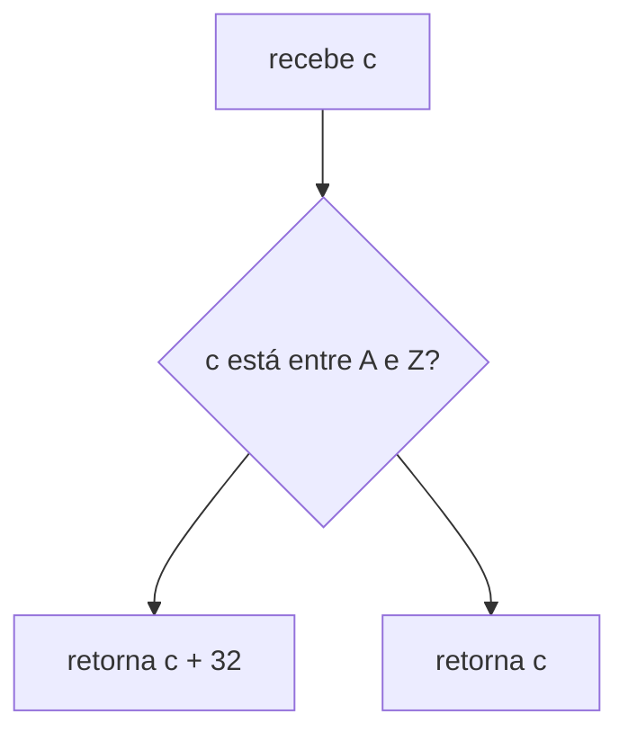
```mermaid
flowchart TD
	A["recebe c"] --> B{"c está entre A e Z?"}
	B --> C["retorna c + 32"]
	B --> D["retorna c"]
```

### Pontos de atenção

Somente converter se estiver entre `'A'` e `'Z'`.

Não subtrair `32`, porque isso é lógica do `toupper`.

Não aplicar em minúsculas, senao `'a' + 32` vira fora do ASCII comum.

Não esquecer o `return (c)` no final.

O retorno é `int`, como na libc, por compatibilidade com `EOF`.

### Testes

Testar maiúsculas, minúsculas, números, simbolos e espaco.
```bash
cc -Wall -Wextra -Werror ft_tolower.c main.c -o test
./test
```

Exemplos: `'A'` vira `'a'`, `'Z'` vira `'z'`; `'a'`, `'5'`, `'!'` e `' '` ficam iguais.


<a id="ft-strchr-c"></a>
## `ft_strchr.c`

`ft_strchr` procura a primeira vez que um caractere aparece dentro de uma string.

Se achar, retorna um ponteiro para essa posição; se não achar, retorna `NULL`.

### Conceito

String em C é percorrida caractere por caractere até o `\0`.

`strchr` não retorna o índice, retorna o endereco onde encontrou o caractere.

Isso permite continuar usando a string a partir daquele ponto.

### Como surgiu / porque existe

Essa função vem da libc e serve para buscar caracteres dentro de strings.

Ela é util quando você quer encontrar onde algo aparece, tipo espaco, virgula ou final da string.

Na Libft, recriamos o mesmo comportamento da original.

### Lógica

`s` é a string onde a busca acontece.

`c` é o caractere procurado, mas chega como `int`.

Durante o loop, compara `s[i]` com `(char)c`.

Se achar, retorna `(char *)&s[i]`.

O cast para `char *` é necessario porque `s` é `const char *`, mas o retorno da função é `char *`.

Depois do loop, se `c == '\0'`, retorna o endereco do terminador.

Se não achar nada, retorna `NULL`.

### Fluxo
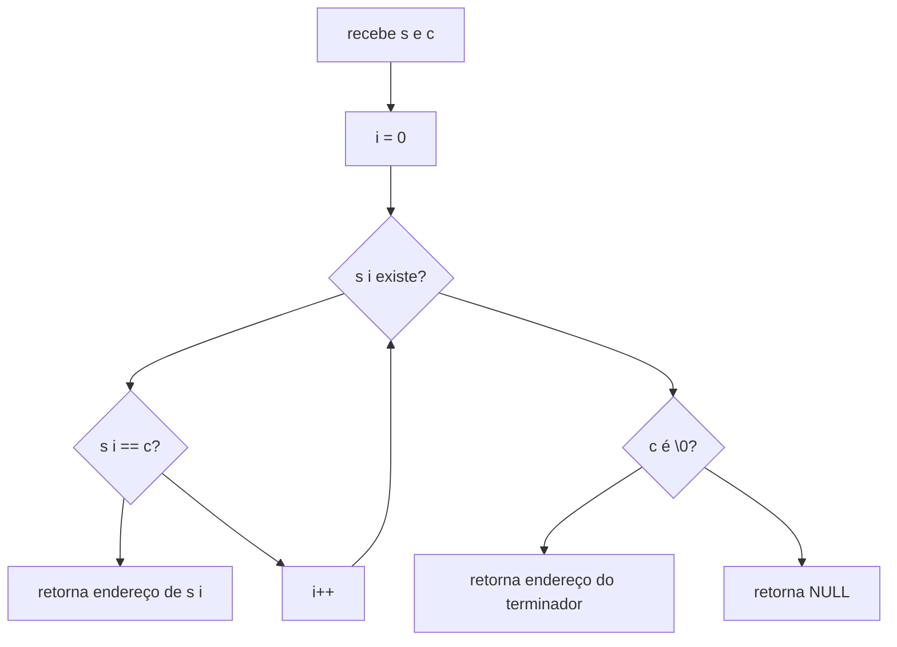
```mermaid
flowchart TD
	A["recebe s e c"] --> B["i = 0"]
	B --> C{"s i existe?"}
	C --> D{"s i == c?"}
	D --> E["retorna endereço de s i"]
	D --> F["i++"]
	F --> C
	C --> G{"c é \0?"}
	G --> H["retorna endereço do terminador"]
	G --> I["retorna NULL"]
```

### Pontos de atenção

Precisa tratar o caso `c == '\0'`.

Procurar `\0` deve retornar o ponteiro pro final da string, não `NULL`.

Usar `(char)c` na comparação.

Usar `(char *)&s[i]` no retorno por causa do `const`.

Não retornar índice, a função retorna ponteiro.

Não precisa tratar `s == NULL`, porque a original também não trata.

### Testes

Testar caractere existente, inexistente, string vazia e busca por `\0`.
```bash
cc -Wall -Wextra -Werror ft_strchr.c main.c -o test
./test
```

Exemplos: buscar `'W'` em `"Hello, World!"` deve retornar `"World!"`; buscar `'z'` deve retornar `NULL`; buscar `'\0'` deve retornar o final da string.


<a id="ft-strrchr-c"></a>
## `ft_strrchr.c`

`ft_strrchr` procura a ultima vez que um caractere aparece dentro de uma string.

Se achar, retorna um ponteiro para ultima posição; se não achar, retorna `NULL`.

### Conceito

Ela é parecida com `ft_strchr`, mas busca a ultima ocorrência.

Em vez de parar no primeiro match, ela guarda sempre o ultimo endereco encontrado.

No final, o ultimo valor salvo é a resposta certa.

### Como surgiu / porque existe

Essa função vem da libc e serve para buscar um caractere de tras para frente na ideia.

O `r` em `strrchr` vem de `reverse`.

Ela é util quando você quer achar a ultima barra, ultimo ponto, ultima letra, etc.

### Lógica

`s` é a string onde a busca acontece.

`c` é o caractere procurado, mas chega como `int`.

`last` comeca como `NULL`.

Percorre a string do comeco ao final.

Se `s[i] == (char)c`, atualiza `last` com o endereco atual.

O loop também testa o `\0`, porque buscar `'\0'` deve retornar o final da string.

No final, retorna `last`.

### Fluxo
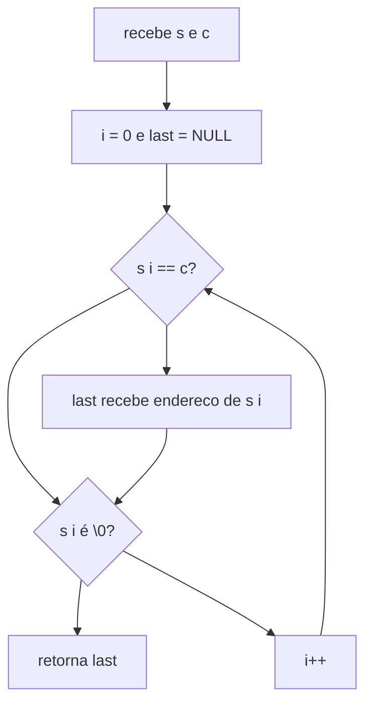
```mermaid
flowchart TD
	A["recebe s e c"] --> B["i = 0 e last = NULL"]
	B --> C{"s i == c?"}
	C --> D["last recebe endereco de s i"]
	C --> E{"s i é \0?"}
	D --> E
	E --> F["retorna last"]
	E --> G["i++"]
	G --> C
```

### Pontos de atenção

Precisa testar o `\0` também.

Por isso `while (s[i])` pode quebrar o caso `c == '\0'`.

A comparação com `c` deve vir antes do teste de parada.

Usar `(char)c` na comparação.

Usar `(char *)&s[i]` no retorno por causa do `const`.

Não retornar índice, retorna ponteiro.

Não precisa tratar `s == NULL`, porque a original também não trata.

### Testes

Testar caractere repetido, inexistente, string vazia e busca por `\0`.
```bash
cc -Wall -Wextra -Werror ft_strrchr.c main.c -o test
./test
```

Exemplos: buscar `'l'` em `"Hello"` deve retornar `"lo"`; buscar `'z'` deve retornar `NULL`; buscar `'\0'` deve retornar o final da string.


<a id="ft-strncmp-c"></a>
## `ft_strncmp.c`

`ft_strncmp` compara duas strings, mas no maximo até `n` bytes.

Retorna `0` se forem iguais, negativo se `s1` for menor, e positivo se `s1` for maior.

### Conceito

A comparação é feita byte por byte.

A função para quando acha uma diferenca, quando chega em `n`, ou quando as duas strings acabam.

O retorno não precisa ser exatamente `-1` ou `1`, somente precisa ter o sinal certo.

### Como surgiu / porque existe

Essa função vem da libc e é uma versao limitada do `strcmp`.

Ela existe para comparar strings sem precisar ler alem de um limite definido.

Isso ajuda quando você quer comparar somente uma parte da string.

### Lógica

`s1` e `s2` sao as strings comparadas.

`n` é o maximo de bytes que podem ser comparados.

`i` comeca em `0`.

`while (i < n && (s1[i] || s2[i]))` continua enquanto ainda pode comparar e alguma string ainda tem caractere.

Se `s1[i] != s2[i]`, retorna a diferenca dos dois bytes.

O cast `(unsigned char)` evita erro com chars de valor alto.

Se não achar diferenca, retorna `0`.

### Fluxo
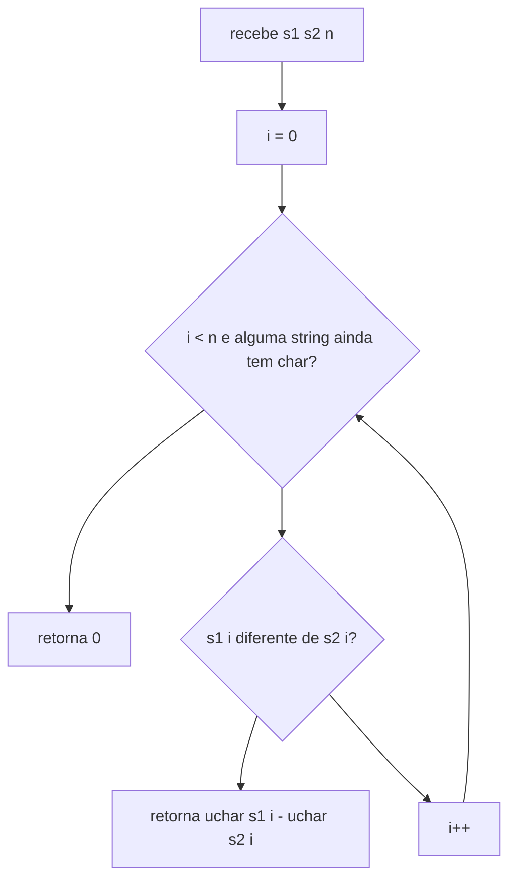
```mermaid
flowchart TD
	A["recebe s1 s2 n"] --> B["i = 0"]
	B --> C{"i < n e alguma string ainda tem char?"}
	C --> D["retorna 0"]
	C --> E{"s1 i diferente de s2 i?"}
	E --> F["retorna uchar s1 i - uchar s2 i"]
	E --> G["i++"]
	G --> C
```

### Pontos de atenção

Se `n = 0`, o loop não entra e retorna `0`.

Usar `(unsigned char)` na subtracao.

Não usar `s1[i] && s2[i]`, porque isso para cedo quando uma string acaba.

Tem que usar `(s1[i] || s2[i])`.

Não esquecer `i++`.

Não retornar diferenca fora do loop.

Não precisa tratar `NULL`, porque a original também não trata.

### Testes

Testar strings iguais, diferentes, limite menor que a diferenca e string que acaba antes.
```bash
cc -Wall -Wextra -Werror ft_strncmp.c main.c -o test
./test
```

Exemplos: `"abc"` com `"abc"` retorna `0`; `"abc"` com `"abd"` em `n = 3` retorna negativo; em `n = 2` retorna `0`.


<a id="ft-memchr-c"></a>
## `ft_memchr.c`

`ft_memchr` procura a primeira ocorrência de um byte dentro de um bloco de memória.

Se achar, retorna um ponteiro para posição; se não achar, retorna `NULL`.

### Conceito

`memchr` trabalha com memória bruta, não com string.

Ela procura dentro de exatamente `n` bytes.

Por isso ela não para no `\0`; para ela, `\0` é somente mais um byte.

### Como surgiu / porque existe

Essa função vem da libc e serve para buscar um byte dentro de buffers.

Ela é util quando você está lidando com memória, arquivos, dados binarios ou strings com `\0` no meio.

Diferente de `strchr`, ela não depende do final da string.

### Lógica

`s` é o bloco de memória onde a busca acontece.

`c` é o byte procurado, mas chega como `int`.

`n` é a quantidade maxima de bytes que serao verificados.

`ptr = (const unsigned char *)s` permite acessar byte por byte.

O loop roda enquanto `i < n`.

Se `ptr[i] == (unsigned char)c`, retorna o endereco daquele byte.

Se terminar o loop sem achar, retorna `NULL`.

### Fluxo
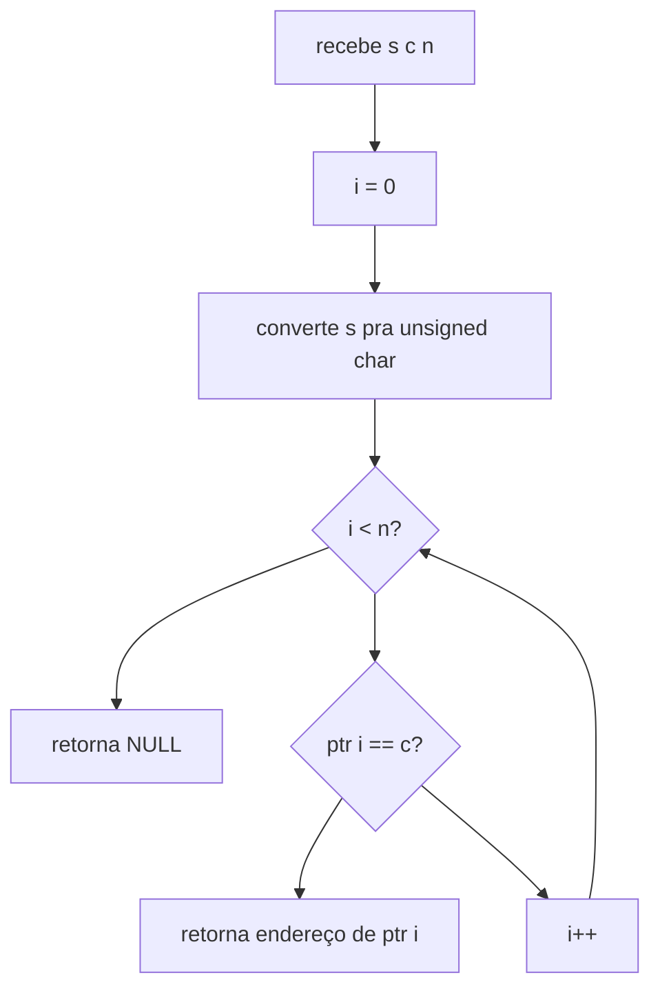
```mermaid
flowchart TD
	A["recebe s c n"] --> B["i = 0"]
	B --> C["converte s pra unsigned char"]
	C --> D{"i < n?"}
	D --> E["retorna NULL"]
	D --> F{"ptr i == c?"}
	F --> G["retorna endereço de ptr i"]
	F --> H["i++"]
	H --> D
```

### Pontos de atenção

Não parar no `\0`.

Não usar `while (i < n && ptr[i])`, porque isso quebra a função.

Usar `(unsigned char)c` na comparação.

Converter `void *` para `const unsigned char *`.

Retornar `(void *)&ptr[i]`.

Se `n = 0`, não procura nada e retorna `NULL`.

Não precisa tratar `s == NULL`, porque a original também não trata.

### Observações
A função `memchr` opera inspecionando a memória byte a byte, o que exige que o parâmetro `int c` passe por um **truncamento de tipo** para `unsigned char`, preservando apenas os seus 8 bits mais baixos (o equivalente matemático a `c & 0xFF` ou `c % 256`, transformando, por exemplo, o inteiro 300 no caractere `,` de valor ASCII 44). Essa assinatura que aceita um `int` em vez de um `char` foi consolidada pelo padrão **ANSI C (C89)** — o comitê que unificou as regras da linguagem nos anos 80 — por dois motivos fundamentais: a compatibilidade retrospectiva com compiladores antigos (onde tipos menores eram promovidos automaticamente para inteiros em chamadas de função) e a conveniência de receber diretamente o retorno de funções de leitura da biblioteca padrão (como `getc`), que usam o tipo `int` para conseguir retornar o valor `-1` (`EOF`) sem conflitar com caracteres válidos.

### Testes

Testar byte existente, inexistente, limite menor que a posição e `\0` no meio.
```bash
cc -Wall -Wextra -Werror ft_memchr.c main.c -o test
./test
```

Exemplos: buscar `'W'` em `"Hello, World!"` com `n = 13` deve achar; com `n = 5` deve retornar `NULL`.


<a id="ft-memcmp-c"></a>
## `ft_memcmp.c`

`ft_memcmp` compara dois blocos de memória byte por byte.

Ela compara até `n` bytes e retorna `0`, negativo ou positivo.

### Conceito

`memcmp` trabalha com memória bruta, não com string.

Isso significa que ela não para no `\0`.

Ela compara exatamente `n` bytes, mesmo que tenha byte zero no meio.

### Como surgiu / porque existe

Essa função vem da libc e serve para comparar buffers de memória.

Ela é util quando você não está lidando somente com texto, mas com bytes puros.

É tipo um `strncmp`, mas sem regra de parar no final da string.

### Lógica

`s1` e `s2` sao os blocos que serao comparados.

`n` é a quantidade de bytes comparados.

Converte os dois ponteiros para `const unsigned char *`.

Isso permite acessar byte por byte e manter o `const`.

O loop roda enquanto `i < n`.

Se `p1[i] != p2[i]`, retorna `p1[i] - p2[i]`.

Se terminar sem diferenca, retorna `0`.

### Fluxo
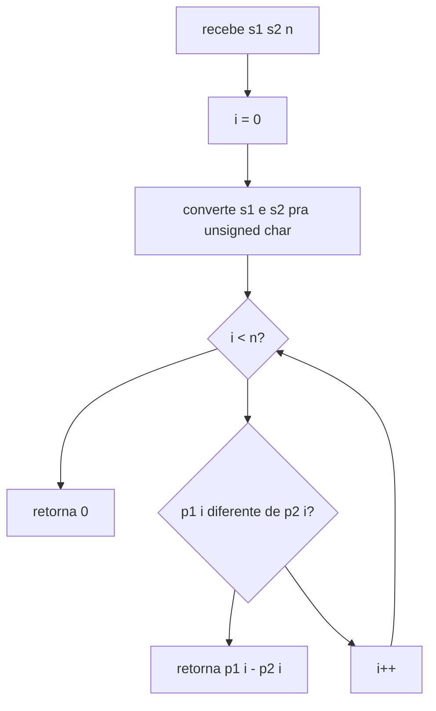
```mermaid
flowchart TD
	A["recebe s1 s2 n"] --> B["i = 0"]
	B --> C["converte s1 e s2 pra unsigned char"]
	C --> D{"i < n?"}
	D --> E["retorna 0"]
	D --> F{"p1 i diferente de p2 i?"}
	F --> G["retorna p1 i - p2 i"]
	F --> H["i++"]
	H --> D
```

### Pontos de atenção

Não parar no `\0`.

Não colocar `(s1[i] || s2[i])` no loop, porque isso vira lógica de string.

Usar `unsigned char`, porque bytes acima de `127` precisam ter sinal correto.

Não indexar `void *` direto.

Não esquecer o `const` nos ponteiros convertidos.

Se `n = 0`, retorna `0`.

Não precisa tratar `NULL`, porque a original também não trata.

### Testes

Testar blocos iguais, diferentes, `n = 0` e diferenca depois de `\0`.
```bash
cc -Wall -Wextra -Werror ft_memcmp.c main.c -o test
./test
```

Exemplos: `"abc"` com `"abc"` retorna `0`; `"abc"` com `"abd"` retorna negativo; `"abc\0def"` com `"abc\0xyz"` em `n = 7` deve achar diferenca depois do `\0`.


<a id="ft-strnstr-c"></a>
## `ft_strnstr.c`

`ft_strnstr` procura a primeira ocorrência de `needle` dentro de `haystack`.

Ela somente olha até `len` bytes de `haystack`.

### Conceito

`strnstr` é uma busca de substring com limite.

Ela tenta achar uma string dentro de outra, mas sem passar do tamanho maximo definido.

A `needle` precisa caber inteira dentro de `len`.

### Como surgiu / porque existe

`strstr` procura na string inteira até o `\0`.

`strnstr` surgiu para fazer a mesma busca, mas com limite de leitura.

Isso evita olhar memória alem do que foi permitido.

### Lógica

`haystack` é onde a busca acontece.

`needle` é a string que quero encontrar.

`len` é o maximo de bytes que posso olhar em `haystack`.

Se `needle` estiver vazia, retorna `haystack`.

`needle_len = ft_strlen(needle)` guarda o tamanho da busca.

O loop roda enquanto `haystack[i]` existe e `i + needle_len <= len`.

Essa condicao garante que a `needle` ainda cabe inteira.

`ft_strncmp(&haystack[i], needle, needle_len)` compara o bloco atual.

Se der `0`, encontrou e retorna `&haystack[i]`.

Se não achar nada, retorna `NULL`.

### Fluxo
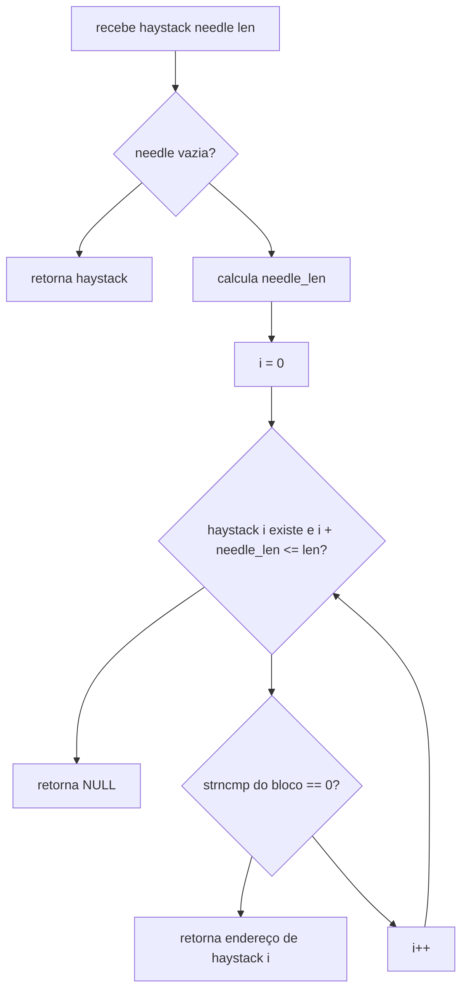
```mermaid
flowchart TD
	A["recebe haystack needle len"] --> B{"needle vazia?"}
	B --> C["retorna haystack"]
	B --> D["calcula needle_len"]
	D --> E["i = 0"]
	E --> F{"haystack i existe e i + needle_len <= len?"}
	F --> G["retorna NULL"]
	F --> H{"strncmp do bloco == 0?"}
	H --> I["retorna endereço de haystack i"]
	H --> J["i++"]
	J --> F
```

### Pontos de atenção

Não esquecer o caso `needle` vazia.

Usar `i + needle_len <= len`, não `< len`.

A `needle` precisa caber inteira dentro do limite.

Não usar `strcmp`, usar `ft_strncmp`.

Não esquecer o cast `(char *)` no retorno.

Não precisa tratar `NULL`, porque a original também não trata.

### Testes

Testar match normal, sem match, limite curto, needle vazia e match no limite exato.
```bash
cc -Wall -Wextra -Werror ft_strnstr.c ft_strlen.c ft_strncmp.c main.c -o test
./test
```

Exemplos: `"Hello World"` com `"World"` e `len = 11` acha; com `len = 9` retorna `NULL`.


<a id="ft-atoi-c"></a>
## `ft_atoi.c`

`ft_atoi` converte uma string em um número `int`.

Ela ignora espacos no inicio, le um sinal opcional e depois converte os dígitos.

### Conceito

`atoi` significa ASCII to integer.

A ideia é pegar caracteres como `'4'` e `'2'` e transformar no número `42`.

Para isso, a função le a string da esquerda para direita e monta o número em base 10.

### Como surgiu / porque existe

Essa função vem da libc e serve para converter texto em número.

Ela é util quando você recebe entrada como string, mas precisa usar como `int`.

Na Libft, seguimos o comportamento classico, sem tratar overflow.

### Lógica

Primeiro pula whitespaces: espaco, `\t`, `\n`, `\v`, `\f`, `\r`.

Depois verifica se tem sinal `+` ou `-`.

Se for `-`, muda `sign` para `-1`.

Depois le os dígitos enquanto estiver entre `'0'` e `'9'`.

`result = result * 10 + (str[i] - '0')` adiciona o novo dígito no final do número.

Para no primeiro caractere que não for dígito.

No final, retorna `result * sign`.

### Fluxo
```mermaid
flowchart TD
	A["recebe str"] --> B["pula whitespaces"]
	B --> C{"tem sinal + ou -?"}
	C --> D["ajusta sign e avanca"]
	C --> E["le digitos"]
	D --> E
	E --> F{"str i é digito?"}
	F --> G["result = result * 10 + digito"]
	G --> H["i++"]
	H --> F
	F --> I["retorna result * sign"]
```

### Pontos de atenção

Whitespace não é somente espaco, também inclui `\t`, `\n`, `\v`, `\f`, `\r`.

Somente aceita um sinal.

`+-5` e `--5` retornam `0`.

Usar `'0'` e `'9'`, não `0` e `9`.

`str[i] - '0'` transforma char dígito em número.

Não tratar overflow na versao classica da Libft.

### Testes

Testar números positivos, negativos, espacos, sinais invalidos e texto depois do número.
```bash
cc -Wall -Wextra -Werror ft_atoi.c main.c -o test
./test
```

Exemplos: `"42"` retorna `42`; `"   -42abc"` retorna `-42`; `"+-5"`, `"--5"`, `"abc"` e `""` retornam `0`.


<a id="ft-calloc-c"></a>
## `ft_calloc.c`

`ft_calloc` aloca memória para `count` elementos de `size` bytes.

Diferente do `malloc`, ela já devolve tudo zerado.

### Conceito

`calloc` é basicamente `malloc + bzero`.

Ela calcula `count * size`, aloca esse total de bytes e depois zera tudo.

Também precisa cuidar de overflow nessa multiplicacao.

### Como surgiu / porque existe

`malloc` somente aloca memória, mas o conteudo vem com lixo.

`calloc` surgiu para alocar memória já inicializada com zero.

Isso é util para arrays, structs e ponteiros que precisam comecar limpos.

### Lógica

`count` é a quantidade de elementos.

`size` é o tamanho de cada elemento.

Antes de multiplicar, checa se `count * size` vai estourar.

`size != 0 && count > SIZE_MAX / size` detecta overflow.

Se tiver overflow, retorna `NULL`.

Depois faz `malloc(count * size)`.

Se `malloc` falhar, retorna `NULL`.

Se der certo, chama `ft_bzero(ptr, count * size)`.

No final, retorna o ponteiro zerado.

### Fluxo
```mermaid
flowchart TD
	A["recebe count e size"] --> B{"tem overflow?"}
	B --> C["retorna NULL"]
	B --> D["malloc count * size"]
	D --> E{"malloc falhou?"}
	E --> C
	E --> F["zera memoria com ft_bzero"]
	F --> G["retorna ptr"]
```

### Pontos de atenção

Não esquecer de checar overflow.

Checar `size != 0` antes de dividir, senao pode dar divisao por zero.

Não retornar `NULL` somente porque `count == 0` ou `size == 0`.

Nesses casos, `malloc(0)` deve gerar ponteiro seguro para `free`.

Não esquecer de zerar a memória.

Precisa de `SIZE_MAX`, entao incluir `<stdint.h>` no `libft.h`.

### Testes

Testar alocação normal, memória zerada, `count = 0`, `size = 0` e overflow.
```bash
cc -Wall -Wextra -Werror ft_calloc.c ft_bzero.c ft_memset.c main.c -o test
./test
```

Exemplos: `ft_calloc(5, sizeof(int))` deve criar 5 ints zerados; `ft_calloc(SIZE_MAX, 2)` deve retornar `NULL`.


<a id="ft-strdup-c"></a>
## `ft_strdup.c`

`ft_strdup` cria uma copia nova de uma string.

Ela aloca memória, copia o conteudo de `s1` e retorna o novo ponteiro.

### Conceito

`strdup` significa string duplicate.

A copia fica em memória nova, entao não é o mesmo ponteiro da string original.

Quem chama a função precisa liberar essa memória depois com `free`.

### Como surgiu / porque existe

Essa função vem da libc e existe para duplicar strings de forma pratica.

Ela é util quando você precisa guardar uma copia propria de uma string.

Assim, se a original mudar, a copia continua independente.

### Lógica

Primeiro calcula `len = ft_strlen(s1)`.

Depois aloca `len + 1` bytes com `malloc`.

O `+1` é pro `\0` final.

Se `malloc` falhar, retorna `NULL`.

Se der certo, copia os caracteres de `s1` para `dup`.

Depois coloca `dup[i] = '\0'`.

No final, retorna `dup`.

### Fluxo
```mermaid
flowchart TD
	A["recebe s1"] --> B["calcula len com ft_strlen"]
	B --> C["malloc len + 1"]
	C --> D{"malloc falhou?"}
	D --> E["retorna NULL"]
	D --> F["copia chars de s1 pra dup"]
	F --> G["coloca \0 no fim"]
	G --> H["retorna dup"]
```

### Pontos de atenção

Não esquecer o `+1` no `malloc`.

Esse `+1` é o espaco do `\0`.

Não esquecer de colocar o `\0` no final.

Checar se `malloc` retornou `NULL`.

Não usar `sizeof(s1)`, porque `s1` é ponteiro e não tamanho da string.

A copia precisa ser independente da original.

Não precisa tratar `s1 == NULL`, porque a original também não trata.

### Testes

Testar string normal, string vazia e se a copia é independente da original.
```bash
cc -Wall -Wextra -Werror ft_strdup.c ft_strlen.c main.c -o test
./test
```

Exemplos: `ft_strdup("Hello")` deve criar outra string `"Hello"` em outro endereco; `ft_strdup("")` deve alocar 1 byte com `\0`.


# Part 2

<a id="ft-substr-c"></a>
## `ft_substr.c`

`ft_substr` cria uma nova string pegando um pedaco de `s`.

Ela comeca no índice `start` e copia no maximo `len` caracteres.

### Conceito

Substring é uma parte de uma string maior.

A função não altera a string original.

Ela cria uma nova string com `malloc`, entao quem chama precisa dar `free`.

### Como surgiu / porque existe

Essa função aparece na Parte 2 da Libft para fácilitar manipulacao de strings.

Ela existe porque muitos projetos precisam recortar pedacos de texto.

Exemplo: pegar uma palavra, um trecho, ou uma parte depois de certo índice.

### Lógica

Primeiro calcula `s_len = ft_strlen(s)`.

Se `start >= s_len`, não tem o que copiar e retorna `ft_strdup("")`.

Isso devolve uma string vazia valida e alocada.

Se `len > s_len - start`, ajusta `len` para não passar do final.

Depois aloca `len + 1` bytes.

O `+1` é pro `\0`.

Copia `s[start + i]` para `sub[i]`.

No final, fecha com `\0` e retorna `sub`.

### Fluxo
```mermaid
flowchart TD
	A["recebe s start len"] --> B["calcula s_len"]
	B --> C{"start >= s_len?"}
	C --> D["retorna strdup vazio"]
	C --> E{"len > s_len - start?"}
	E --> F["ajusta len"]
	E --> G["malloc len + 1"]
	F --> G
	G --> H{"malloc falhou?"}
	H --> I["retorna NULL"]
	H --> J["copia s start+i pra sub i"]
	J --> K["fecha com \0"]
	K --> L["retorna sub"]
```

### Pontos de atenção

Se `start >= s_len`, retorna `""` alocado, não `NULL`.

Não esquecer de ajustar `len` quando passa do final.

Cuidado com `s_len - start`, porque pode dar underflow se não tratar `start` antes.

Não esquecer o `+1` no `malloc`.

Copiar de `s[start + i]`, não de `s[i]`.

Não esquecer o `\0` final.

### Testes

Testar substring no meio, no comeco, no final, `len = 0` e `start` alem do final.
```bash
cc -Wall -Wextra -Werror ft_substr.c ft_strlen.c ft_strdup.c main.c -o test
./test
```

Exemplos: `"Hello World", 6, 5` retorna `"World"`; `"Hello", 10, 5` retorna `""`; `"Hello", 0, 100` retorna `"Hello"`.

<a id="ft-strjoin-c"></a>
## `ft_strjoin.c`

`ft_strjoin` junta duas strings em uma nova string.

Ela cria `s1 + s2` em memória nova e retorna esse ponteiro.

### Conceito

Concatenar é colocar uma string depois da outra.

A função não altera `s1` nem `s2`.

Ela cria uma terceira string com `malloc`, entao quem chama precisa dar `free`.

### Como surgiu / porque existe

Essa função aparece na Parte 2 da Libft para fácilitar manipulacao de strings.

Ela existe porque muitos projetos precisam montar textos juntando pedacos.

Exemplo: juntar caminho + nome de arquivo, prefixo + sufixo, mensagem + valor.

### Lógica

Calcula o tamanho total com `ft_strlen(s1) + ft_strlen(s2) + 1`.

O `+1` é pro `\0`.

Aloca `result` com `malloc`.

Se `malloc` falhar, retorna `NULL`.

Primeiro copia `s1` para `result`.

Depois copia `s2` a partir de `result[i + j]`.

No final, coloca `result[i + j] = '\0'`.

Retorna `result`.

### Fluxo
```mermaid
flowchart TD
	A["recebe s1 e s2"] --> B["calcula strlen s1 + strlen s2 + 1"]
	B --> C["malloc result"]
	C --> D{"malloc falhou?"}
	D --> E["retorna NULL"]
	D --> F["copia s1 pra result"]
	F --> G["copia s2 depois de s1"]
	G --> H["coloca \0 no fim"]
	H --> I["retorna result"]
```

### Pontos de atenção

Não esquecer o `+1` no `malloc`.

Esse `+1` é o espaco do `\0`.

No segundo loop, usar `result[i + j]`, não `result[j]`.

Não esquecer de fechar com `\0`.

Checar se `malloc` falhou.

Não precisa tratar `s1 == NULL` ou `s2 == NULL`, porque o padrao da Libft geralmente não trata.

A string retornada precisa ser liberada com `free`.

### Testes

Testar duas strings normais, `s1` vazia, `s2` vazia e as duas vazias.
```bash
cc -Wall -Wextra -Werror ft_strjoin.c ft_strlen.c main.c -o test
./test
```

Exemplos: `"Hello, " + "World!"` deve retornar `"Hello, World!"`; `"" + "World"` retorna `"World"`; `"Hello" + ""` retorna `"Hello"`.

<a id="ft-strtrim-c"></a>
## `ft_strtrim.c`

`ft_strtrim` cria uma nova string removendo chars do `set` do comeco e do final de `s1`.

Ela não remove chars do meio, somente das pontas.

### Conceito

Trim significa aparar.

A ideia é cortar caracteres indesejados nas extremidades da string.

O resultado é uma nova string alocada com `malloc`.

### Como surgiu / porque existe

Essa função aparece na Parte 2 da Libft para fácilitar manipulacao de texto.

Ela existe porque é comum limpar espacos, barras, simbolos ou chars extras antes/depois de uma string.

Exemplo: tirar espacos em volta de `"   Hello   "`.

### Lógica

Usa um helper `static is_in_set` para saber se um char está no `set`.

`start` comeca em `0` e avanca enquanto `s1[start]` estiver no `set`.

`end` comeca em `ft_strlen(s1)`.

Depois `end` recua enquanto `s1[end - 1]` estiver no `set`.

A condicao `end > start` evita underflow quando tudo deve ser removido.

Depois aloca `end - start + 1`.

O `+1` é pro `\0`.

Copia o trecho com `ft_strlcpy(result, s1 + start, end - start + 1)`.

Retorna `result`.

### Fluxo
```mermaid
flowchart TD
	A["recebe s1 e set"] --> B["start = 0"]
	B --> C{"char da esquerda está no set?"}
	C --> D["start++"]
	D --> C
	C --> E["end = strlen s1"]
	E --> F{"end > start e char da direita está no set?"}
	F --> G["end--"]
	G --> F
	F --> H["malloc end - start + 1"]
	H --> I{"malloc falhou?"}
	I --> J["retorna NULL"]
	I --> K["copia trecho com strlcpy"]
	K --> L["retorna result"]
```

### Pontos de atenção

Remove somente do comeco e do final, não do meio.

Helper deve ser `static` para não virar função publica da lib.

No final, testar `s1[end - 1]`, não `s1[end]`.

Não esquecer `end > start`, porque `size_t` não fica negativo.

Não esquecer o `+1` no `malloc`.

Se tudo for removido, deve retornar `""` alocado.

Não precisa tratar `s1 == NULL` ou `set == NULL`, porque o padrao da Libft geralmente não trata.

### Testes

Testar espacos, varios chars no set, set vazio, tudo removido e chars no meio.
```bash
cc -Wall -Wextra -Werror ft_strtrim.c ft_strlen.c ft_strlcpy.c main.c -o test
./test
```

Exemplos: `"   Hello   "` com `" "` retorna `"Hello"`; `"abcHelloabc"` com `"abc"` retorna `"Hello"`; `"ab Hello ab"` com `"ab"` retorna `" Hello "`.


<a id="ft-split-c"></a>
## `ft_split.c`

`ft_split` divide uma string em varias strings menores usando um char separador.

Ela retorna um array de strings terminado com `NULL`.

### Conceito

`split` quebra uma string em pedacos.

Cada pedaco vira uma nova string alocada com `malloc`.

O array final é um `char **`, igual a ideia do `argv`.

### Como surgiu / porque existe

Essa função aparece na Parte 2 da Libft porque separar texto é algo muito comum.

Ela é util para quebrar frases, caminhos, comandos ou listas separadas por algum caractere.

Exemplo: dividir `"Hello World 42"` por espaco vira `"Hello"`, `"World"`, `"42"`.

### Lógica

Primeiro `count_words` conta quantos pedacos existem.

Depois aloca `(count + 1) * sizeof(char *)`.

O `+1` é pro `NULL` final.

No loop principal, pula separadores consecutivos.

Quando acha uma palavra, mede com `word_len`.

Depois copia a palavra com `copy_word`.

Se algum `malloc` falhar, chama `free_all` para liberar o que já foi alocado.

No final, coloca `result[w] = NULL`.

### Fluxo
```mermaid
flowchart TD
	A["recebe s e c"] --> B["count_words conta palavras"]
	B --> C["malloc array count + 1"]
	C --> D{"malloc falhou?"}
	D --> E["retorna NULL"]
	D --> F["pula separadores"]
	F --> G{"chegou no fim?"}
	G --> H["coloca NULL final"]
	G --> I["mede palavra com word_len"]
	I --> J["copia palavra com copy_word"]
	J --> K{"copy_word falhou?"}
	K --> L["free_all e retorna NULL"]
	K --> M["avanca i e w"]
	M --> F
	H --> N["retorna result"]
```

### Pontos de atenção

O array precisa terminar com `NULL`.

Separadores consecutivos não geram string vazia.

Separador no comeco ou no final também não gera string vazia.

Precisa liberar tudo se um `malloc` interno falhar.

`i` anda na string original.

`w` anda no array de palavras.

Usar helpers `static` ajuda a não estourar 25 linhas.

Não precisa tratar `s == NULL`, porque o padrao da Libft geralmente não trata.

### Testes

Testar frase normal, separadores consecutivos, string vazia, somente separadores e sem separador.
```bash
cc -Wall -Wextra -Werror ft_split.c main.c -o test
./test
```

Exemplos: `"Hello World 42"` com `' '` retorna `["Hello", "World", "42", NULL]`; `",,abc,,def,,"` com `','` retorna `["abc", "def", NULL]`; `"aaaa"` com `'a'` retorna `[NULL]`.


<a id="ft-itoa-c"></a>
## `ft_itoa.c`

`ft_itoa` converte um número `int` em uma string.

Ela retorna a representacao decimal do número, incluindo `-` se for negativo.

### Conceito

`itoa` significa integer to ASCII.

A ideia é transformar um número como `-42` nos chars `'-'`, `'4'`, `'2'` e `'\0'`.

Como a string é nova, precisa usar `malloc`.

### Como surgiu / porque existe

Essa função aparece na Parte 2 da Libft para converter números em texto.

Ela é util quando você precisa imprimir, salvar ou juntar números com strings.

Exemplo: transformar `42` em `"42"` para usar em uma mensagem.

### Lógica

Primeiro conta quantos caracteres a string vai ter com `count_digits`.

Se `n <= 0`, já conta 1 char para cobrir `0` ou o sinal `-`.

Aloca `len + 1` bytes.

O `+1` é pro `\0`.

Copia `n` para um `long nb`.

Usar `long` evita overflow no caso `INT_MIN`.

Se `nb < 0`, coloca `'-'` no inicio e faz `nb = -nb`.

Se `nb == 0`, coloca `'0'`.

Depois preenche os dígitos de tras para frente usando `nb % 10 + '0'`.

### Fluxo
```mermaid
flowchart TD
	A["recebe n"] --> B["count_digits calcula len"]
	B --> C["malloc len + 1"]
	C --> D{"malloc falhou?"}
	D --> E["retorna NULL"]
	D --> F["nb = n em long"]
	F --> G["coloca \0 no fim"]
	G --> H{"nb < 0?"}
	H --> I["coloca sinal e inverte nb"]
	H --> J{"nb == 0?"}
	I --> J
	J --> K["str 0 recebe 0"]
	J --> L{"nb > 0?"}
	K --> M["retorna str"]
	L --> N["preenche digito de tras pra frente"]
	N --> O["nb = nb / 10"]
	O --> L
	L --> M
```

### Pontos de atenção

Não fazer `n = -n` direto, porque `INT_MIN` quebra.

Usar `long` para conseguir inverter `-2147483648`.

Não esquecer o caso `n == 0`.

Não esquecer de contar o sinal `-`.

Não esquecer o `+1` do `malloc`.

Preencher de tras para frente fácilita porque `nb % 10` pega o ultimo dígito.

Somar `'0'` transforma número em caractere.

### Testes

Testar zero, positivos, negativos, `INT_MAX` e `INT_MIN`.
```bash
cc -Wall -Wextra -Werror ft_itoa.c main.c -o test
./test
```

Exemplos: `42` retorna `"42"`; `-42` retorna `"-42"`; `0` retorna `"0"`; `INT_MIN` retorna `"-2147483648"`.


<a id="ft-strmapi-c"></a>
## `ft_strmapi.c`

`ft_strmapi` cria uma nova string aplicando uma função `f` em cada char de `s`.

Ela passa para `f` o índice do char e o proprio char.

### Conceito

`mapi` vem da ideia de mapear uma string com índice.

Cada caractere vira outro caractere, mas a string original não muda.

O resultado fica em uma nova string alocada com `malloc`.

### Como surgiu / porque existe

Essa função aparece na Parte 2 da Libft para treinar ponteiro para função.

Ela é util quando você quer transformar uma string inteira seguindo uma regra.

Exemplo: transformar letras, marcar chars, ou mudar algo dependendo do índice.

### Lógica

Calcula `len = ft_strlen(s)`.

Aloca `len + 1` bytes.

O `+1` é pro `\0`.

Se `malloc` falhar, retorna `NULL`.

Percorre a string com `i`.

Em cada posição, faz `result[i] = f(i, s[i])`.

Depois fecha com `result[i] = '\0'`.

Retorna `result`.

### Fluxo
```mermaid
flowchart TD
	A["recebe s e função f"] --> B["calcula len com ft_strlen"]
	B --> C["malloc len + 1"]
	C --> D{"malloc falhou?"}
	D --> E["retorna NULL"]
	D --> F["i = 0"]
	F --> G{"i < len?"}
	G --> H["result i recebe f i s i"]
	H --> I["i++"]
	I --> G
	G --> J["coloca \0 no fim"]
	J --> K["retorna result"]
```

### Pontos de atenção

`f` é um ponteiro para função.

Ler `char (*f)(unsigned int, char)` de dentro para fora.

`f` recebe primeiro o índice e depois o char.

Não inverter para `f(s[i], i)`.

Não esquecer o `+1` no `malloc`.

Não esquecer o `\0` final.

Não altera `s`, cria uma nova string.

### Testes

Testar função que ignora índice, função que usa índice e string vazia.
```bash
cc -Wall -Wextra -Werror ft_strmapi.c ft_strlen.c main.c -o test
./test
```

Exemplos: `to_upper("hello")` deve retornar `"HELLO"`; `add_index("AAAA")` deve retornar `"ABCD"`; `""` deve retornar `""`.


<a id="ft-striteri-c"></a>
## `ft_striteri.c`

`ft_striteri` aplica uma função `f` em cada char de uma string.

Ela modifica a propria string, sem criar uma nova.

### Conceito

`iteri` vem da ideia de iterar com índice.

A diferenca é que aqui `f` recebe o endereco do char.

Como recebe `char *`, a função consegue alterar o caractere original.

### Como surgiu / porque existe

Essa função aparece na Parte 2 da Libft para treinar ponteiro para função e modificacao in-place.

Ela é parecida com `ft_strmapi`, mas não usa `malloc`.

Serve quando você quer transformar a propria string direto.

### Lógica

`s` é a string que vai ser modificada.

`f` é uma função que recebe o índice e o endereco do char.

`i` comeca em `0`.

O loop roda enquanto `s[i]` não for `\0`.

Em cada posição, chama `f(i, &s[i])`.

O `&s[i]` passa o endereco do caractere.

Assim, `f` pode mudar o valor usando `*c`.

### Fluxo
```mermaid
flowchart TD
	A["recebe s e função f"] --> B["i = 0"]
	B --> C{"s i existe?"}
	C --> D["termina sem return"]
	C --> E["chama f i endereco de s i"]
	E --> F["i++"]
	F --> C
```

### Pontos de atenção

Passar `&s[i]`, não `s[i]`.

`&s[i]` é endereco; `s[i]` é valor.

Não aloca memória.

Não retorna nada, porque a função é `void`.

Usar `unsigned int i`, porque é o tipo que `f` espera.

Não esquecer `i++`.

Não usar string literal direto, porque a função modifica a string.

### Testes

Testar função que muda para maiúscula, função que usa índice e string vazia.
```bash
cc -Wall -Wextra -Werror ft_striteri.c main.c -o test
./test
```

Exemplos: `"hello"` vira `"HELLO"`; `"AAAA"` com função que soma índice vira `"ABCD"`; `""` continua `""`.


<a id="ft-putchar-fd-c"></a>
## `ft_putchar_fd.c`

`ft_putchar_fd` escreve um unico caractere em um file descriptor.

Ela usa `write` para mandar 1 byte pro destino indicado.

### Conceito

File descriptor, ou `fd`, é um número que representa uma saida ou entrada aberta no sistema.

`0` é stdin, `1` é stdout, `2` é stderr.

Qualquer arquivo aberto normalmente vira `3` ou mais.

### Como surgiu / porque existe

Em Unix, quase tudo pode ser tratado como arquivo: terminal, arquivo real, pipe ou socket.

O `fd` surgiu para representar esses destinos com números simples.

Essa função existe para escrever um char em qualquer destino, não somente no terminal.

### Lógica

`c` é o caractere que vai ser escrito.

`fd` é o destino.

`write` recebe 3 coisas: `fd`, endereco do buffer e quantidade de bytes.

Como `c` é um char local, precisa passar `&c`.

O `1` significa que somente 1 byte será escrito.

A função é `void`, entao ignora o retorno do `write`.

### Fluxo
```mermaid
flowchart TD
	A["recebe c e fd"] --> B["pega endereco de c"]
	B --> C["chama write fd &c 1"]
	C --> D["escreve 1 byte no fd"]
	D --> E["termina sem return"]
```

### Pontos de atenção

Usar `&c`, não `c`.

`write` espera ponteiro pro buffer.

A ordem é `write(fd, buffer, tamanho)`.

Não usar `printf`, porque a função permitida é `write`.

O tamanho é `1`, porque char tem 1 byte.

Não precisa tratar erro de `write`, porque o protótipo da função é `void`.

### Testes

Testar escrevendo no stdout, stderr, newline, tab e caractere nulo.
```bash
cc -Wall -Wextra -Werror ft_putchar_fd.c main.c -o test
./test
```

Exemplos: `ft_putchar_fd('A', 1)` imprime `A`; `ft_putchar_fd('!', 2)` escreve no stderr.


<a id="ft-putstr-fd-c"></a>
## `ft_putstr_fd.c`

`ft_putstr_fd` escreve uma string inteira em um file descriptor.

Ela usa `write` para mandar todos os chars de `s` pro destino indicado.

### Conceito

Essa função é tipo um `putchar_fd`, mas para string inteira.

Em vez de escrever char por char, ela pode escrever tudo de uma vez.

Para isso, usa `ft_strlen(s)` para saber quantos bytes escrever.

### Como surgiu / porque existe

Em Unix, você pode escrever em terminal, arquivo, pipe ou stderr usando um `fd`.

Essa função existe para mandar texto para qualquer destino sem usar `printf`.

Na Libft, ela treina uso de `write`, `fd` e strings.

### Lógica

`s` é a string que vai ser escrita.

`fd` é o destino.

`ft_strlen(s)` calcula quantos bytes a string tem.

`write(fd, s, ft_strlen(s))` escreve todos esses bytes.

Não passa `&s`, porque `s` já é um ponteiro.

A função é `void`, entao ignora o retorno de `write`.

Não adiciona `\n`; isso é trabalho da `ft_putendl_fd`.

### Fluxo
```mermaid
flowchart TD
	A["recebe s e fd"] --> B["calcula tamanho com ft_strlen"]
	B --> C["chama write fd s tamanho"]
	C --> D["escreve a string no fd"]
	D --> E["termina sem return"]
```

### Pontos de atenção

Usar `s`, não `&s`.

`write` espera um ponteiro pro buffer, e `s` já é ponteiro.

A ordem é `write(fd, buffer, tamanho)`.

Não usar `printf`.

Não colocar `\n` automaticamente.

String vazia escreve 0 bytes.

Não precisa tratar `s == NULL`, porque o padrao da Libft geralmente não trata.

### Testes

Testar stdout, stderr, string vazia, newline embutido e tabs.
```bash
cc -Wall -Wextra -Werror ft_putstr_fd.c ft_strlen.c main.c -o test
./test
```

Exemplos: `ft_putstr_fd("Hello", 1)` imprime `Hello`; `ft_putstr_fd("erro\n", 2)` escreve no stderr.


<a id="ft-putendl-fd-c"></a>
## `ft_putendl_fd.c`

`ft_putendl_fd` escreve uma string em um file descriptor e adiciona `\n` no final.

Ela é basicamente `ft_putstr_fd` + quebra de linha.

### Conceito

`endl` vem de end line.

A função escreve a string e depois pula para proxima linha.

Ela não cria string nova, somente escreve no `fd`.

### Como surgiu / porque existe

Essa função aparece na Libft para fácilitar saidas com quebra de linha.

Ela é parecida com `puts`, mas usando file descriptor.

Serve para escrever em stdout, stderr, arquivo, pipe, etc.

### Lógica

`s` é a string que será escrita.

`fd` é o destino.

Primeiro chama `ft_putstr_fd(s, fd)`.

Depois chama `ft_putchar_fd('\n', fd)`.

O `'\n'` é um char, valor ASCII `10`.

A função é `void`, entao não retorna nada.

### Fluxo
```mermaid
flowchart TD
	A["recebe s e fd"] --> B["chama ft_putstr_fd s fd"]
	B --> C["escreve a string"]
	C --> D["chama ft_putchar_fd barra n fd"]
	D --> E["escreve quebra de linha"]
	E --> F["termina sem return"]
```

### Pontos de atenção

O `\n` vem depois da string.

Usar `'\n'`, não `"\n"`.

`'\n'` é char; `"\n"` é string.

Não precisa reescrever tudo com `write`.

Se `ft_putstr_fd` não trata `NULL`, essa função também não trata.

Não adicionar `\0`, porque isso é terminador de string, não saida visível.

### Testes

Testar stdout, stderr, string vazia e string que já tem `\n` no meio.
```bash
cc -Wall -Wextra -Werror ft_putendl_fd.c ft_putstr_fd.c ft_putchar_fd.c ft_strlen.c main.c -o test
./test
```

Exemplos: `ft_putendl_fd("Hello", 1)` imprime `Hello` e pula linha; `ft_putendl_fd("", 1)` imprime somente uma quebra de linha.


<a id="ft-putnbr-fd-c"></a>
## `ft_putnbr_fd.c`

`ft_putnbr_fd` escreve um número inteiro em um file descriptor.

Ela imprime o número sem `\n` no final.

### Conceito

A função transforma um `int` em caracteres e escreve no `fd`.

Ela não cria string e não usa `malloc`.

Para imprimir na ordem certa, usa recursao.

### Como surgiu / porque existe

Essa função aparece na Libft para escrever números usando apenas saida basica.

Ela é util para imprimir inteiros em stdout, stderr, arquivos ou pipes.

Como o enunciado permite somente `write`, a solucao classica é imprimir dígito por dígito.

### Lógica

Copia `n` para um `long nb`.

Usar `long` evita overflow no caso `INT_MIN`.

Se `nb < 0`, imprime `'-'` e transforma `nb` em positivo.

Se `nb >= 10`, chama a propria função com `nb / 10`.

Essa recursao imprime os dígitos da esquerda primeiro.

Depois imprime o ultimo dígito com `(nb % 10) + '0'`.

O `+ '0'` transforma número em caractere.

### Fluxo
```mermaid
flowchart TD
	A["recebe n e fd"] --> B["nb = n em long"]
	B --> C{"nb < 0?"}
	C --> D["imprime sinal -"]
	D --> E["nb = -nb"]
	C --> F{"nb >= 10?"}
	E --> F
	F --> G["chama ft_putnbr_fd nb / 10"]
	G --> H["imprime nb % 10 + 0"]
	F --> H
	H --> I["termina sem return"]
```

### Pontos de atenção

Não fazer `n = -n` direto, porque `INT_MIN` quebra.

Usar `long` para conseguir lidar com `-2147483648`.

Imprimir a recursao antes do ultimo dígito.

Se imprimir o resto antes, a ordem sai invertida.

Não esquecer `+ '0'`.

Não adiciona `\n`; isso seria outra função.

Zero já funciona: imprime `'0'` direto.

### Testes

Testar zero, positivo, negativo, `INT_MAX` e `INT_MIN`.
```bash
cc -Wall -Wextra -Werror ft_putnbr_fd.c ft_putchar_fd.c main.c -o test
./test
```

Exemplos: `42` imprime `42`; `-42` imprime `-42`; `0` imprime `0`; `INT_MIN` imprime `-2147483648`.


# Part 3

<a id="ft-lstnew-c"></a>
## `ft_lstnew.c`

`ft_lstnew` cria um novo no de lista ligada.

Ela aloca uma `t_list`, coloca o `content` dentro e deixa `next` como `NULL`.

### Conceito

Lista ligada é uma sequencia de nos.

Cada no tem um conteudo e um ponteiro pro proximo no.

Na Libft, isso é feito com a struct `t_list`.

### Como surgiu / porque existe

Lista ligada existe para guardar dados em sequencia sem precisar de array fixo.

Cada elemento aponta pro proximo, entao da para crescer a lista dinamicamente.

`ft_lstnew` é a função base para criar um no novo.

### Lógica

`content` é um ponteiro genérico, entao pode apontar para qualquer tipo.

Aloca memória com `malloc(sizeof(t_list))`.

Se `malloc` falhar, retorna `NULL`.

`new_node->content = content` guarda o conteudo recebido.

`new_node->next = NULL` deixa o no solto, sem proximo.

Depois retorna `new_node`.

### Fluxo
```mermaid
flowchart TD
	A["recebe content"] --> B["malloc sizeof t_list"]
	B --> C{"malloc falhou?"}
	C --> D["retorna NULL"]
	C --> E["content recebe content"]
	E --> F["next recebe NULL"]
	F --> G["retorna new_node"]
```

### Pontos de atenção

Usar `sizeof(t_list)`, não `sizeof(t_list *)`.

Não esquecer `next = NULL`.

Se esquecer, `next` fica com lixo de memória.

Não copiar o conteudo, somente guardar o ponteiro recebido.

Checar se `malloc` falhou antes de acessar os campos.

`->` acessa campo de struct por ponteiro.

### Testes

Testar content string, content int, content `NULL` e dois nos diferentes.
```bash
cc -Wall -Wextra -Werror ft_lstnew.c main.c -o test
./test
```

Exemplos: `ft_lstnew("Hello")` deve criar um no com `content = "Hello"` e `next = NULL`; `ft_lstnew(NULL)` também deve criar um no valido.


<a id="ft-lstadd-front-c"></a>
## `ft_lstadd_front.c`

`ft_lstadd_front` adiciona um no no comeco da lista ligada.

O novo no vira a nova cabeca da lista.

### Conceito

Lista ligada comeca por um ponteiro para primeira posição.

Para mudar essa primeira posição, a função precisa receber o endereco desse ponteiro.

Por isso o parametro é `t_list **lst`.

### Como surgiu / porque existe

Em lista ligada, adicionar no comeco é uma operacao simples e rapida.

Não precisa percorrer a lista inteira.

Basta fazer o novo no apontar para antiga cabeca e depois atualizar a cabeca.

### Lógica

`lst` é o endereco do ponteiro da cabeca.

`*lst` é a cabeca atual da lista.

`new` é o no que vai entrar na frente.

Primeiro faz `new->next = *lst`.

Assim, `new` aponta para antiga cabeca.

Depois faz `*lst = new`.

Agora a cabeca da lista é o novo no.

A ordem importa muito.

### Fluxo
```mermaid
flowchart TD
	A["recebe lst e new"] --> B{"lst ou new é NULL?"}
	B --> C["return"]
	B --> D["new next recebe antiga cabeca"]
	D --> E["cabeca da lista recebe new"]
	E --> F["termina sem return"]
```

### Pontos de atenção

Precisa ser `t_list **lst`, não `t_list *lst`.

Se usar ponteiro simples, você não muda a cabeca original.

A ordem certa é `new->next = *lst` antes de `*lst = new`.

Se inverter, pode criar `new->next = new`.

Proteger contra `lst == NULL`.

Proteger contra `new == NULL`.

Lista vazia funciona naturalmente, porque `*lst` é `NULL`.

### Testes

Testar adicionando em lista vazia, lista com nos e casos `NULL`.
```bash
cc -Wall -Wextra -Werror ft_lstadd_front.c ft_lstnew.c main.c -o test
./test
```

Exemplos: lista `[A, B]` com novo `X` deve virar `[X, A, B]`; lista vazia com `X` deve virar `[X]`.


<a id="ft-lstsize-c"></a>
## `ft_lstsize.c`

`ft_lstsize` conta quantos nos existem em uma lista ligada.

Se a lista estiver vazia, retorna `0`.

### Conceito

Lista ligada é percorrida no por no.

Cada no aponta pro proximo usando `next`.

Para contar, basta andar pela lista até chegar em `NULL`.

### Como surgiu / porque existe

Em lista ligada, o tamanho não fica salvo automaticamente.

Diferente de array, você não sabe quantos elementos tem somente olhando o ponteiro inicial.

Por isso essa função percorre tudo e conta manualmente.

### Lógica

`lst` aponta pro primeiro no da lista.

`current` comeca apontando para `lst`.

`count` comeca em `0`.

Enquanto `current` não for `NULL`, existe um no valido.

A cada no, faz `count++`.

Depois avanca com `current = current->next`.

Quando `current` vira `NULL`, chegou no final.

Retorna `count`.

### Fluxo
```mermaid
flowchart TD
	A["recebe lst"] --> B["count = 0"]
	B --> C["current = lst"]
	C --> D{"current existe?"}
	D --> E["count++"]
	E --> F["current = current next"]
	F --> D
	D --> G["retorna count"]
```

### Pontos de atenção

Não precisa tratar `lst == NULL` com `if`.

Se `lst` for `NULL`, o loop não entra e retorna `0`.

Não esquecer `current = current->next`.

Se esquecer, vira loop infinito.

Usar `int` no retorno, porque o protótipo pede `int`.

Usar ponteiro auxiliar `current` deixa mais claro.

Cada volta do loop conta exatamente 1 no.

### Testes

Testar lista vazia, lista com 1 no, lista com 3 nos e lista maior.
```bash
cc -Wall -Wextra -Werror ft_lstsize.c ft_lstnew.c ft_lstadd_front.c main.c -o test
./test
```

Exemplos: lista `[A, B, C]` retorna `3`; lista vazia `NULL` retorna `0`; lista `[A]` retorna `1`.


<a id="ft-lstlast-c"></a>
## `ft_lstlast.c`

`ft_lstlast` retorna o ultimo no de uma lista ligada.

Se a lista estiver vazia, retorna `NULL`.

### Conceito

O ultimo no da lista é aquele que tem `next == NULL`.

Para achar ele, a função percorre a lista até encontrar um no sem proximo.

Ela não cria nada, somente devolve um ponteiro para um no existente.

### Como surgiu / porque existe

Em lista ligada, você não acessa o ultimo elemento direto como em array.

Precisa andar no por no usando `next`.

Essa função existe para localizar o ultimo no, principalmente para adicionar algo no final depois.

### Lógica

`current` comeca apontando para `lst`.

O loop continua enquanto `current` existe e `current->next` também existe.

Isso significa que ainda não chegou no ultimo no.

A cada volta, faz `current = current->next`.

Quando `current->next == NULL`, `current` é o ultimo.

Se `lst == NULL`, `current` já comeca como `NULL` e retorna `NULL`.

### Fluxo
```mermaid
flowchart TD
	A["recebe lst"] --> B["current = lst"]
	B --> C{"current existe e current next existe?"}
	C --> D["current = current next"]
	D --> C
	C --> E["retorna current"]
```

### Pontos de atenção

Usar `while (current && current->next)`.

A ordem importa por causa do curto-circuito do `&&`.

Se `current` for `NULL`, o C não tenta acessar `current->next`.

Não usar `while (current->next)` sozinho, porque quebra em lista vazia.

Não retornar `current->next`, porque o ultimo `next` é `NULL`.

Não precisa de `if` separado para lista vazia.

### Testes

Testar lista vazia, lista com 1 no e lista com varios nos.
```bash
cc -Wall -Wextra -Werror ft_lstlast.c ft_lstnew.c ft_lstadd_front.c main.c -o test
./test
```

Exemplos: lista `[A, B, C]` retorna o no `C`; lista `[A]` retorna `A`; lista vazia retorna `NULL`.


<a id="ft-lstadd-back-c"></a>
## `ft_lstadd_back.c`

`ft_lstadd_back` adiciona um no no final da lista ligada.

Se a lista estiver vazia, o novo no vira a cabeca.

### Conceito

Adicionar no final significa ligar o novo no no `next` do ultimo no.

Para isso, primeiro precisa achar o ultimo elemento da lista.

Se não tiver nenhum no, a cabeca da lista passa a ser o novo no.

### Como surgiu / porque existe

Em lista ligada, não existe acesso direto ao ultimo elemento.

Para chegar no final, você precisa percorrer usando `next`.

Essa função existe para inserir mantendo a ordem natural de chegada.

### Lógica

`lst` é o endereco do ponteiro da cabeca.

`*lst` é a cabeca atual.

`new` é o no que vai ser adicionado.

Se `lst` ou `new` for `NULL`, sai sem fazer nada.

Se `*lst == NULL`, a lista está vazia e faz `*lst = new`.

Se a lista já tem nos, usa `ft_lstlast(*lst)` para achar o ultimo.

Depois faz `ultimo->next = new`.

### Fluxo
```mermaid
flowchart TD
	A["recebe lst e new"] --> B{"lst ou new é NULL?"}
	B --> C["return"]
	B --> D{"lista vazia?"}
	D --> E["cabeca recebe new"]
	E --> F["return"]
	D --> G["acha ultimo com ft_lstlast"]
	G --> H["ultimo next recebe new"]
	H --> I["termina sem return"]
```

### Pontos de atenção

Precisa tratar `*lst == NULL`.

Se não tratar, `ft_lstlast(NULL)->next` da segfault.

Depois de `*lst = new`, precisa dar `return`.

Sem esse `return`, pode virar `new->next = new`.

Usar `t_list **lst`, porque lista vazia exige mudar a cabeca.

Não precisa limpar `new->next`, porque o no já deveria vir pronto.

Proteger contra `lst == NULL` e `new == NULL`.

### Testes

Testar lista vazia, lista com varios nos, mistura com `add_front` e casos `NULL`.
```bash
cc -Wall -Wextra -Werror ft_lstadd_back.c ft_lstlast.c ft_lstnew.c ft_lstadd_front.c main.c -o test
./test
```

Exemplos: lista `[A, B]` com novo `X` deve virar `[A, B, X]`; lista vazia com `X` deve virar `[X]`.


<a id="ft-lstdelone-c"></a>
## `ft_lstdelone.c`

`ft_lstdelone` libera um unico no da lista.

Ela libera o `content` usando `del` e depois libera o proprio no com `free`.

### Conceito

O `content` da lista é `void *`, entao pode ser qualquer coisa.

Por isso a Libft não sabe sozinha como liberar esse conteudo.

Quem chama passa a função `del`, que sabe como liberar corretamente.

### Como surgiu / porque existe

Lista ligada guarda nos separados na memória.

Cada no pode ter um conteudo diferente, criado de formas diferentes.

`ft_lstdelone` existe para apagar somente um no, sem mexer no resto da lista.

### Lógica

`lst` é o no que vai ser apagado.

`del` é a função que libera o `content`.

Se `lst` ou `del` for `NULL`, a função sai.

Primeiro chama `del(lst->content)`.

Depois chama `free(lst)`.

Não toca em `lst->next`.

O resto da lista continua responsabilidade de quem chamou.

### Fluxo
```mermaid
flowchart TD
	A["recebe lst e del"] --> B{"lst ou del é NULL?"}
	B --> C["return"]
	B --> D["chama del no content"]
	D --> E["free no lst"]
	E --> F["termina sem return"]
```

### Pontos de atenção

A ordem importa: primeiro `del(content)`, depois `free(lst)`.

Se der `free(lst)` antes, você perde acesso seguro ao `content`.

Não liberar `lst->next`, porque isso seria trabalho do `ft_lstclear`.

Não usar `free(content)` direto, usar `del(content)`.

Proteger contra `lst == NULL`.

Proteger contra `del == NULL`.

Se `del == NULL`, não libera nada.

### Testes

Testar no com `content` alocado, content estatico, `lst NULL`, `del NULL` e se não toca no proximo.
```bash
cc -Wall -Wextra -Werror ft_lstdelone.c ft_lstnew.c main.c -o test
./test
```

Exemplos: no com `strdup("Hello")` deve chamar `del` no content e liberar o no; lista `[A, B]` deletando `A` não deve liberar `B`.

<a id="ft-lstclear-c"></a>
## `ft_lstclear.c`

`ft_lstclear` libera a lista inteira.

Ela libera cada `content`, cada no, e no final deixa a cabeca como `NULL`.

### Conceito

Limpar uma lista ligada significa andar no por no e liberar tudo.

Como cada no aponta pro proximo, você precisa guardar o `next` antes de apagar o no atual.

Se não guardar, perde o resto da lista.

### Como surgiu / porque existe

Em lista ligada, cada no foi alocado separado na memória.

Por isso não da para dar um unico `free` na lista inteira.

`ft_lstclear` existe para liberar tudo com seguranca e evitar vazamento de memória.

### Lógica

`lst` é o endereco do ponteiro da cabeca.

`del` é a função que libera o `content`.

Se `lst` ou `del` for `NULL`, sai.

`current` comeca em `*lst`.

Antes de apagar `current`, salva `next = current->next`.

Depois chama `ft_lstdelone(current, del)`.

Entao faz `current = next`.

No final, faz `*lst = NULL`.

### Fluxo
```mermaid
flowchart TD
	A["recebe lst e del"] --> B{"lst ou del é NULL?"}
	B --> C["return"]
	B --> D["current = *lst"]
	D --> E{"current existe?"}
	E --> F["next = current next"]
	F --> G["ft_lstdelone current del"]
	G --> H["current = next"]
	H --> E
	E --> I["*lst = NULL"]
	I --> J["termina sem return"]
```

### Pontos de atenção

Guardar `next` antes de deletar o no atual.

Não acessar `current->next` depois de dar `free`.

Isso seria use-after-free.

Usar `ft_lstdelone` para reaproveitar `del(content)` + `free(no)`.

No final, fazer `*lst = NULL`.

Sem isso, o chamador fica com ponteiro pendurado.

Proteger contra `lst == NULL` e `del == NULL`.

### Testes

Testar lista com varios nos, lista com 1 no, lista vazia, `lst NULL` e `del NULL`.
```bash
cc -Wall -Wextra -Werror ft_lstclear.c ft_lstdelone.c ft_lstnew.c ft_lstadd_back.c ft_lstsize.c main.c -o test
./test
```

Exemplos: lista `[A, B, C]` deve chamar `del` 3 vezes e deixar `lst == NULL`; lista vazia não deve chamar `del`.


<a id="ft-lstiter-c"></a>
## `ft_lstiter.c`

`ft_lstiter` aplica uma função `f` no `content` de cada no da lista.

Ela percorre a lista inteira, mas não muda a estrutura da lista.

### Conceito

Iterar uma lista é visitar cada no, um por um.

Aqui a função não conta nem cria nada.

Ela somente passa o `content` de cada no para função `f`.

### Como surgiu / porque existe

Essa função existe para aplicar uma acao em todos os elementos da lista.

É tipo um loop padrao reaproveitavel.

Serve para imprimir, alterar ou processar o conteudo de cada no.

### Lógica

`lst` aponta pro primeiro no.

`f` é a função aplicada em cada `content`.

Se `lst` ou `f` for `NULL`, sai.

`current` comeca em `lst`.

Enquanto `current` existir, chama `f(current->content)`.

Depois avanca com `current = current->next`.

A lista continua com os mesmos nos e os mesmos links.

### Fluxo
```mermaid
flowchart TD
	A["recebe lst e f"] --> B{"lst ou f é NULL?"}
	B --> C["return"]
	B --> D["current = lst"]
	D --> E{"current existe?"}
	E --> F["chama f no content"]
	F --> G["current = current next"]
	G --> E
	E --> H["termina sem return"]
```

### Pontos de atenção

Passar `current->content`, não `&current->content`.

`content` já é um ponteiro.

Proteger contra `f == NULL`.

Não esquecer `current = current->next`.

`f` pode modificar o conteudo, mas não deveria mexer na estrutura da lista.

Não existe índice aqui, diferente de `ft_striteri`.

### Testes

Testar imprimindo strings, modificando ints, alterando strings e casos `NULL`.
```bash
cc -Wall -Wextra -Werror ft_lstiter.c ft_lstnew.c ft_lstadd_back.c main.c -o test
./test
```

Exemplos: lista `["alpha", "beta"]` com `print_string` imprime todos; lista `[10, 20, 30]` com `double_int` vira `[20, 40, 60]`.

<a id="ft-lstmap-c"></a>
## `ft_lstmap.c`

`ft_lstmap` cria uma nova lista aplicando uma função `f` em cada `content` da lista original.

Ela não altera a lista original.

### Conceito

`map` é transformar cada elemento de uma estrutura em outro elemento.

Aqui, cada `content` antigo passa por `f` e vira um novo `content`.

Depois cada novo `content` entra em um novo no de uma nova lista.

### Como surgiu / porque existe

Essa função existe para criar uma lista transformada sem mexer na original.

É parecida com `ft_lstiter`, mas `iter` somente aplica uma acao e não cria lista nova.

`lstmap` cria uma nova lista, por isso precisa lidar com `malloc` e falhas no meio.

### Lógica

`lst` é a lista original.

`f` transforma cada `content`.

`del` libera contents em caso de erro.

Comeca com `new_list = NULL`.

Para cada no da lista original, faz `new_content = f(lst->content)`.

Depois cria `new_node = ft_lstnew(new_content)`.

Se `ft_lstnew` falhar, libera `new_content` com `del`.

Depois limpa a lista parcial com `ft_lstclear`.

Se deu certo, adiciona o no no final com `ft_lstadd_back`.

No final, retorna `new_list`.

### Fluxo
```mermaid
flowchart TD
	A["recebe lst f del"] --> B{"lst f ou del é NULL?"}
	B --> C["retorna NULL"]
	B --> D["new_list = NULL"]
	D --> E{"lst existe?"}
	E --> F["retorna new_list"]
	E --> G["new_content = f content"]
	G --> H["new_node = ft_lstnew new_content"]
	H --> I{"new_node falhou?"}
	I --> J["del new_content"]
	J --> K["ft_lstclear new_list"]
	K --> L["retorna NULL"]
	I --> M["ft_lstadd_back new_list new_node"]
	M --> N["lst = lst next"]
	N --> E
```

### Pontos de atenção

Não modificar a lista original.

Usar `ft_lstadd_back`, porque a ordem precisa ser mantida.

Se usar `ft_lstadd_front`, a lista nova sai invertida.

Se `ft_lstnew` falhar, precisa liberar `new_content`.

Também precisa limpar toda a lista parcial com `ft_lstclear`.

`f` cria/transforma; `del` destrói.

Não confundir `f` com `del`.

Proteger contra `lst`, `f` ou `del` `NULL`.

### Testes

Testar lista de ints, lista de strings, lista vazia, `f NULL`, `del NULL` e falha de alocação se possível.
```bash
cc -Wall -Wextra -Werror ft_lstmap.c ft_lstnew.c ft_lstadd_back.c ft_lstclear.c ft_lstdelone.c ft_lstsize.c main.c -o test
./test
```

Exemplos: lista `[10, 20, 30]` com `double_int` deve gerar `[20, 40, 60]`; lista `["hello", "world"]` com uppercase deve gerar `["HELLO", "WORLD"]`, mantendo a original intacta.