# Descricao
libft.h - 
O libft.h é o cabeçalho público da biblioteca. Ele tem o header guard, os includes que minhas funções usam (stddef.h, stdlib.h, unistd.h), a definição da struct t_list da Parte 3, e os protótipos de todas as funções da libft, divididos em três blocos: libc, adicionais e lista ligada.

Makefile - 
Makefile define NAME = libft.a, lista todos os .c, gera os .o com cc -Wall -Wextra -Werror -c, e empacota com ar rcs na regra $(NAME). As regras all, clean, fclean e re estão presentes e marcadas como .PHONY. O %.o: %.c libft.h garante que se eu alterar o header, tudo recompila, e que arquivos não modificados não são recompilados, evitando relink desnecessário

ft_isalpha -  
A função ft_isalpha verifica se o caractere recebido está no intervalo das letras maiúsculas ('A' a 'Z') ou minúsculas ('a' a 'z'). Como o enunciado da 42 exige retorno exatamente 1 ou 0, eu uso um if com os dois intervalos ligados por || e retorno 1 se entrar, 0 caso contrário.

ft_isdigit -  
A função ft_isdigit verifica se o caractere recebido é um dígito decimal. Em ASCII, os dígitos '0' a '9' ocupam posições consecutivas (48 a 57), então basta um if checando se c está nesse intervalo. Retorno 1 se for dígito, 0 caso contrário, conforme o enunciado da 42 exige.

ft_isalnum -  
A função ft_isalnum verifica se o caractere é alfanumérico, ou seja, letra ou dígito. Eu reaproveito as funções ft_isalpha e ft_isdigit que já escrevi, ligando-as com ||. Se alguma das duas retorna 1, é alfanumérico, então retorno 1; caso contrário, retorno 0.

ft_isascii -  
A função ft_isascii verifica se o valor recebido cabe na tabela ASCII padrão, que vai de 0 a 127. Um if simples checa esse intervalo e retorno 1 se estiver dentro, 0 caso contrário. É a função mais direta do bloco — nenhum caractere específico, só o intervalo numérico da tabela inteira.

ft_isprint -  
A função ft_isprint verifica se o caractere recebido é imprimível, ou seja, se aparece visualmente na tela. Em ASCII, os imprimíveis vão do espaço ' ' (32) até o til '~' (126), um bloco contínuo. Um if checa esse intervalo: retorno 1 se está dentro, 0 caso contrário. Importante: o espaço entra como imprimível, e o DEL (127) e os caracteres de controle (0 a 31) ficam de fora.

ft_strlen -  
A função ft_strlen retorna o tamanho de uma string, sem contar o \0 final. Eu uso um contador i que começa em 0 e um while (s[i]) que avança enquanto o caractere não é nulo — como \0 vale 0 e zero é falso em C, o loop para sozinho no terminador. No final, i tem exatamente o número de caracteres lidos, e é o que eu retorno.

ft_memset -  
A função ft_memset preenche len bytes a partir do endereço b com o valor c. Como o ponteiro chega como void *, eu converto para unsigned char * para conseguir acessar a memória byte a byte. Faço um loop de 0 até len - 1, escrevendo (unsigned char)c em cada posição, e no final devolvo o ponteiro original b, seguindo a convenção da família mem* da libc.

ft_bzero -  
A função ft_bzero zera n bytes a partir do ponteiro s. Como o comportamento é equivalente a memset(s, 0, n), eu reaproveito o ft_memset que já escrevi, passando 0 como o byte de preenchimento. Não retorno nada porque o protótipo é void, igual ao da libc

ft_memcpy -  
A função ft_memcpy copia n bytes de src para dst, byte a byte. Como os ponteiros chegam como void *, eu converto ambos para unsigned char * (com const no de origem, para preservar constância). Faço uma proteção contra o caso dst e src serem ambos NULL, retornando NULL nesse caso. Senão, percorro de 0 até n - 1 copiando s[i] em d[i] e devolvo dst no final. Importante: memcpy não trata sobreposição — pra isso existe o memmove.

ft_memmove -  
A função ft_memmove copia len bytes de src para dst lidando com sobreposição. A ideia é simples: comparo os endereços. Se o destino vem antes da fonte (d < s), copio do começo para o fim, normal. Se vem depois (d >= s), copio de trás para frente, para não sobrescrever bytes da fonte antes de lê-los. Uso unsigned char * para trabalhar byte a byte, faço a proteção contra dst e src ambos NULL, e devolvo dst no final. Para o loop decrescente, uso i = len e decremento i antes de usar, evitando o problema de size_t nunca ser negativo.

ft_strlcpy -  
A função ft_strlcpy copia src para dst respeitando o tamanho do buffer e sempre fechando com \0. Trato primeiro o caso dstsize == 0, retornando direto o tamanho da fonte sem escrever nada — isso evita o underflow de dstsize - 1 em size_t. Senão, um while copia enquanto há caractere na fonte e ainda há espaço (i < dstsize - 1, deixando 1 byte para o terminador). No fim, escrevo o \0 na posição onde o loop parou e retorno ft_strlen(src) — esse retorno permite ao chamador detectar truncamento.

ft_strlcat -  
A função ft_strlcat concatena src no final de dst, respeitando o tamanho do buffer e sempre fechando com \0. Primeiro calculo dst_len e src_len reusando ft_strlen. Trato o caso patológico em que dstsize <= dst_len: aqui dst não tem \0 dentro do buffer informado, então retorno direto dstsize + src_len sem mexer em nada. Senão, percorro src escrevendo em dst[dst_len + i] enquanto há caractere e enquanto dst_len + i < dstsize - 1, para deixar espaço pro terminador. Fecho com \0 e retorno dst_len + src_len — o tamanho que a string teria se coubesse, padrão BSD que permite detectar truncamento.

ft_toupper -  
A função ft_toupper converte uma letra minúscula para maiúscula, e devolve qualquer outro caractere inalterado. Em ASCII, as minúsculas vão de 97 a 122 e as maiúsculas de 65 a 90 — sempre 32 a menos. Então um if testa se c está no intervalo das minúsculas; se está, retorno c - 32, senão retorno c direto. O parâmetro é int para manter compatibilidade com EOF, igual à libc.

ft_tolower -  
A função ft_tolower converte uma letra maiúscula em minúscula, e devolve qualquer outro caractere inalterado. Como a distância ASCII entre maiúsculas (65–90) e minúsculas (97–122) é sempre 32, um if testa o intervalo das maiúsculas e, se entrar, retorno c + 32. Senão, retorno c direto. É o espelho do ft_toupper: muda só o intervalo testado e o sinal da operação

ft_strchr -  
A função ft_strchr busca a primeira ocorrência do caractere c na string s. Eu percorro com um while (s[i]) e, a cada passo, comparo s[i] com (char)c. O cast pra char é importante porque c chega como int por compatibilidade com EOF. Se acho, retorno (char *)&s[i], com cast para tirar a constância imposta pelo const char *s. Saí do loop e não achei? Trato o caso especial: se c for \0, retorno o endereço do terminador (porque o \0 é considerado parte da string para strchr). Senão, retorno NULL.

ft_strrchr -  
A função ft_strrchr busca a última ocorrência de c em s. Em vez de percorrer do fim pra frente, eu percorro do começo pro fim e mantenho um ponteiro last que vai sendo atualizado sempre que acho c. Quando o loop termina, o last aponta naturalmente para a última ocorrência. Para cobrir o caso especial em que c == '\0', eu uso while (1) e testo a comparação com c antes de checar se cheguei no \0 — assim o \0 final também é considerado como um caractere válido na busca. Se nada casar, last continua NULL e é o que retorno.

ft_strncmp -  
A função ft_strncmp compara duas strings byte a byte até no máximo n caracteres. O while continua enquanto i < n e enquanto pelo menos uma das strings ainda tem caractere (s1[i] || s2[i]). Se acho diferença, retorno (unsigned char)s1[i] - (unsigned char)s2[i] — o cast para unsigned char é importante porque o man exige comparação como bytes não sinalizados, evitando que valores acima de 127 sejam interpretados como negativos e quebrem o sinal do retorno. Se chego ao fim sem diferença, retorno 0.

ft_memchr -  
A função ft_memchr procura o primeiro byte igual a c dentro dos primeiros n bytes do bloco apontado por s. Converto s para const unsigned char * para acessar byte a byte preservando a constância, e comparo cada byte com (unsigned char)c. Diferente do strchr, o memchr não para no \0 — ele trabalha com memória bruta, percorrendo exatamente n bytes. Se acho, retorno o endereço como void * (com cast); se chego ao fim sem achar, retorno NULL.

ft_memcmp -  
A função ft_memcmp compara dois blocos de memória byte a byte, exatamente n bytes. Converto os dois ponteiros para const unsigned char * — preservando a constância e garantindo que a comparação seja como bytes não sinalizados, conforme o man. Diferente do strncmp, não paro no \0: o memcmp é puro byte-a-byte. Quando acho a primeira diferença, retorno p1[i] - p2[i] (a subtração entre unsigned char dá o sinal correto). Se percorro n bytes sem diferença, retorno 0.

ft_strnstr -  
A função ft_strnstr procura a primeira ocorrência de needle dentro dos primeiros len bytes de haystack. Trato primeiro o caso clássico de needle vazia, retornando o próprio haystack. Senão, calculo needle_len com ft_strlen e percorro haystack com um índice i, parando quando chego no \0 ou quando i + needle_len > len (a needle não caberia mais inteira). Em cada posição, comparo needle_len bytes com ft_strncmp; se forem iguais, retorno &haystack[i] com cast. Se nada bate, retorno NULL.

ft_atoi -  
A função ft_atoi converte uma string em int seguindo três fases: primeiro pula whitespace (os 6 caracteres clássicos do man atoi: espaço, \t, \n, \v, \f, \r); depois lê opcionalmente um sinal + ou - — apenas uma vez, sem aceitar múltiplos sinais; e finalmente acumula dígitos com a fórmula result = result * 10 + (str[i] - '0'), parando no primeiro caractere não-dígito. No final, retorno result * sign. Uso 3 variáveis além do parâmetro: índice i, sign e result. Sigo o padrão da libft de não tratar overflow, que é comportamento indefinido segundo o man. Mas para tratar seria possivel colocando um if para verificar se o resultado (* 10 + digito) ultrapassa o MAX_INT possivel.

ft_calloc -  
A função ft_calloc aloca um bloco de count * size bytes e o zera com ft_bzero. Antes de chamar malloc, faço proteção contra overflow: se count > (size_t)-1 / size, retorno NULL direto. Uso (size_t)-1 porque em C atribuir -1 a um tipo unsigned dá o valor máximo do tipo, garantido pelo padrão — é equivalente a SIZE_MAX, mas sem precisar incluir <stdint.h>. Testo size != 0 antes para evitar divisão por zero. Quando count ou size é 0, deixo o malloc(0) do sistema lidar — ele retorna um ponteiro único válido para free, conforme o enunciado da 42 pede.
Eu uso (size_t)-1 em vez de SIZE_MAX por dois motivos: primeiro, é o mesmo valor — em C, atribuir -1 a um tipo unsigned dá o valor máximo do tipo, garantido pelo padrão. Segundo, evito um include a mais. A lógica é: se count * size daria overflow, isto é, se count > (size_t)-1 / size, retorno NULL antes de chamar malloc. Testo size != 0 primeiro para evitar divisão por zero

ft_strdup -  
A função ft_strdup cria uma cópia da string s1 em memória nova. Primeiro calculo o tamanho com ft_strlen e alloco len + 1 bytes — o +1 é para o terminador \0. Se o malloc falha, retorno NULL. Senão, copio os len bytes com um while, escrevo o \0 na posição len e retorno o ponteiro novo. O usuário é responsável por liberar com free.

ft_substr -  
A função ft_substr extrai uma substring de s, começando em start, com no máximo len caracteres. Trato dois casos: primeiro, se start >= strlen(s), retorno uma string vazia alocada via ft_strdup("") — substring válida porém vazia. Segundo, se len é maior do que o que sobra após start, ajusto len = strlen(s) - start para não passar do fim. Depois aloco len + 1 bytes, copio com um while, coloco o \0 e retorno. Esse +1 é sempre para o terminador.

ft_strjoin -  
A função ft_strjoin cria uma nova string concatenando s1 e s2. Aloco com malloc o tamanho total mais 1 byte para o \0. Depois faço dois loops simples: o primeiro copia s1 para o começo do buffer, deixando i igual ao tamanho de s1; o segundo copia s2 começando na posição i + j. No fim, escrevo \0 em i + j, que é a posição exata do terminador. Se o malloc falhar, retorno NULL.

ft_strtrim -  
A função ft_strtrim cria uma nova string baseada em s1 removendo das pontas todos os caracteres que aparecem em set. Uso um helper static chamado is_in_set que diz se um caractere está no set. Depois movo dois índices: start avança enquanto o caractere estiver no set; end começa no \0 e recua testando s1[end - 1]. A condição end > start no segundo loop é essencial para não passar do começo quando a string inteira é do set. No final, alloco end - start + 1 bytes, copio com ft_strlcpy (que já fecha com \0) e retorno.

ft_split -  
A função ft_split divide uma string em pedaços usando um caractere delimitador, retornando um array de strings terminado em NULL. Eu uso 4 helpers static: count_words conta quantos pedaços tem (com dois whiles aninhados: um pula separadores, outro pula não-separadores); word_len mede o tamanho do próximo pedaço; copy_word aloca e copia uma palavra individualmente; e free_all libera tudo se algum malloc interno falhar. Na função principal, alloco (n+1) * sizeof(char *) para o array (o +1 é para o NULL sentinela), percorro a string pulando separadores e copiando palavras uma a uma. Se qualquer alocação falhar, libero o que já tinha alocado e retorno NULL — sem leaks.

ft_itoa -  
A função ft_itoa converte um int em string decimal. Primeiro chamo count_digits que conta quantos caracteres a string vai ter, incluindo o '-' se n for negativo — para isso uso o truque if (n <= 0) count = 1 que cobre o sinal e também o caso n == 0. Depois alloco len + 1 bytes. O passo crítico é copiar n para uma variável long: isso permite fazer -nb mesmo quando n == INT_MIN, em que o valor absoluto não caberia em int. Trato o sinal, trato o caso n == 0, e preencho de trás para frente usando nb % 10 + '0' para cada dígito. O \0 vai na última posição antes do loop começar.

ft_strmapi -  
"A função ft_strmapi cria uma nova string aplicando uma função f a cada caractere de s, passando também o índice. Alloco ft_strlen(s) + 1 bytes e itero com unsigned int i — mesmo tipo que f espera no contrato, sem nenhuma conversão. Uso while (s[i]) para parar no \0, o que dispensa uma variável separada para o tamanho. No fim, escrevo \0 e retorno o ponteiro.

ft_striteri -  
A função ft_striteri aplica f a cada caractere de s in-place, passando o índice e o endereço do caractere. Como f recebe char *, ela pode modificar diretamente a string original — não preciso alocar nada nem retornar nova string. Uso unsigned int i para o índice, alinhado com o tipo que f espera no contrato — evito downcast silencioso. O loop usa while (s[i]), parando no \0

ft_putchar_fd -  
A função ft_putchar_fd escreve um caractere no file descriptor indicado, usando a syscall write. Como write espera um ponteiro para o buffer, passo &c — o endereço do caractere local. O tamanho é 1 byte. A função é void: ignoro o retorno do write, que normalmente indica quantos bytes foram escritos.

ft_putstr_fd -  
A função ft_putstr_fd escreve uma string inteira no file descriptor usando write. Em vez de fazer um loop chamando ft_putchar_fd para cada caractere, faço uma única chamada a write passando o tamanho calculado por ft_strlen — uma syscall em vez de várias, mais eficiente. O s já é char *, então não precisa de cast. O retorno de write é ignorado conforme o protótipo void do enunciado.

ft_putendl_fd -  
A função ft_putendl_fd escreve uma string no file descriptor seguida por uma quebra de linha. Reaproveito as duas funções já prontas: ft_putstr_fd(s, fd) para a string completa, depois ft_putchar_fd('\n', fd) para o \n. É o exemplo clássico de composição na libft — funções pequenas que se encaixam em outras maiores.

ft_putnbr_fd -  
A função ft_putnbr_fd escreve um inteiro no file descriptor de forma recursiva. Primeiro copio n para uma variável long, o que me permite tratar INT_MIN sem overflow ao calcular -n. Se é negativo, imprimo - e inverto o sinal. Depois, se nb >= 10, faço recursão com nb / 10 — isso imprime os dígitos mais à esquerda primeiro. No fim de cada nível, imprimo o dígito atual com (nb % 10) + '0'. O cast (int) na recursão é explícito porque nb / 10 é long, mas depois da divisão o valor cabe em int com folga.

ft_lstnew -  
A função ft_lstnew cria um nó novo da lista ligada. Alloco sizeof(t_list) bytes — o tamanho exato da struct — e checo se o malloc falhou. Depois preencho os dois campos: content recebe o ponteiro genérico passado, e next recebe NULL para indicar que o nó está solto. Esse next = NULL é essencial: sem ele, ficaria lixo, e qualquer operação posterior na lista seguiria por um endereço inválido.

ft_lstadd_front -  
A função ft_lstadd_front adiciona um nó no começo da lista. Recebo um ponteiro duplo t_list **lst para poder modificar o ponteiro de cabeça do chamador. Faço duas atribuições na ordem certa: primeiro new->next = *lst (o novo nó aponta para a antiga cabeça), depois *lst = new (a cabeça da lista vira o novo nó). A ordem importa: se invertesse, eu faria new->next = new, criando uma auto-referência. Protejo contra lst ou new serem NULL.

ft_lstsize -  
A função ft_lstsize percorre a lista contando nós. Uso um ponteiro current inicializado com lst e um contador count = 0. O while (current) avança enquanto não chegou ao fim — cada iteração incrementa count e faz current = current->next. Quando current vira NULL, saio e retorno count. Se a lista é vazia (lst == NULL), o loop não entra e retorno 0 naturalmente, sem precisar de if extra.

ft_lstlast -  
A função ft_lstlast retorna o último nó da lista. Inicializo current = lst e avanço com um while (current && current->next). A condição é importante: primeiro testo current para não desreferenciar NULL em lista vazia (graças ao curto-circuito do &&); depois testo current->next para ver se ainda há próximo. Quando o loop sai, current aponta para o último nó (ou continua sendo NULL se a lista estava vazia). Retorno current direto — cobre os dois casos

ft_lstadd_back -  
A função ft_lstadd_back adiciona um nó no fim da lista. Trato dois casos: se a lista está vazia (*lst == NULL), o new vira a cabeça com *lst = new — preciso do ponteiro duplo justamente para modificar o ponteiro de cabeça do chamador. Se a lista tem nós, reaproveito ft_lstlast para achar o último e faço ultimo->next = new. Sem o caso especial da lista vazia, ft_lstlast retornaria NULL e tentar acessar NULL->next segfaltaria.

ft_lstdelone -  
A função ft_lstdelone libera um único nó. Chamo del(lst->content) para liberar o conteúdo (a função foi passada pelo usuário porque a libft não sabe o tipo do content), e depois free(lst) para liberar a struct do nó. Não toco em lst->next — o nome delone diz isso explicitamente; a responsabilidade do resto da lista é de outra função (ft_lstclear). A ordem importa: liberar content primeiro, depois o nó, para não usar memória já liberada.

ft_lstclear -  
A função ft_lstclear libera toda a lista. O detalhe crítico é guardar current->next em uma variável antes de chamar ft_lstdelone(current, del) — depois do free, acessar current->next é use-after-free. Reaproveito o ft_lstdelone que já faz del(content) + free(nó) para cada nó. No final, faço *lst = NULL para deixar o ponteiro do chamador limpo e indicar lista vazia.

ft_lstiter -  
A função ft_lstiter aplica uma função f ao content de cada nó da lista. Inicializo current = lst e percorro com while (current), chamando f(current->content) em cada iteração e depois avançando com current = current->next. Como content é void * e f recebe void *, a chamada é direta sem cast. A função f pode modificar o conteúdo apontado, mas a estrutura da lista não muda — número de nós e encadeamento permanecem iguais. Faço proteção contra lst ou f NULL no início.

ft_lstmap -  
A função ft_lstmap cria uma nova lista aplicando f a cada content da lista original. Para cada nó: calculo new_content = f(content), crio um nó novo com ft_lstnew(new_content) e ligo no fim da nova lista com ft_lstadd_back. O ponto crítico é o tratamento de erro: se ft_lstnew falhar, eu já tenho new_content recém-criado por f que precisa ser liberado com del, e uma lista parcial que precisa ser destruída com ft_lstclear. Só assim evito leaks no caminho de falha. Reaproveito quatro funções da própria libft — lstnew, lstadd_back, lstclear e implicitamente lstdelone via lstclear.

## Navegacao rapida

### Setup

- [`libft.h`](#libft-h)
- [`Makefile`](#makefile)

### Parte 1 — Libc functions

- [`ft_isalpha.c`](#ft_isalpha-c)
- [`ft_isdigit.c`](#ft_isdigit-c)
- [`ft_isalnum.c`](#ft_isalnum-c)
- [`ft_isascii.c`](#ft_isascii-c)
- [`ft_isprint.c`](#ft_isprint-c)
- [`ft_strlen.c`](#ft_strlen-c)
- [`ft_memset.c`](#ft_memset-c)
- [`ft_bzero.c`](#ft_bzero-c)
- [`ft_memcpy.c`](#ft_memcpy-c)
- [`ft_memmove.c`](#ft_memmove-c)
- [`ft_strlcpy.c`](#ft_strlcpy-c)
- [`ft_strlcat.c`](#ft_strlcat-c)
- [`ft_toupper.c`](#ft_toupper-c)
- [`ft_tolower.c`](#ft_tolower-c)
- [`ft_strchr.c`](#ft_strchr-c)
- [`ft_strrchr.c`](#ft_strrchr-c)
- [`ft_strncmp.c`](#ft_strncmp-c)
- [`ft_memchr.c`](#ft_memchr-c)
- [`ft_memcmp.c`](#ft_memcmp-c)
- [`ft_strnstr.c`](#ft_strnstr-c)
- [`ft_atoi.c`](#ft_atoi-c)
- [`ft_calloc.c`](#ft_calloc-c)
- [`ft_strdup.c`](#ft_strdup-c)

### Parte 2 — Additional functions

- [`ft_substr.c`](#ft_substr-c)
- [`ft_strjoin.c`](#ft_strjoin-c)
- [`ft_strtrim.c`](#ft_strtrim-c)
- [`ft_split.c`](#ft_split-c)
- [`ft_itoa.c`](#ft_itoa-c)
- [`ft_strmapi.c`](#ft_strmapi-c)
- [`ft_striteri.c`](#ft_striteri-c)
- [`ft_putchar_fd.c`](#ft_putchar-fd-c)
- [`ft_putstr_fd.c`](#ft_putstr-fd-c)
- [`ft_putendl_fd.c`](#ft_putendl-fd-c)
- [`ft_putnbr_fd.c`](#ft_putnbr-fd-c)

### Parte 3 — Linked list

- [`ft_lstnew.c`](#ft_lstnew-c)
- [`ft_lstadd_front.c`](#ft_lstadd-front-c)
- [`ft_lstsize.c`](#ft_lstsize-c)
- [`ft_lstlast.c`](#ft_lstlast-c)
- [`ft_lstadd_back.c`](#ft_lstadd-back-c)
- [`ft_lstdelone.c`](#ft_lstdelone-c)
- [`ft_lstclear.c`](#ft_lstclear-c)
- [`ft_lstiter.c`](#ft_lstiter-c)
- [`ft_lstmap.c`](#ft_lstmap-c)

# Parte 1
<a id="libft-h"></a>
## libft.h

Arquivo de cabecalho da Libft.

Ele serve pra mostrar pro compilador quais funcoes existem, quais includes sao usados e como a struct `t_list` funciona.

O header nao tem a logica das funcoes. Ele so declara os prototipos.

`#ifndef / # define / #endif` e o header guard.  
Ele evita q o mesmo arquivo seja incluido mais de uma vez.

`<stddef.h>` libera `size_t` pq faz parte dos prototipos do man, usar o size_t que e' um unsigned long

`<stdlib.h>` libera `malloc` e `free`.

`<unistd.h>` libera `write`.

A `struct s_list` representa um no de lista ligada.

Ela tem `content`, q guarda o conteudo, e `next`, q aponta pro proximo no.

Dentro da struct usamos `struct s_list *next` pq `t_list` ainda nao existe naquele momento.

Pontos de atencao: nao esquecer `#endif`, manter os `const`, declarar todos os prototipos e cuidar da Norminette com 'norminette -R CheckDefine'

Teste possivel:

```bash
cc -Wall -Wextra -Werror -c libft.h
```
--- 
## `Makefile`

O `Makefile` automatiza a compilacao da Libft e gera o arquivo final `libft.a`.

### Conceito

`make` eh uma ferramenta criada pra compilar projetos sem vc precisar rodar todos os comandos na mao. Compara as datas dos arquivos e so recompila o q mudou.

### Como surgiu / pq existe

Em C, projetos grandes tem varios `.c`, `.h` e `.o`.
Compilar tudo manualmente daria trabalho e seria facil errar.
O `Makefile` existe pra escrever as regras uma vez e depois so rodar `make`.

### Logica

`NAME = libft.a` define o nome da biblioteca final.

`CC = cc`  compilador exigido.

`CFLAGS = -Wall -Wextra -Werror` sao as flags que temos que usar.

`SRCS` guarda todos os arquivos `.c`.

`OBJS = $(SRCS:.c=.o)` troca cada `.c` por `.o`.

`all: $(NAME)` diz quem o alvo principal e gera a lib.

`$(NAME): $(OBJS)` cria o `libft.a` a partir dos objetos.

`ar rcs` junta os `.o` dentro da biblioteca estatica. r = replace, c = create, s = sort(cria indice). 

`%.o: %.c libft.h` diz como transformar qualquer `.c` em `.o`.

`$<` representa o arquivo de entrada, normalmente o `.c`.

`$@` representa o arquivo de saida, normalmente o `.o`.

### Fluxo

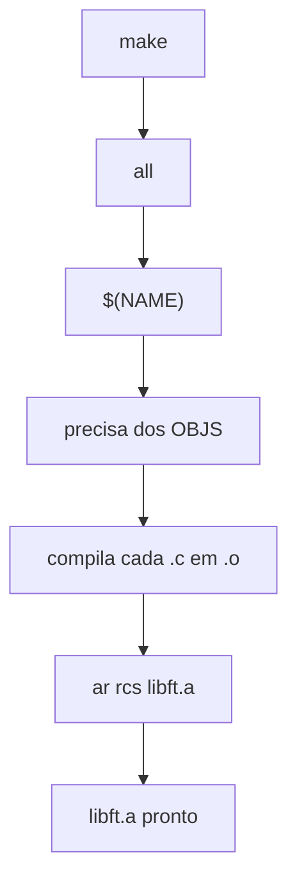

### Pontos de atencao

Comandos precisam comecar com TAB real, nao espaco.

Se faltar TAB, aparece erro tipo `missing separator`.

Nao use `gcc` se o enunciado pede `cc`.

Colocar `libft.h` na dependencia faz recompilar qdo o header muda.

`.PHONY` evita conflito com arquivos chamados `clean`, `fclean`, `all` ou `re`.

### Testes

```bash
make
make
make clean
make fclean
make re
```

No segundo `make`, se nada mudou, ele nao deve recompilar tudo.

## `ft_isalpha.c`

`ft_isalpha` verifica se o caractere recebido eh uma letra.

Retorna `1` se for letra maiuscula ou minuscula, e `0` se nao for.

### Conceito

A funcao trabalha com a tabela ASCII.

Em C, caracteres tb sao numeros, entao da pra comparar `'A'`, `'Z'`, `'a'` e `'z'` direto.

### Como surgiu / pq existe

Essa funcao vem da libc original, usada pra testar se um caractere eh alfabetico.

A versao da Libft recria esse comportamento, mas a 42 pede retorno exato: `1` ou `0`.

### Logica

`int c` recebe o caractere como inteiro, igual na libc.

`c >= 'A' && c <= 'Z'` testa se eh letra maiuscula.

`c >= 'a' && c <= 'z'` testa se eh letra minuscula.

`||` significa OU, entao basta estar em um dos dois intervalos.

Se cair em algum intervalo, retorna `1`.

Se nao cair, retorna `0`.

Nao da pra escrever `'A' <= c <= 'Z'` em C, pq isso nao funciona como na matematica.

### Fluxo

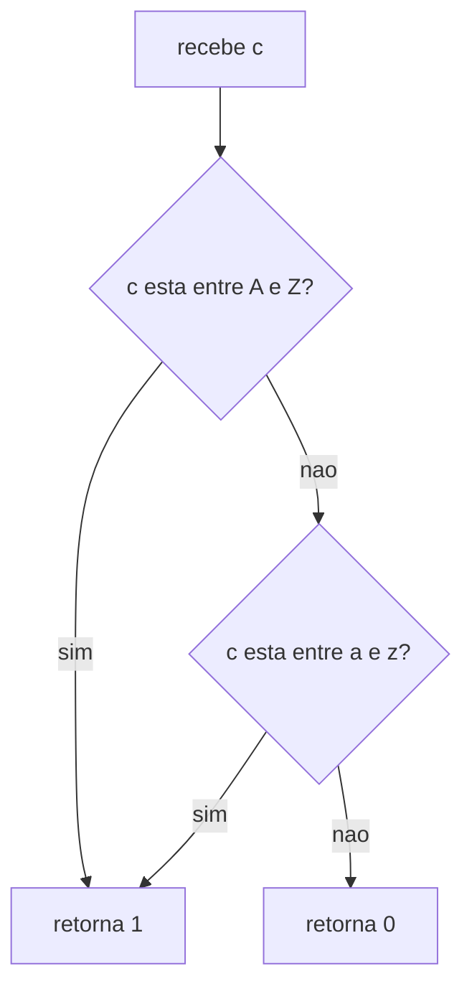

### Pontos de atencao

Usar `&&` pra testar intervalo.

Usar `||` pra juntar maiuscula ou minuscula.

Nao usar `|`, pq isso eh operador bit a bit.

Retornar exatamente `1` ou `0`.

Incluir `libft.h` pra manter o prototipo certo.

### Testes

Testar letras maiusculas, minusculas, numeros, simbolos e limites.

```bash
cc -Wall -Wextra -Werror ft_isalpha.c main.c -o test
./test
```

Exemplos: `'A'`, `'z'`, `'g'` devem retornar `1`; `'5'`, `'!'`, `0` e `127` devem retornar `0`.

## `ft_isdigit.c`

`ft_isdigit` verifica se o caractere recebido eh um numero de `0` a `9`.

Retorna `1` se for digito decimal, e `0` se nao for.

### Conceito

A funcao usa a tabela ASCII.

Em ASCII, os caracteres `'0'` ate `'9'` ficam em sequencia.

Por isso da pra testar se `c` esta dentro desse intervalo.

### Como surgiu / pq existe

Essa funcao vem da libc original e serve pra identificar se um caractere eh um digito.

Na Libft, a gente recria esse comportamento, mas seguindo a regra da 42: retornar exatamente `1` ou `0`.

### Logica

`int c` recebe o caractere como inteiro, igual na libc.

`c >= '0' && c <= '9'` testa se `c` esta entre os digitos.

`&&` significa E, entao as duas condicoes precisam ser verdadeiras.

Se estiver entre `'0'` e `'9'`, retorna `1`.

Se nao estiver, retorna `0`.

Usar `'0'` e `'9'` eh melhor q usar `48` e `57`, pq fica mais legivel.

### Fluxo

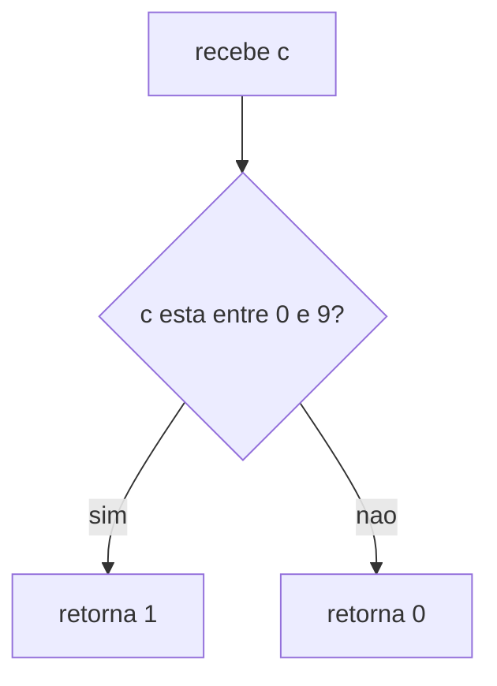

### Pontos de atencao

Nao confundir `'0'` com `0`.

`'0'` eh o caractere zero, valor ASCII 48.

`0` eh o byte nulo, usado como fim de string.

Nao escrever `c >= 0 && c <= 9`, pq isso testa caracteres de controle, nao numeros visuais.

Nao escrever `0 <= c <= 9`, pq em C nao funciona como na matematica.

Retornar exatamente `1` ou `0`.

### Testes

Testar inicio, fim, meio do intervalo e caracteres fora dele.

```bash
cc -Wall -Wextra -Werror ft_isdigit.c main.c -o test
./test
```

Exemplos: `'0'`, `'5'`, `'9'` devem retornar `1`; `'a'`, `'Z'`, `' '`, `0` devem retornar `0`.

## `ft_isalnum.c`

`ft_isalnum` verifica se o caractere recebido eh letra ou numero.

Retorna `1` se for letra ou digito, e `0` se nao for.

### Conceito

`alnum` vem de `alpha` + `numeric`.

Ou seja, a funcao junta a ideia de `ft_isalpha` com `ft_isdigit`.

### Como surgiu / pq existe

Essa funcao vem da libc e serve pra testar se um caractere eh alfanumerico.

Na Libft, a ideia eh recriar esse comportamento reaproveitando funcoes q ja existem.

### Logica

`ft_isalpha(c)` testa se `c` eh letra.

`ft_isdigit(c)` testa se `c` eh numero de `0` a `9`.

`||` significa OU, entao basta uma das duas funcoes retornar `1`.

Se for letra ou digito, retorna `1`.

Se nao for nenhum dos dois, retorna `0`.

O `||` tem curto-circuito: se `ft_isalpha(c)` ja for verdadeiro, o C nem precisa chamar `ft_isdigit(c)`.

### Fluxo

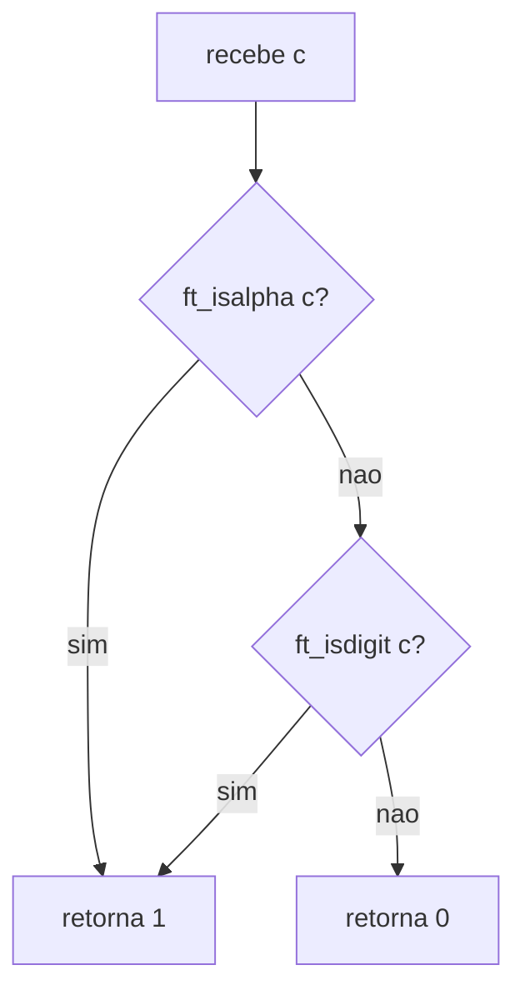

### Pontos de atencao

Reaproveitar `ft_isalpha` e `ft_isdigit` deixa o codigo mais limpo.

Usar `||`, nao `|`.

Nao retornar `ft_isalpha(c) + ft_isdigit(c)`, pq a ideia aqui eh logica, nao soma.

Incluir `libft.h` pra enxergar os prototipos.

Garantir q `ft_isalpha` e `ft_isdigit` estejam funcionando antes.

### Testes

Testar letras, numeros, simbolos, espaco e valores fora do ASCII visivel.

```bash
cc -Wall -Wextra -Werror ft_isalnum.c ft_isalpha.c ft_isdigit.c main.c -o test
./test
```

Exemplos: `'A'`, `'z'`, `'5'` devem retornar `1`; `'!'`, `' '`, `0` e `127` devem retornar `0`.

## `ft_isascii.c`

`ft_isascii` verifica se o valor recebido faz parte da tabela ASCII padrao.

Retorna `1` se estiver entre `0` e `127`, e `0` se nao estiver.

### Conceito

ASCII eh uma tabela q transforma caracteres em numeros.

Ela tem 128 valores, indo de `0` ate `127`.

Isso inclui letras, numeros, simbolos, espaco e caracteres de controle.

### Como surgiu / pq existe

ASCII surgiu pra padronizar como computadores representam texto.

Antes disso, sistemas diferentes podiam usar codigos diferentes pros mesmos caracteres.

Na Libft, essa funcao serve pra dizer se um valor pertence ao ASCII puro.

### Logica

`int c` recebe o valor a ser testado.

`c >= 0 && c <= 127` verifica se `c` esta dentro da tabela ASCII.

`&&` significa E, entao as duas condicoes precisam ser verdadeiras.

Se `c` estiver entre `0` e `127`, retorna `1`.

Se for menor q `0` ou maior q `127`, retorna `0`.

ASCII nao eh a mesma coisa q caractere imprimivel.

### Fluxo

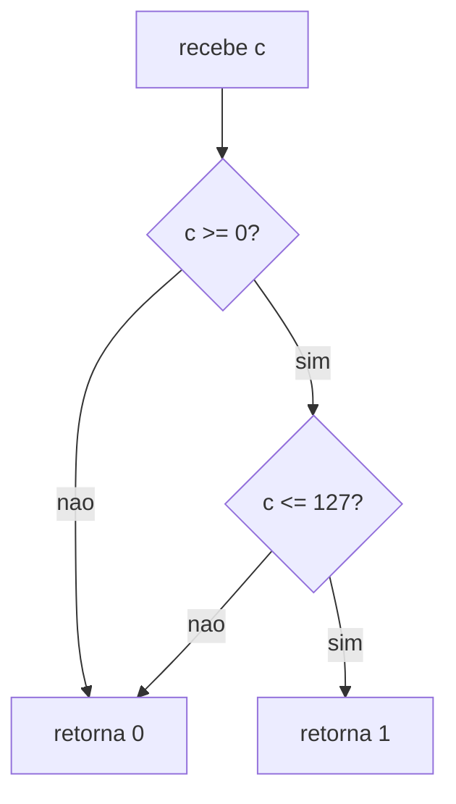

### Pontos de atencao

ASCII vai de `0` a `127`, nao de `1` a `128`.

Nao confundir com `ft_isprint`, q vai de `32` a `126`.

`0` eh valido em ASCII, mesmo sendo caractere nulo.

`127` tb eh valido, mesmo sendo DEL.

Valores negativos nao sao ASCII.

Retornar exatamente `1` ou `0`.

### Curiosidade
Pq usar int e nao char? Prototipo pede, e tambem Pq o char e' pode ser char de -128 a 128 se signed e de 0 a 255 de for unsigned. EOF e' uma constante definida por -1. se usarmos char unsigned, o -1 vira 255 e haveria conflito con o caracter -1 (Preto 0xFF). usar int cobre essa excecao. Tabela estendida (negativos ou > 127), cobrem outros caracteres como trema, letra eh, fracao, etc.

### Testes

Testar os limites e valores fora deles.

```bash
cc -Wall -Wextra -Werror ft_isascii.c main.c -o test
./test
```

Exemplos: `0`, `65`, `127` e `'A'` devem retornar `1`; `-1`, `128` e `255` devem retornar `0`.


## `ft_strlen.c`

`ft_strlen` conta qtos caracteres uma string tem.

Ela retorna o tamanho da string sem contar o `\0` final.

### Conceito

String em C eh um array de `char` q termina com `\0`.

O `\0` marca onde a string acaba.

`size_t` eh o tipo usado pra representar tamanhos em C.

### Como surgiu / pq existe

Essa funcao vem da libc e eh uma das bases pra trabalhar com strings.

Como C nao guarda o tamanho da string automaticamente, a funcao precisa contar ate achar o `\0`.

### Logica

`const char *s` recebe a string sem permitir modificacao.

`size_t i` eh o contador.

`i = 0` comeca no primeiro caractere.

`while (s[i])` continua enquanto o caractere nao for `\0`.

`i++` avanca para o proximo caractere.

Qdo encontra `\0`, o loop para e retorna `i`.

Nao conta o `\0`, pq ele so marca o fim da string.

### Fluxo

```mermaid
flowchart TD
	A[recebe string s] --> B[i = 0]
	B --> C{s[i] eh diferente de zero?}
	C -- sim --> D[i++]
	D --> C
	C -- nao --> E[retorna i]
```

### Pontos de atencao

Usar `size_t`, nao `int`.

Nao contar o `\0`.

Nao esquecer o `i++`, senao vira loop infinito.

`while (s[i])` para pq `\0` vale zero.

Nao precisa tratar `NULL`, pq `strlen` original tb nao trata.

Na Norminette, declare `i` primeiro e atribua depois.

### Testes

Testar string vazia, string com 1 char e strings maiores.

```bash
cc -Wall -Wextra -Werror ft_strlen.c main.c -o test
./test
```

Exemplos: `""` deve retornar `0`; `"a"` deve retornar `1`; `"hello"` deve retornar `5`.


## `ft_memset.c`

`ft_memset` preenche um bloco de memoria com o mesmo byte varias vezes.

Ela escreve o valor `c` em `len` bytes e retorna o ponteiro original `b`.

### Conceito

Memoria em C pode ser tratada byte por byte.

`void *` eh um ponteiro generico, entao pode apontar pra qualquer tipo.

Pra mexer em bytes, a gente converte pra `unsigned char *`.

### Como surgiu / pq existe

Essa funcao vem da libc e serve pra inicializar ou sobrescrever blocos de memoria.

Eh muito usada pra zerar buffers, preencher arrays ou preparar memoria antes de usar.

### Logica

`void *b` eh o bloco de memoria q vai ser preenchido.

`int c` eh o valor recebido, mas so 1 byte dele importa.

`size_t len` diz qtos bytes serao alterados.

`ptr = (unsigned char *)b` permite acessar a memoria byte a byte.

`ptr[i] = (unsigned char)c` escreve o byte na posicao atual.

O loop roda enquanto `i < len`.

No final, retorna `b`, igual a libc.

### Fluxo

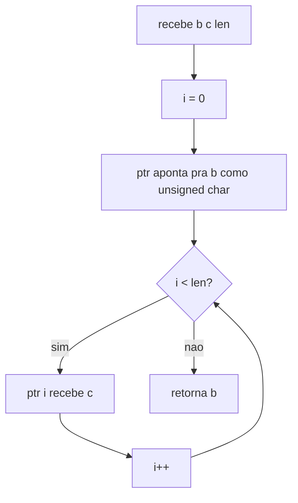

### Pontos de atencao

Nao da pra fazer `b[i]` direto, pq `void *` nao tem tamanho definido.

Usar `unsigned char *` pra manipular memoria byte a byte.

Fazer cast de `c` pra `unsigned char`, pq `c` chega como `int`.

Nao tratar `NULL`, pq `memset` original tb nao trata.

Se `len = 0`, nao muda nada e retorna `b`.

Nao confundir com `ft_bzero`, q so preenche com zero.

### Testes

Testar preenchendo com letra, com zero e com `len = 0`.

### Curiosidade
Pq fazer cast com unsigned char *? Nao podiamos usar im int *?
resposta principal e' granulariadade, pq o memset "seta" o endereco, byte a byte e sizeof(int) = 4.
Mas por outro lado temos essa curiosidade:
```
A CPU lê a memória RAM de forma mais eficiente quando os dados estão alinhados com o tamanho da palavra do sistema. Um ponteiro do tipo int * geralmente exige que o endereço de memória seja múltiplo de 4.

Se o usuário passar para o seu memset um endereço que comece em um byte ímpar (como 0x003 vindo de um substring ou um struct desalinhado) e você tentar fazer um cast para int * e manipular a memória nessa posição, algumas arquiteturas de processador (como ARM) vão disparar uma exceção de hardware imediatamente, resultando em um Bus Error. O tipo unsigned char * tem alinhamento de 1 byte, o que significa que ele pode apontar com segurança para qualquer endereço da memória sem nunca quebrar o processador.
```

```bash
cc -Wall -Wextra -Werror ft_memset.c main.c -o test
./test
```

Exemplos: preencher `buf` com `'A'`, comparar com `memset`, e testar se os bytes viraram o valor esperado.

## `ft_bzero.c`

`ft_bzero` zera um bloco de memoria.

Ela preenche `n` bytes com `0` a partir do ponteiro `s`.

### Conceito

`bzero` eh basicamente um `memset` especifico pra zero.

Em vez de preencher com qualquer valor, ela sempre coloca byte `0`.

Serve pra limpar memoria, buffers ou arrays antes de usar.

### Como surgiu / pq existe

`bzero` veio da BSD libc e eh uma funcao antiga.

Hoje ela eh considerada meio obsoleta, pq da pra fazer a mesma coisa com `memset(s, 0, n)`.

Na Libft, ela aparece pq faz parte das funcoes q a 42 pede pra recriar.

### Logica

`s` eh o bloco de memoria q vai ser zerado.

`n` eh a qtd de bytes q serao alterados.

Como `ft_memset` ja preenche memoria com um byte especifico, basta chamar ela com `0`.

`ft_memset(s, 0, n)` escreve zero nos primeiros `n` bytes.

A funcao nao retorna nada, pq o prototipo eh `void`.

### Fluxo

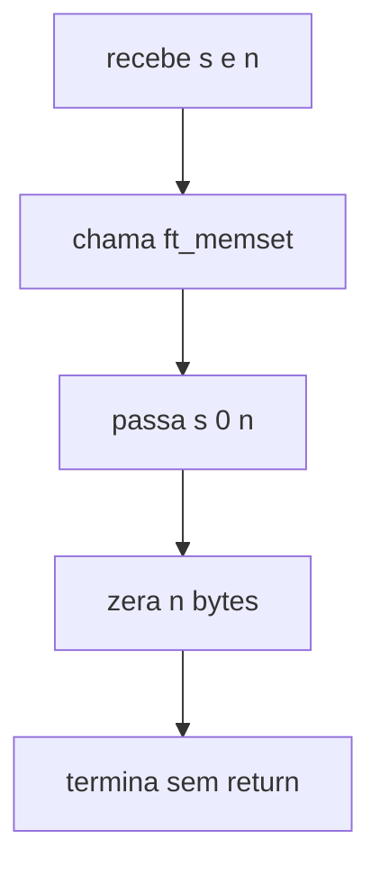

### Pontos de atencao

Nao retornar nada, pq a funcao eh `void`.

Nao confundir a ordem: `bzero(s, n)` tem so 2 parametros.

`memset(s, 0, n)` tem 3 parametros.

Reaproveitar `ft_memset` evita repetir loop.

Nao precisa tratar `NULL`, pq a original tb nao trata.

Se `n = 0`, nada muda.

### Testes

Testar zerando parte de um buffer e vendo se o resto ficou igual.

```bash
cc -Wall -Wextra -Werror ft_bzero.c ft_memset.c main.c -o test
./test
```

Exemplo: buffer com `10` chars `X`, chamar `ft_bzero(buf, 5)` e conferir se so os 5 primeiros viraram `0`.


## `ft_memcpy.c`

`ft_memcpy` copia `n` bytes de um bloco de memoria pra outro.

Ela copia de `src` pra `dst` e retorna o ponteiro original `dst`.

### Conceito

`memcpy` trabalha com memoria bruta, nao com string.

Por isso ela copia bytes, incluindo `\0`, se ele estiver dentro dos `n` bytes.

Como recebe `void *`, precisa converter pra `unsigned char *` pra acessar byte por byte.

### Como surgiu / pq existe

Essa funcao vem da libc e existe pra copiar blocos de memoria de forma direta.

Ela eh usada qdo vc sabe exatamente qtos bytes quer copiar.

Mas ela nao foi feita pra lidar com sobreposicao de memoria.

### Logica

`dst` eh o destino, onde os bytes serao escritos.

`src` eh a origem, de onde os bytes serao lidos.

`n` eh a qtd de bytes copiados.

`d = (unsigned char *)dst` permite escrever byte a byte.

`s = (const unsigned char *)src` permite ler byte a byte sem alterar a origem.

`d[i] = s[i]` copia cada byte da origem pro destino.

Se `dst` e `src` forem `NULL`, retorna `dst` sem mexer em nada.

### Curiosidade:
```
if (!dst && !src)
	return (dst);
```
trata o caso que as duas entradas sao nulas e retorna nulo, mas nao trato diretamente o caso
se um ou o outro forem nulos, pq o memcpy da libc nao trata e da erro de segfail.

### Fluxo

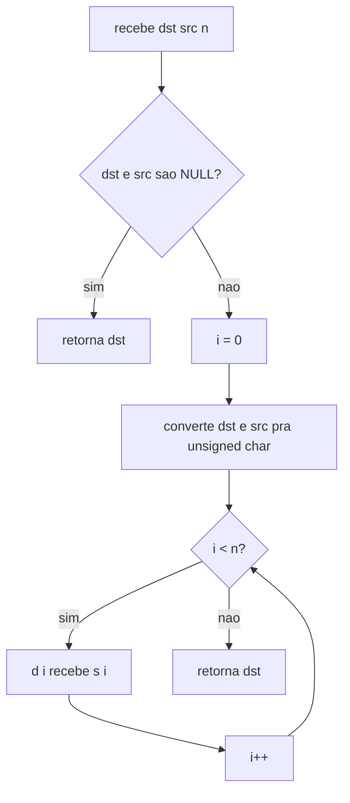

### Pontos de atencao

A ordem eh `dst, src, n`, igual ideia de `dst = src`.

Nao usar `memcpy` se as regioes de memoria se sobrepoem.

Pra sobreposicao, use `memmove`.

Nao da pra indexar `void *` direto.

Manter `const` no ponteiro da origem.

Nao trocar `if (!dst && !src)` por `if (!dst || !src)`.

Se `n = 0`, nao copia nada e retorna `dst`.

### Testes

Testar copia normal, copia com `n = 0` e comparar com `memcpy`.

```bash
cc -Wall -Wextra -Werror ft_memcpy.c main.c -o test
./test
```

Exemplos: copiar `"hello"` com `n = 6`, copiar array de `int` como bytes e testar `ft_memcpy(NULL, NULL, 10)`.


## `ft_memmove.c`

`ft_memmove` copia `len` bytes de `src` pra `dst`.

A diferenca pro `memcpy` eh q ela funciona mesmo qdo as regioes de memoria se sobrepoem.

### Conceito

Sobreposicao acontece qdo `src` e `dst` dividem parte da mesma memoria.

Se copiar na direcao errada, vc pode sobrescrever um byte antes de ler ele.

Por isso `memmove` escolhe se copia do comeco ou do fim.

### Como surgiu / pq existe

`memcpy` eh rapido, mas nao protege contra overlap.

`memmove` existe pra copiar memoria com seguranca qdo origem e destino podem se cruzar.

A ideia eh agir como se copiasse primeiro pra um buffer temporario.

### Logica

`dst` eh onde os bytes serao escritos.

`src` eh de onde os bytes serao lidos.

`len` eh a qtd de bytes copiados.

Se `dst` e `src` forem `NULL`, retorna `dst`.

Converte `dst` e `src` pra `unsigned char *` pra mexer byte a byte.

Se `d < s`, copia do comeco pro fim.

Se `d >= s`, copia do fim pro comeco.

Isso evita sobrescrever bytes da origem antes de ler.

### Fluxo

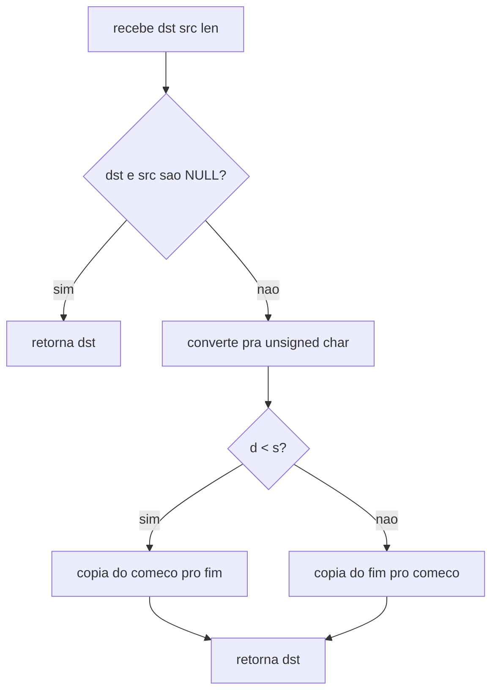

### Pontos de atencao

Nao escrever igual `memcpy`, pq vai falhar com overlap.

Usar `unsigned char *` pra copiar byte por byte.

Nao usar `while (i >= 0)` com `size_t`, pq ele nunca fica negativo.

No loop reverso, usar `i = len` e decrementar antes de acessar.

Nao trocar `if (!dst && !src)` por `if (!dst || !src)`.

A ordem dos parametros eh `dst, src, len`.


### Curiosidades
Poderiamos calcular o se realmente existe overlap e memoria, usando src+len ou dst+len
mas usando esse atalho eficiente de  d < s, ja tratamos os casos possiveis ja que se d esta
antes de , nao sobrescreve s antes e o caso inverso do do d estar apos o s.

### Testes

Testar sem overlap, com `dst > src`, com `dst < src`, `len = 0` e `NULL + NULL`.

```bash
cc -Wall -Wextra -Werror ft_memmove.c main.c -o test
./test
```

Exemplos: `ft_memmove(str + 2, str, 4)` em `"abcdef"` deve gerar `"ababcd"`.


## `ft_strlcpy.c`

`ft_strlcpy` copia uma string pra `dst` respeitando o tamanho do buffer.

Ela copia no maximo `dstsize - 1`, fecha com `\0` e retorna o tamanho de `src`.

### Conceito

String em C precisa terminar com `\0`.

`strlcpy` eh uma copia mais segura pq tenta evitar overflow.

Ela usa `dstsize` como tamanho total do buffer, incluindo espaco pro `\0`.

### Como surgiu / pq existe

`strcpy` pode estourar o buffer pq copia sem saber o tamanho do destino.

`strncpy` limita a copia, mas pode nao colocar `\0`.

`strlcpy` surgiu pra copiar com limite, garantir `\0` e ainda avisar se truncou.

### Logica

`dst` eh o buffer de destino.

`src` eh a string de origem.

`dstsize` eh o tamanho total de `dst`.

Se `dstsize == 0`, nao escreve nada e retorna `ft_strlen(src)`.

O loop copia enquanto `src[i]` existe e `i < dstsize - 1`.

`dstsize - 1` deixa uma posicao livre pro `\0`.

Depois do loop, faz `dst[i] = '\0'`.

O retorno eh sempre `ft_strlen(src)`, nao a qtd copiada.

### Fluxo

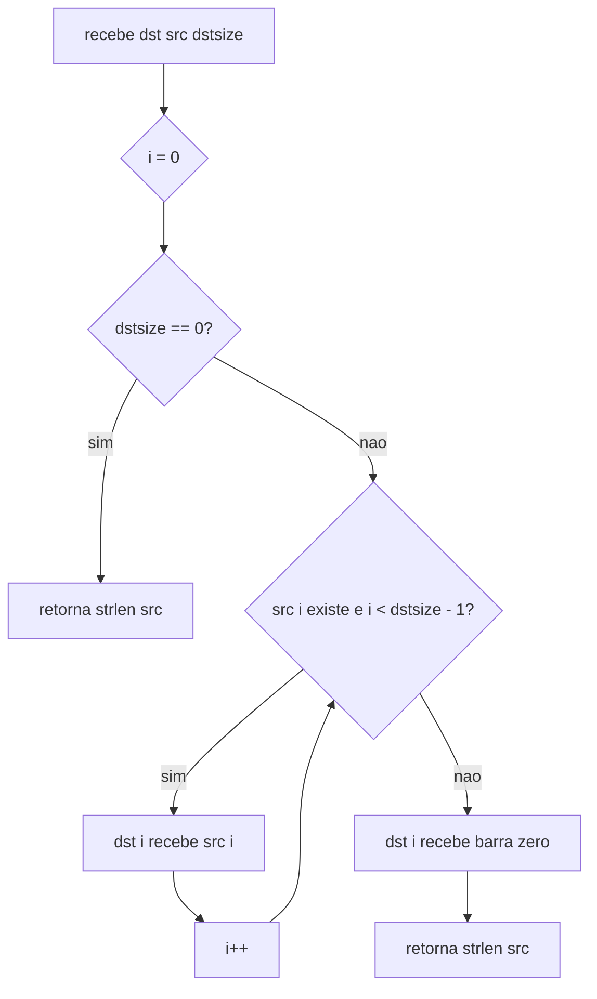

### Pontos de atencao

Retorno eh o tamanho de `src`, nao qtos chars foram copiados.

Se retorno `>= dstsize`, a string foi truncada.

Precisa tratar `dstsize == 0` pra evitar underflow em `size_t`.

Nao esquecer o `\0` final.

Nao usar `i <= dstsize - 1`, pq pode nao deixar espaco pro `\0`.

Nao precisa tratar `src == NULL`, pq a original tb nao trata.

### Testes

Testar buffer pequeno, buffer grande, `dstsize = 1` e `dstsize = 0`.

```bash
cc -Wall -Wextra -Werror ft_strlcpy.c ft_strlen.c main.c -o test
./test
```

Exemplos: copiar `"Hello World"` em buffer 5 deve gerar `"Hell"` e retornar `11`.


## `ft_strlcat.c`

`ft_strlcat` adiciona `src` no final de `dst`, respeitando o tamanho total do buffer.

Ela sempre tenta fechar com `\0` e retorna o tamanho q a string teria se coubesse.

### Conceito

`strlcat` eh uma concatenacao segura.

Ela nao recebe so qtos chars copiar, mas sim o tamanho total do buffer `dst`.

Isso ajuda a evitar overflow e permite saber se a string foi cortada.

### Como surgiu / pq existe

`strcat` concatena sem saber o tamanho do destino e pode estourar memoria.

`strncat` limita a origem, mas nao controla bem o tamanho total do buffer.

`strlcat` surgiu pra concatenar com limite, fechar com `\0` e detectar truncamento.

### Logica

`dst` ja tem uma string dentro.

`src` eh a string q vai ser adicionada no fim.

`dstsize` eh o tamanho total do buffer `dst`.

`dst_len = ft_strlen(dst)` acha onde `dst` termina.

`src_len = ft_strlen(src)` calcula o tamanho da origem.

Se `dstsize <= dst_len`, nao tem espaco seguro e retorna `dstsize + src_len`.

O loop copia `src[i]` pra `dst[dst_len + i]`.

A condicao `dst_len + i < dstsize - 1` deixa espaco pro `\0`.

No final, fecha com `\0` e retorna `dst_len + src_len`.

### Fluxo

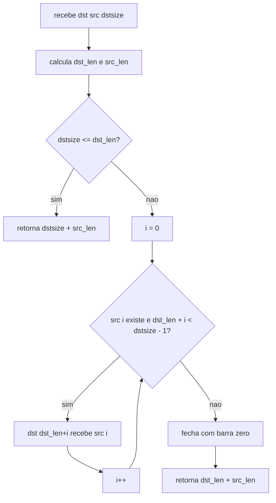

### Pontos de atencao

Retorno nao eh qtos chars foram copiados.

Retorno eh o tamanho q a string tentaria ter.

Se retorno `>= dstsize`, truncou.

Nao esquecer o caso `dstsize <= dst_len`.

Nao esquecer de somar `dst_len + i`, senao vc sobrescreve o comeco de `dst`.

Nao esquecer o `\0` final.

Nao precisa tratar `NULL`, pq a original tb nao trata.

### Testes

Testar quando cabe tudo, quando trunca e quando `dstsize <= dst_len`.

```bash
cc -Wall -Wextra -Werror ft_strlcat.c ft_strlen.c main.c -o test
./test
```

Exemplos: `"Hi "` + `"World"` com buffer 20 deve virar `"Hi World"` e retornar `8`.


## `ft_toupper.c`

`ft_toupper` transforma letra minuscula em maiuscula.

Se nao for minuscula, retorna o proprio caractere sem mudar.

### Conceito

A funcao usa a tabela ASCII.

Em ASCII, letras minusculas e maiusculas ficam separadas por `32`.

Exemplo: `'a'` vale `97` e `'A'` vale `65`.

### Como surgiu / pq existe

Essa funcao vem da libc e serve pra normalizar caracteres.

Ela eh util qdo vc quer comparar ou tratar texto sem diferenciar minuscula de maiuscula.

Na Libft, a gente recria o comportamento da funcao original.

### Logica

`int c` recebe o caractere como inteiro, igual na libc.

`c >= 'a' && c <= 'z'` testa se eh letra minuscula.

Se for minuscula, retorna `c - 32`.

Subtrair `32` leva a letra pro equivalente maiusculo.

Se nao for minuscula, retorna `c` sem alterar.

Nao usa `ft_isalpha`, pq maiusculas nao devem ser convertidas.

### Fluxo

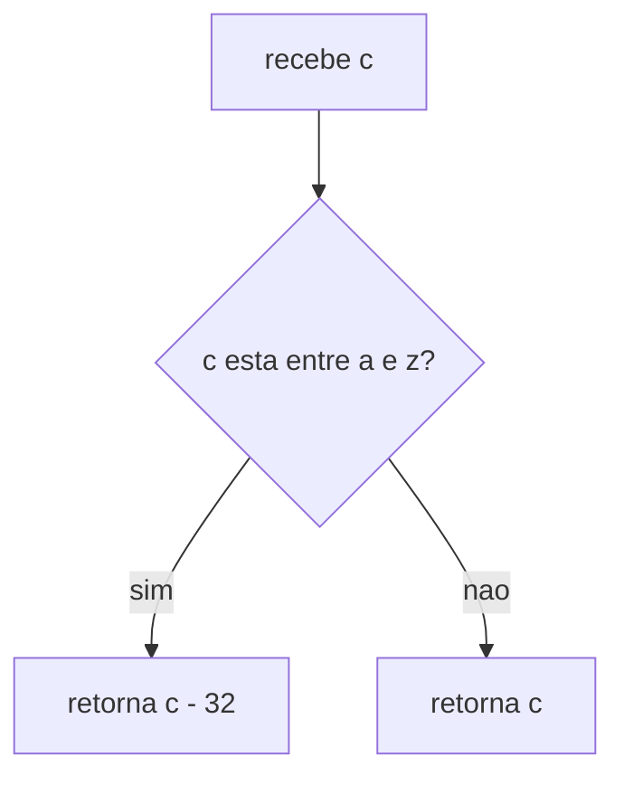

### Pontos de atencao

So converter se estiver entre `'a'` e `'z'`.

Nao somar `32`, pq isso eh logica do `tolower`.

Nao aplicar em maiusculas, senao `'A' - 32` vira outro caractere.

Nao esquecer o `return (c)` no final.

O retorno eh `int`, igual a libc, por compatibilidade com `EOF`.

### Testes

Testar minusculas, maiusculas, numeros, simbolos e espaco.

```bash
cc -Wall -Wextra -Werror ft_toupper.c main.c -o test
./test
```

Exemplos: `'a'` vira `'A'`, `'z'` vira `'Z'`; `'A'`, `'5'`, `'!'` e `' '` ficam iguais.


````md
## `ft_tolower.c`

`ft_tolower` transforma letra maiuscula em minuscula.

Se nao for maiuscula, retorna o proprio caractere sem mudar.

### Conceito

A funcao usa a tabela ASCII.

Em ASCII, letras maiusculas e minusculas ficam separadas por `32`.

Exemplo: `'A'` vale `65` e `'a'` vale `97`.

### Como surgiu / pq existe

Essa funcao vem da libc e serve pra normalizar caracteres.

Ela eh util qdo vc quer comparar ou tratar texto sem diferenciar maiuscula de minuscula.

Na Libft, ela eh o espelho da `ft_toupper`.

### Logica

`int c` recebe o caractere como inteiro, igual na libc.

`c >= 'A' && c <= 'Z'` testa se eh letra maiuscula.

Se for maiuscula, retorna `c + 32`.

Somar `32` leva a letra pro equivalente minusculo.

Se nao for maiuscula, retorna `c` sem alterar.

Nao usa `ft_isalpha`, pq minusculas nao devem ser convertidas.

### Fluxo

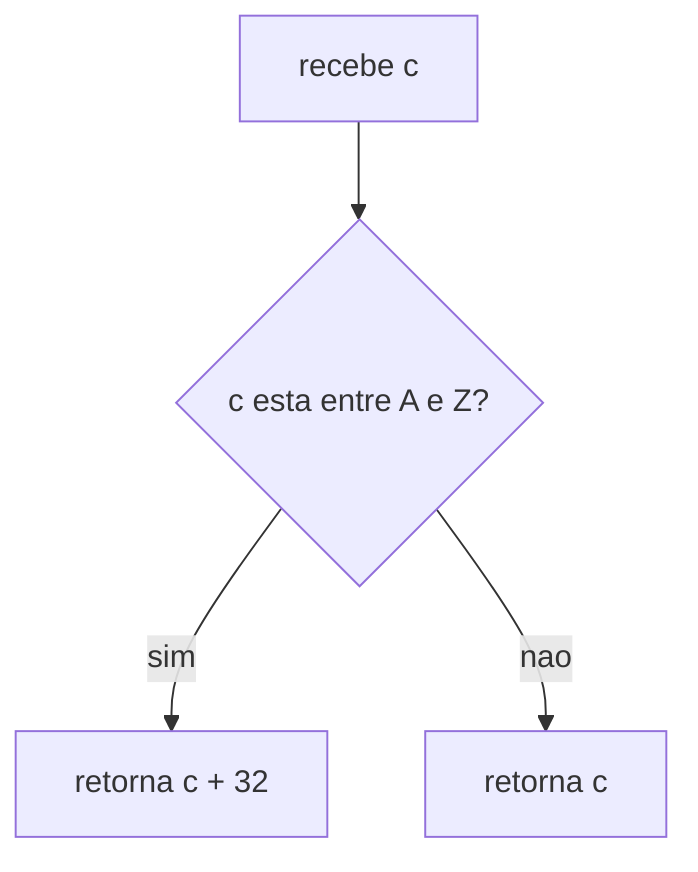

### Pontos de atencao

So converter se estiver entre `'A'` e `'Z'`.

Nao subtrair `32`, pq isso eh logica do `toupper`.

Nao aplicar em minusculas, senao `'a' + 32` vira fora do ASCII comum.

Nao esquecer o `return (c)` no final.

O retorno eh `int`, igual a libc, por compatibilidade com `EOF`.

### Testes

Testar maiusculas, minusculas, numeros, simbolos e espaco.

```bash
cc -Wall -Wextra -Werror ft_tolower.c main.c -o test
./test
```

Exemplos: `'A'` vira `'a'`, `'Z'` vira `'z'`; `'a'`, `'5'`, `'!'` e `' '` ficam iguais.
````


## `ft_tolower.c`

`ft_tolower` transforma letra maiuscula em minuscula.

Se nao for maiuscula, retorna o proprio caractere sem mudar.

### Conceito

A funcao usa a tabela ASCII.

Em ASCII, letras maiusculas e minusculas ficam separadas por `32`.

Exemplo: `'A'` vale `65` e `'a'` vale `97`.

### Como surgiu / pq existe

Essa funcao vem da libc e serve pra normalizar caracteres.

Ela eh util qdo vc quer comparar ou tratar texto sem diferenciar maiuscula de minuscula.

Na Libft, ela eh o espelho da `ft_toupper`.

### Logica

`int c` recebe o caractere como inteiro, igual na libc.

`c >= 'A' && c <= 'Z'` testa se eh letra maiuscula.

Se for maiuscula, retorna `c + 32`.

Somar `32` leva a letra pro equivalente minusculo.

Se nao for maiuscula, retorna `c` sem alterar.

Nao usa `ft_isalpha`, pq minusculas nao devem ser convertidas.

### Fluxo


### Pontos de atencao

So converter se estiver entre `'A'` e `'Z'`.

Nao subtrair `32`, pq isso eh logica do `toupper`.

Nao aplicar em minusculas, senao `'a' + 32` vira fora do ASCII comum.

Nao esquecer o `return (c)` no final.

O retorno eh `int`, igual a libc, por compatibilidade com `EOF`.

### Testes

Testar maiusculas, minusculas, numeros, simbolos e espaco.

```bash
cc -Wall -Wextra -Werror ft_tolower.c main.c -o test
./test
```

Exemplos: `'A'` vira `'a'`, `'Z'` vira `'z'`; `'a'`, `'5'`, `'!'` e `' '` ficam iguais.


## `ft_strchr.c`

`ft_strchr` procura a primeira vez q um caractere aparece dentro de uma string.

Se achar, retorna um ponteiro pra essa posicao; se nao achar, retorna `NULL`.

### Conceito

String em C eh percorrida caractere por caractere ate o `\0`.

`strchr` nao retorna o indice, retorna o endereco onde encontrou o caractere.

Isso permite continuar usando a string a partir daquele ponto.

### Como surgiu / pq existe

Essa funcao vem da libc e serve pra buscar caracteres dentro de strings.

Ela eh util qdo vc quer encontrar onde algo aparece, tipo espaco, virgula ou fim da string.

Na Libft, a gente recria o mesmo comportamento da original.

### Logica

`s` eh a string onde a busca acontece.

`c` eh o caractere procurado, mas chega como `int`.

Durante o loop, compara `s[i]` com `(char)c`.

Se achar, retorna `(char *)&s[i]`.

O cast pra `char *` eh necessario pq `s` eh `const char *`, mas o retorno da funcao eh `char *`.

Depois do loop, se `c == '\0'`, retorna o endereco do terminador.

Se nao achar nada, retorna `NULL`.

### Fluxo

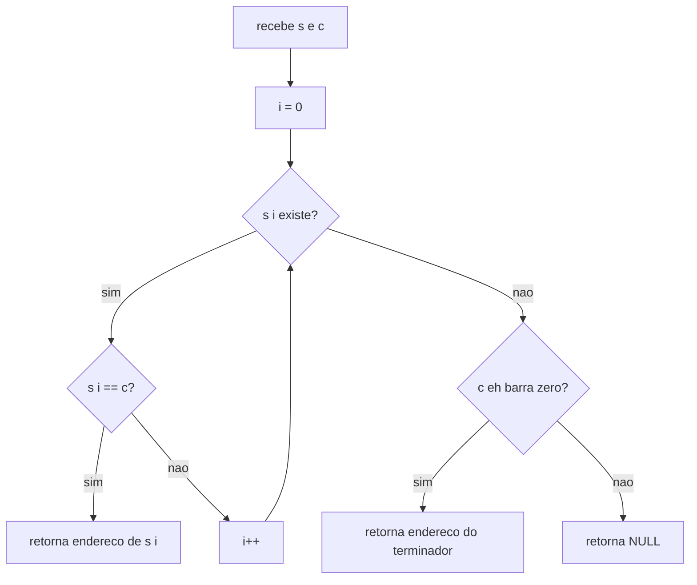

### Pontos de atencao

Precisa tratar o caso `c == '\0'`.

Procurar `\0` deve retornar o ponteiro pro fim da string, nao `NULL`.

Usar `(char)c` na comparacao.

Usar `(char *)&s[i]` no retorno por causa do `const`.

Nao retornar indice, a funcao retorna ponteiro.

Nao precisa tratar `s == NULL`, pq a original tb nao trata.

### Testes

Testar caractere existente, inexistente, string vazia e busca por `\0`.

```bash
cc -Wall -Wextra -Werror ft_strchr.c main.c -o test
./test
```

Exemplos: buscar `'W'` em `"Hello, World!"` deve retornar `"World!"`; buscar `'z'` deve retornar `NULL`; buscar `'\0'` deve retornar o fim da string.


## `ft_strrchr.c`

`ft_strrchr` procura a ultima vez q um caractere aparece dentro de uma string.

Se achar, retorna um ponteiro pra ultima posicao; se nao achar, retorna `NULL`.

### Conceito

Ela eh parecida com `ft_strchr`, mas busca a ultima ocorrencia.

Em vez de parar no primeiro match, ela guarda sempre o ultimo endereco encontrado.

No final, o ultimo valor salvo eh a resposta certa.

### Como surgiu / pq existe

Essa funcao vem da libc e serve pra buscar um caractere de tras pra frente na ideia.

O `r` em `strrchr` vem de `reverse`.

Ela eh util qdo vc quer achar a ultima barra, ultimo ponto, ultima letra, etc.

### Logica

`s` eh a string onde a busca acontece.

`c` eh o caractere procurado, mas chega como `int`.

`last` comeca como `NULL`.

Percorre a string do comeco ao fim.

Se `s[i] == (char)c`, atualiza `last` com o endereco atual.

O loop tb testa o `\0`, pq buscar `'\0'` deve retornar o fim da string.

No final, retorna `last`.

### Fluxo

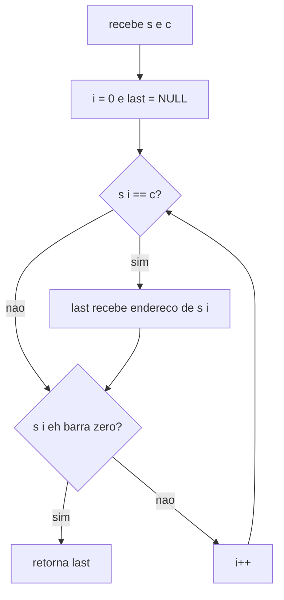

### Pontos de atencao

Precisa testar o `\0` tb.

Por isso `while (s[i])` pode quebrar o caso `c == '\0'`.

A comparacao com `c` deve vir antes do teste de parada.

Usar `(char)c` na comparacao.

Usar `(char *)&s[i]` no retorno por causa do `const`.

Nao retornar indice, retorna ponteiro.

Nao precisa tratar `s == NULL`, pq a original tb nao trata.

### Testes

Testar caractere repetido, inexistente, string vazia e busca por `\0`.

```bash
cc -Wall -Wextra -Werror ft_strrchr.c main.c -o test
./test
```

Exemplos: buscar `'l'` em `"Hello"` deve retornar `"lo"`; buscar `'z'` deve retornar `NULL`; buscar `'\0'` deve retornar o fim da string.


## `ft_strncmp.c`

`ft_strncmp` compara duas strings, mas no maximo ate `n` bytes.

Retorna `0` se forem iguais, negativo se `s1` for menor, e positivo se `s1` for maior.

### Conceito

A comparacao eh feita byte por byte.

A funcao para qdo acha uma diferenca, qdo chega em `n`, ou qdo as duas strings acabam.

O retorno nao precisa ser exatamente `-1` ou `1`, so precisa ter o sinal certo.

### Como surgiu / pq existe

Essa funcao vem da libc e eh uma versao limitada do `strcmp`.

Ela existe pra comparar strings sem precisar ler alem de um limite definido.

Isso ajuda qdo vc quer comparar so uma parte da string.

### Logica

`s1` e `s2` sao as strings comparadas.

`n` eh o maximo de bytes q podem ser comparados.

`i` comeca em `0`.

`while (i < n && (s1[i] || s2[i]))` continua enquanto ainda pode comparar e alguma string ainda tem caractere.

Se `s1[i] != s2[i]`, retorna a diferenca dos dois bytes.

O cast `(unsigned char)` evita erro com chars de valor alto.

Se nao achar diferenca, retorna `0`.

### Fluxo

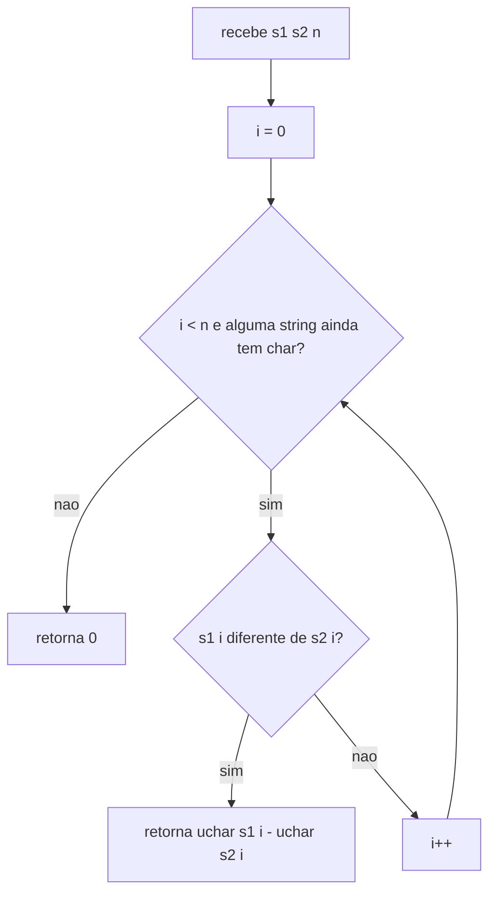

### Pontos de atencao

Se `n = 0`, o loop nao entra e retorna `0`.

Usar `(unsigned char)` na subtracao.

Nao usar `s1[i] && s2[i]`, pq isso para cedo qdo uma string acaba.

Tem q usar `(s1[i] || s2[i])`.

Nao esquecer `i++`.

Nao retornar diferenca fora do loop.

Nao precisa tratar `NULL`, pq a original tb nao trata.

### Testes

Testar strings iguais, diferentes, limite menor q a diferenca e string q acaba antes.

```bash
cc -Wall -Wextra -Werror ft_strncmp.c main.c -o test
./test
```

Exemplos: `"abc"` com `"abc"` retorna `0`; `"abc"` com `"abd"` em `n = 3` retorna negativo; em `n = 2` retorna `0`.


## `ft_memchr.c`

`ft_memchr` procura a primeira ocorrencia de um byte dentro de um bloco de memoria.

Se achar, retorna um ponteiro pra posicao; se nao achar, retorna `NULL`.

### Conceito

`memchr` trabalha com memoria bruta, nao com string.

Ela procura dentro de exatamente `n` bytes.

Por isso ela nao para no `\0`; pra ela, `\0` eh so mais um byte.

### Como surgiu / pq existe

Essa funcao vem da libc e serve pra buscar um byte dentro de buffers.

Ela eh util qdo vc esta lidando com memoria, arquivos, dados binarios ou strings com `\0` no meio.

Diferente de `strchr`, ela nao depende do fim da string.

### Logica

`s` eh o bloco de memoria onde a busca acontece.

`c` eh o byte procurado, mas chega como `int`.

`n` eh a qtd maxima de bytes q serao verificados.

`ptr = (const unsigned char *)s` permite acessar byte por byte.

O loop roda enquanto `i < n`.

Se `ptr[i] == (unsigned char)c`, retorna o endereco daquele byte.

Se terminar o loop sem achar, retorna `NULL`.

### Fluxo

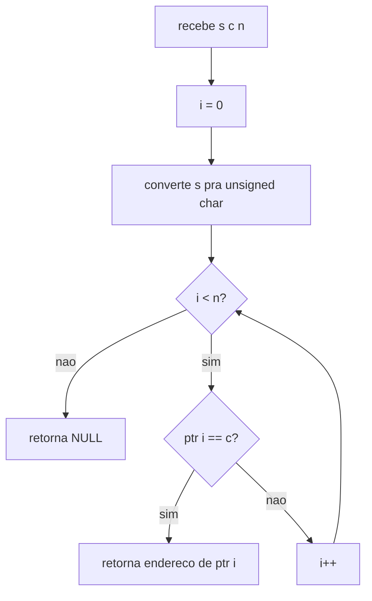

### Pontos de atencao

Nao parar no `\0`.

Nao usar `while (i < n && ptr[i])`, pq isso quebra a funcao.

Usar `(unsigned char)c` na comparacao.

Converter `void *` pra `const unsigned char *`.

Retornar `(void *)&ptr[i]`.

Se `n = 0`, nao procura nada e retorna `NULL`.

Nao precisa tratar `s == NULL`, pq a original tb nao trata.

### Curiosidades
A função `memchr` opera inspecionando a memória byte a byte, o que exige que o parâmetro `int c` passe por um **truncamento de tipo** para `unsigned char`, preservando apenas os seus 8 bits mais baixos (o equivalente matemático a `c & 0xFF` ou `c % 256`, transformando, por exemplo, o inteiro 300 no caractere `,` de valor ASCII 44). Essa assinatura que aceita um `int` em vez de um `char` foi consolidada pelo padrão **ANSI C (C89)** — o comitê que unificou as regras da linguagem nos anos 80 — por dois motivos fundamentais: a compatibilidade retrospectiva com compiladores antigos (onde tipos menores eram promovidos automaticamente para inteiros em chamadas de função) e a conveniência de receber diretamente o retorno de funções de leitura da biblioteca padrão (como `getc`), que usam o tipo `int` para conseguir retornar o valor `-1` (`EOF`) sem conflitar com caracteres válidos.

### Testes

Testar byte existente, inexistente, limite menor q a posicao e `\0` no meio.

```bash
cc -Wall -Wextra -Werror ft_memchr.c main.c -o test
./test
```

Exemplos: buscar `'W'` em `"Hello, World!"` com `n = 13` deve achar; com `n = 5` deve retornar `NULL`.


## `ft_memcmp.c`

`ft_memcmp` compara dois blocos de memoria byte por byte.

Ela compara ate `n` bytes e retorna `0`, negativo ou positivo.

### Conceito

`memcmp` trabalha com memoria bruta, nao com string.

Isso significa q ela nao para no `\0`.

Ela compara exatamente `n` bytes, mesmo q tenha byte zero no meio.

### Como surgiu / pq existe

Essa funcao vem da libc e serve pra comparar buffers de memoria.

Ela eh util qdo vc nao esta lidando so com texto, mas com bytes puros.

Eh tipo um `strncmp`, mas sem regra de parar no fim da string.

### Logica

`s1` e `s2` sao os blocos q serao comparados.

`n` eh a qtd de bytes comparados.

Converte os dois ponteiros pra `const unsigned char *`.

Isso permite acessar byte por byte e manter o `const`.

O loop roda enquanto `i < n`.

Se `p1[i] != p2[i]`, retorna `p1[i] - p2[i]`.

Se terminar sem diferenca, retorna `0`.

### Fluxo

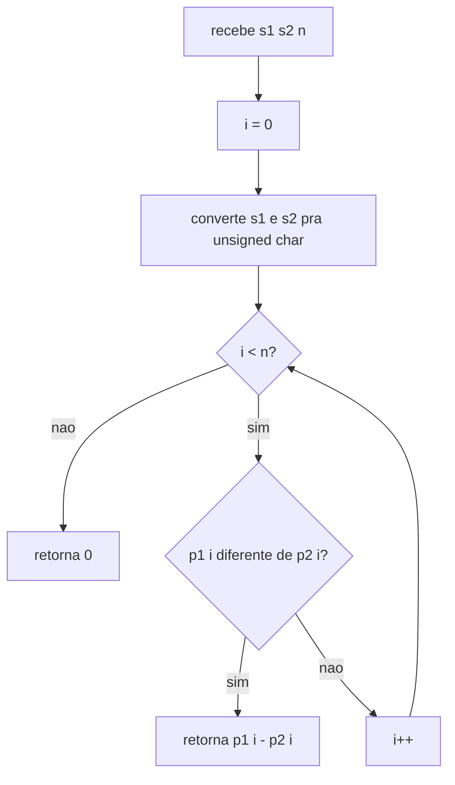

### Pontos de atencao

Nao parar no `\0`.

Nao colocar `(s1[i] || s2[i])` no loop, pq isso vira logica de string.

Usar `unsigned char`, pq bytes acima de `127` precisam ter sinal correto.

Nao indexar `void *` direto.

Nao esquecer o `const` nos ponteiros convertidos.

Se `n = 0`, retorna `0`.

Nao precisa tratar `NULL`, pq a original tb nao trata.

### Testes

Testar blocos iguais, diferentes, `n = 0` e diferenca depois de `\0`.

```bash
cc -Wall -Wextra -Werror ft_memcmp.c main.c -o test
./test
```

Exemplos: `"abc"` com `"abc"` retorna `0`; `"abc"` com `"abd"` retorna negativo; `"abc\0def"` com `"abc\0xyz"` em `n = 7` deve achar diferenca depois do `\0`.


## `ft_strnstr.c`

`ft_strnstr` procura a primeira ocorrencia de `needle` dentro de `haystack`.

Ela so olha ate `len` bytes de `haystack`.

### Conceito

`strnstr` eh uma busca de substring com limite.

Ela tenta achar uma string dentro de outra, mas sem passar do tamanho maximo definido.

A `needle` precisa caber inteira dentro de `len`.

### Como surgiu / pq existe

`strstr` procura na string inteira ate o `\0`.

`strnstr` surgiu pra fazer a mesma busca, mas com limite de leitura.

Isso evita olhar memoria alem do q foi permitido.

### Logica

`haystack` eh onde a busca acontece.

`needle` eh a string q quero encontrar.

`len` eh o maximo de bytes q posso olhar em `haystack`.

Se `needle` estiver vazia, retorna `haystack`.

`needle_len = ft_strlen(needle)` guarda o tamanho da busca.

O loop roda enquanto `haystack[i]` existe e `i + needle_len <= len`.

Essa condicao garante q a `needle` ainda cabe inteira.

`ft_strncmp(&haystack[i], needle, needle_len)` compara o bloco atual.

Se der `0`, encontrou e retorna `&haystack[i]`.

Se nao achar nada, retorna `NULL`.

### Fluxo

```mermaid
flowchart TD
	A[recebe haystack needle len] --> B{needle vazia?}
	B -- sim --> C[retorna haystack]
	B -- nao --> D[calcula needle_len]
	D --> E[i = 0]
	E --> F{haystack i existe e i + needle_len <= len?}
	F -- nao --> G[retorna NULL]
	F -- sim --> H{strncmp do bloco == 0?}
	H -- sim --> I[retorna endereco de haystack i]
	H -- nao --> J[i++]
	J --> F
```

### Pontos de atencao

Nao esquecer o caso `needle` vazia.

Usar `i + needle_len <= len`, nao `< len`.

A `needle` precisa caber inteira dentro do limite.

Nao usar `strcmp`, usar `ft_strncmp`.

Nao esquecer o cast `(char *)` no retorno.

Nao precisa tratar `NULL`, pq a original tb nao trata.

### Testes

Testar match normal, sem match, limite curto, needle vazia e match no limite exato.

```bash
cc -Wall -Wextra -Werror ft_strnstr.c ft_strlen.c ft_strncmp.c main.c -o test
./test
```

Exemplos: `"Hello World"` com `"World"` e `len = 11` acha; com `len = 9` retorna `NULL`.


## `ft_atoi.c`

`ft_atoi` converte uma string em um numero `int`.

Ela ignora espacos no inicio, le um sinal opcional e depois converte os digitos.

### Conceito

`atoi` significa ASCII to integer.

A ideia eh pegar caracteres como `'4'` e `'2'` e transformar no numero `42`.

Pra isso, a funcao le a string da esquerda pra direita e monta o numero em base 10.

### Como surgiu / pq existe

Essa funcao vem da libc e serve pra converter texto em numero.

Ela eh util qdo vc recebe entrada como string, mas precisa usar como `int`.

Na Libft, seguimos o comportamento classico, sem tratar overflow.

### Logica

Primeiro pula whitespaces: espaco, `\t`, `\n`, `\v`, `\f`, `\r`.

Depois verifica se tem sinal `+` ou `-`.

Se for `-`, muda `sign` pra `-1`.

Depois le os digitos enquanto estiver entre `'0'` e `'9'`.

`result = result * 10 + (str[i] - '0')` adiciona o novo digito no final do numero.

Para no primeiro caractere q nao for digito.

No fim, retorna `result * sign`.

### Fluxo

```mermaid
flowchart TD
	A[recebe str] --> B[pula whitespaces]
	B --> C{tem sinal + ou -?}
	C -- sim --> D[ajusta sign e avanca]
	C -- nao --> E[le digitos]
	D --> E
	E --> F{str i eh digito?}
	F -- sim --> G[result = result * 10 + digito]
	G --> H[i++]
	H --> F
	F -- nao --> I[retorna result * sign]
```

### Pontos de atencao

Whitespace nao eh so espaco, tb inclui `\t`, `\n`, `\v`, `\f`, `\r`.

So aceita um sinal.

`+-5` e `--5` retornam `0`.

Usar `'0'` e `'9'`, nao `0` e `9`.

`str[i] - '0'` transforma char digito em numero.

Nao tratar overflow na versao classica da Libft.

### Testes

Testar numeros positivos, negativos, espacos, sinais invalidos e texto depois do numero.

```bash
cc -Wall -Wextra -Werror ft_atoi.c main.c -o test
./test
```

Exemplos: `"42"` retorna `42`; `"   -42abc"` retorna `-42`; `"+-5"`, `"--5"`, `"abc"` e `""` retornam `0`.


## `ft_calloc.c`

`ft_calloc` aloca memoria pra `count` elementos de `size` bytes.

Diferente do `malloc`, ela ja devolve tudo zerado.

### Conceito

`calloc` eh basicamente `malloc + bzero`.

Ela calcula `count * size`, aloca esse total de bytes e depois zera tudo.

Tambem precisa cuidar de overflow nessa multiplicacao.

### Como surgiu / pq existe

`malloc` so aloca memoria, mas o conteudo vem com lixo.

`calloc` surgiu pra alocar memoria ja inicializada com zero.

Isso eh util pra arrays, structs e ponteiros q precisam comecar limpos.

### Logica

`count` eh a qtd de elementos.

`size` eh o tamanho de cada elemento.

Antes de multiplicar, checa se `count * size` vai estourar.

`size != 0 && count > SIZE_MAX / size` detecta overflow.

Se tiver overflow, retorna `NULL`.

Depois faz `malloc(count * size)`.

Se `malloc` falhar, retorna `NULL`.

Se der certo, chama `ft_bzero(ptr, count * size)`.

No final, retorna o ponteiro zerado.

### Fluxo

```mermaid
flowchart TD
	A[recebe count e size] --> B{tem overflow?}
	B -- sim --> C[retorna NULL]
	B -- nao --> D[malloc count * size]
	D --> E{malloc falhou?}
	E -- sim --> C
	E -- nao --> F[zera memoria com ft_bzero]
	F --> G[retorna ptr]
```

### Pontos de atencao

Nao esquecer de checar overflow.

Checar `size != 0` antes de dividir, senao pode dar divisao por zero.

Nao retornar `NULL` so pq `count == 0` ou `size == 0`.

Nesses casos, `malloc(0)` deve gerar ponteiro seguro pra `free`.

Nao esquecer de zerar a memoria.

Precisa de `SIZE_MAX`, entao incluir `<stdint.h>` no `libft.h`.

### Testes

Testar alocacao normal, memoria zerada, `count = 0`, `size = 0` e overflow.

```bash
cc -Wall -Wextra -Werror ft_calloc.c ft_bzero.c ft_memset.c main.c -o test
./test
```

Exemplos: `ft_calloc(5, sizeof(int))` deve criar 5 ints zerados; `ft_calloc(SIZE_MAX, 2)` deve retornar `NULL`.


## `ft_strdup.c`

`ft_strdup` cria uma copia nova de uma string.

Ela aloca memoria, copia o conteudo de `s1` e retorna o novo ponteiro.

### Conceito

`strdup` significa string duplicate.

A copia fica em memoria nova, entao nao eh o mesmo ponteiro da string original.

Quem chama a funcao precisa liberar essa memoria depois com `free`.

### Como surgiu / pq existe

Essa funcao vem da libc e existe pra duplicar strings de forma pratica.

Ela eh util qdo vc precisa guardar uma copia propria de uma string.

Assim, se a original mudar, a copia continua independente.

### Logica

Primeiro calcula `len = ft_strlen(s1)`.

Depois aloca `len + 1` bytes com `malloc`.

O `+1` eh pro `\0` final.

Se `malloc` falhar, retorna `NULL`.

Se der certo, copia os caracteres de `s1` pra `dup`.

Depois coloca `dup[i] = '\0'`.

No final, retorna `dup`.

### Fluxo

```mermaid
flowchart TD
	A[recebe s1] --> B[calcula len com ft_strlen]
	B --> C[malloc len + 1]
	C --> D{malloc falhou?}
	D -- sim --> E[retorna NULL]
	D -- nao --> F[copia chars de s1 pra dup]
	F --> G[coloca barra zero no fim]
	G --> H[retorna dup]
```

### Pontos de atencao

Nao esquecer o `+1` no `malloc`.

Esse `+1` eh o espaco do `\0`.

Nao esquecer de colocar o `\0` no final.

Checar se `malloc` retornou `NULL`.

Nao usar `sizeof(s1)`, pq `s1` eh ponteiro e nao tamanho da string.

A copia precisa ser independente da original.

Nao precisa tratar `s1 == NULL`, pq a original tb nao trata.

### Testes

Testar string normal, string vazia e se a copia eh independente da original.

```bash
cc -Wall -Wextra -Werror ft_strdup.c ft_strlen.c main.c -o test
./test
```

Exemplos: `ft_strdup("Hello")` deve criar outra string `"Hello"` em outro endereco; `ft_strdup("")` deve alocar 1 byte com `\0`.


# Part 2

## `ft_substr.c`

`ft_substr` cria uma nova string pegando um pedaco de `s`.

Ela comeca no indice `start` e copia no maximo `len` caracteres.

### Conceito

Substring eh uma parte de uma string maior.

A funcao nao altera a string original.

Ela cria uma nova string com `malloc`, entao quem chama precisa dar `free`.

### Como surgiu / pq existe

Essa funcao aparece na Parte 2 da Libft pra facilitar manipulacao de strings.

Ela existe pq muitos projetos precisam recortar pedacos de texto.

Exemplo: pegar uma palavra, um trecho, ou uma parte depois de certo indice.

### Logica

Primeiro calcula `s_len = ft_strlen(s)`.

Se `start >= s_len`, nao tem o q copiar e retorna `ft_strdup("")`.

Isso devolve uma string vazia valida e alocada.

Se `len > s_len - start`, ajusta `len` pra nao passar do fim.

Depois aloca `len + 1` bytes.

O `+1` eh pro `\0`.

Copia `s[start + i]` pra `sub[i]`.

No final, fecha com `\0` e retorna `sub`.

### Fluxo

```mermaid
flowchart TD
	A[recebe s start len] --> B[calcula s_len]
	B --> C{start >= s_len?}
	C -- sim --> D[retorna strdup vazio]
	C -- nao --> E{len > s_len - start?}
	E -- sim --> F[ajusta len]
	E -- nao --> G[malloc len + 1]
	F --> G
	G --> H{malloc falhou?}
	H -- sim --> I[retorna NULL]
	H -- nao --> J[copia s start+i pra sub i]
	J --> K[fecha com barra zero]
	K --> L[retorna sub]
```

### Pontos de atencao

Se `start >= s_len`, retorna `""` alocado, nao `NULL`.

Nao esquecer de ajustar `len` qdo passa do fim.

Cuidado com `s_len - start`, pq pode dar underflow se nao tratar `start` antes.

Nao esquecer o `+1` no `malloc`.

Copiar de `s[start + i]`, nao de `s[i]`.

Nao esquecer o `\0` final.

### Testes

Testar substring no meio, no comeco, no fim, `len = 0` e `start` alem do fim.

```bash
cc -Wall -Wextra -Werror ft_substr.c ft_strlen.c ft_strdup.c main.c -o test
./test
```

Exemplos: `"Hello World", 6, 5` retorna `"World"`; `"Hello", 10, 5` retorna `""`; `"Hello", 0, 100` retorna `"Hello"`.

## `ft_strjoin.c`

`ft_strjoin` junta duas strings em uma nova string.

Ela cria `s1 + s2` em memoria nova e retorna esse ponteiro.

### Conceito

Concatenar eh colocar uma string depois da outra.

A funcao nao altera `s1` nem `s2`.

Ela cria uma terceira string com `malloc`, entao quem chama precisa dar `free`.

### Como surgiu / pq existe

Essa funcao aparece na Parte 2 da Libft pra facilitar manipulacao de strings.

Ela existe pq muitos projetos precisam montar textos juntando pedacos.

Exemplo: juntar caminho + nome de arquivo, prefixo + sufixo, mensagem + valor.

### Logica

Calcula o tamanho total com `ft_strlen(s1) + ft_strlen(s2) + 1`.

O `+1` eh pro `\0`.

Aloca `result` com `malloc`.

Se `malloc` falhar, retorna `NULL`.

Primeiro copia `s1` pra `result`.

Depois copia `s2` a partir de `result[i + j]`.

No final, coloca `result[i + j] = '\0'`.

Retorna `result`.

### Fluxo

```mermaid
flowchart TD
	A[recebe s1 e s2] --> B[calcula strlen s1 + strlen s2 + 1]
	B --> C[malloc result]
	C --> D{malloc falhou?}
	D -- sim --> E[retorna NULL]
	D -- nao --> F[copia s1 pra result]
	F --> G[copia s2 depois de s1]
	G --> H[coloca barra zero no fim]
	H --> I[retorna result]
```

### Pontos de atencao

Nao esquecer o `+1` no `malloc`.

Esse `+1` eh o espaco do `\0`.

No segundo loop, usar `result[i + j]`, nao `result[j]`.

Nao esquecer de fechar com `\0`.

Checar se `malloc` falhou.

Nao precisa tratar `s1 == NULL` ou `s2 == NULL`, pq o padrao da Libft geralmente nao trata.

A string retornada precisa ser liberada com `free`.

### Testes

Testar duas strings normais, `s1` vazia, `s2` vazia e as duas vazias.

```bash
cc -Wall -Wextra -Werror ft_strjoin.c ft_strlen.c main.c -o test
./test
```

Exemplos: `"Hello, " + "World!"` deve retornar `"Hello, World!"`; `"" + "World"` retorna `"World"`; `"Hello" + ""` retorna `"Hello"`.

## `ft_strtrim.c`

`ft_strtrim` cria uma nova string removendo chars do `set` do comeco e do fim de `s1`.

Ela nao remove chars do meio, so das pontas.

### Conceito

Trim significa aparar.

A ideia eh cortar caracteres indesejados nas extremidades da string.

O resultado eh uma nova string alocada com `malloc`.

### Como surgiu / pq existe

Essa funcao aparece na Parte 2 da Libft pra facilitar manipulacao de texto.

Ela existe pq eh comum limpar espacos, barras, simbolos ou chars extras antes/depois de uma string.

Exemplo: tirar espacos em volta de `"   Hello   "`.

### Logica

Usa um helper `static is_in_set` pra saber se um char esta no `set`.

`start` comeca em `0` e avanca enquanto `s1[start]` estiver no `set`.

`end` comeca em `ft_strlen(s1)`.

Depois `end` recua enquanto `s1[end - 1]` estiver no `set`.

A condicao `end > start` evita underflow qdo tudo deve ser removido.

Depois aloca `end - start + 1`.

O `+1` eh pro `\0`.

Copia o trecho com `ft_strlcpy(result, s1 + start, end - start + 1)`.

Retorna `result`.

### Fluxo

```mermaid
flowchart TD
	A[recebe s1 e set] --> B[start = 0]
	B --> C{char da esquerda esta no set?}
	C -- sim --> D[start++]
	D --> C
	C -- nao --> E[end = strlen s1]
	E --> F{end > start e char da direita esta no set?}
	F -- sim --> G[end--]
	G --> F
	F -- nao --> H[malloc end - start + 1]
	H --> I{malloc falhou?}
	I -- sim --> J[retorna NULL]
	I -- nao --> K[copia trecho com strlcpy]
	K --> L[retorna result]
```

### Pontos de atencao

Remove so do comeco e do fim, nao do meio.

Helper deve ser `static` pra nao virar funcao publica da lib.

No fim, testar `s1[end - 1]`, nao `s1[end]`.

Nao esquecer `end > start`, pq `size_t` nao fica negativo.

Nao esquecer o `+1` no `malloc`.

Se tudo for removido, deve retornar `""` alocado.

Nao precisa tratar `s1 == NULL` ou `set == NULL`, pq o padrao da Libft geralmente nao trata.

### Testes

Testar espacos, varios chars no set, set vazio, tudo removido e chars no meio.

```bash
cc -Wall -Wextra -Werror ft_strtrim.c ft_strlen.c ft_strlcpy.c main.c -o test
./test
```

Exemplos: `"   Hello   "` com `" "` retorna `"Hello"`; `"abcHelloabc"` com `"abc"` retorna `"Hello"`; `"ab Hello ab"` com `"ab"` retorna `" Hello "`.


## `ft_split.c`

`ft_split` divide uma string em varias strings menores usando um char separador.

Ela retorna um array de strings terminado com `NULL`.

### Conceito

`split` quebra uma string em pedacos.

Cada pedaco vira uma nova string alocada com `malloc`.

O array final eh um `char **`, igual a ideia do `argv`.

### Como surgiu / pq existe

Essa funcao aparece na Parte 2 da Libft pq separar texto eh algo muito comum.

Ela eh util pra quebrar frases, caminhos, comandos ou listas separadas por algum caractere.

Exemplo: dividir `"Hello World 42"` por espaco vira `"Hello"`, `"World"`, `"42"`.

### Logica

Primeiro `count_words` conta qtos pedacos existem.

Depois aloca `(count + 1) * sizeof(char *)`.

O `+1` eh pro `NULL` final.

No loop principal, pula separadores consecutivos.

Qdo acha uma palavra, mede com `word_len`.

Depois copia a palavra com `copy_word`.

Se algum `malloc` falhar, chama `free_all` pra liberar o q ja foi alocado.

No final, coloca `result[w] = NULL`.

### Fluxo

```mermaid
flowchart TD
	A[recebe s e c] --> B[count_words conta palavras]
	B --> C[malloc array count + 1]
	C --> D{malloc falhou?}
	D -- sim --> E[retorna NULL]
	D -- nao --> F[pula separadores]
	F --> G{chegou no fim?}
	G -- sim --> H[coloca NULL final]
	G -- nao --> I[mede palavra com word_len]
	I --> J[copia palavra com copy_word]
	J --> K{copy_word falhou?}
	K -- sim --> L[free_all e retorna NULL]
	K -- nao --> M[avanca i e w]
	M --> F
	H --> N[retorna result]
```

### Pontos de atencao

O array precisa terminar com `NULL`.

Separadores consecutivos nao geram string vazia.

Separador no comeco ou no fim tb nao gera string vazia.

Precisa liberar tudo se um `malloc` interno falhar.

`i` anda na string original.

`w` anda no array de palavras.

Usar helpers `static` ajuda a nao estourar 25 linhas.

Nao precisa tratar `s == NULL`, pq o padrao da Libft geralmente nao trata.

### Testes

Testar frase normal, separadores consecutivos, string vazia, so separadores e sem separador.

```bash
cc -Wall -Wextra -Werror ft_split.c main.c -o test
./test
```

Exemplos: `"Hello World 42"` com `' '` retorna `["Hello", "World", "42", NULL]`; `",,abc,,def,,"` com `','` retorna `["abc", "def", NULL]`; `"aaaa"` com `'a'` retorna `[NULL]`.


## `ft_itoa.c`

`ft_itoa` converte um numero `int` em uma string.

Ela retorna a representacao decimal do numero, incluindo `-` se for negativo.

### Conceito

`itoa` significa integer to ASCII.

A ideia eh transformar um numero como `-42` nos chars `'-'`, `'4'`, `'2'` e `'\0'`.

Como a string eh nova, precisa usar `malloc`.

### Como surgiu / pq existe

Essa funcao aparece na Parte 2 da Libft pra converter numeros em texto.

Ela eh util qdo vc precisa imprimir, salvar ou juntar numeros com strings.

Exemplo: transformar `42` em `"42"` pra usar em uma mensagem.

### Logica

Primeiro conta qtos caracteres a string vai ter com `count_digits`.

Se `n <= 0`, ja conta 1 char pra cobrir `0` ou o sinal `-`.

Aloca `len + 1` bytes.

O `+1` eh pro `\0`.

Copia `n` pra um `long nb`.

Usar `long` evita overflow no caso `INT_MIN`.

Se `nb < 0`, coloca `'-'` no inicio e faz `nb = -nb`.

Se `nb == 0`, coloca `'0'`.

Depois preenche os digitos de tras pra frente usando `nb % 10 + '0'`.

### Fluxo

```mermaid
flowchart TD
	A[recebe n] --> B[count_digits calcula len]
	B --> C[malloc len + 1]
	C --> D{malloc falhou?}
	D -- sim --> E[retorna NULL]
	D -- nao --> F[nb = n em long]
	F --> G[coloca barra zero no fim]
	G --> H{nb < 0?}
	H -- sim --> I[coloca sinal e inverte nb]
	H -- nao --> J{nb == 0?}
	I --> J
	J -- sim --> K[str 0 recebe 0]
	J -- nao --> L{nb > 0?}
	K --> M[retorna str]
	L -- sim --> N[preenche digito de tras pra frente]
	N --> O[nb = nb / 10]
	O --> L
	L -- nao --> M
```

### Pontos de atencao

Nao fazer `n = -n` direto, pq `INT_MIN` quebra.

Usar `long` pra conseguir inverter `-2147483648`.

Nao esquecer o caso `n == 0`.

Nao esquecer de contar o sinal `-`.

Nao esquecer o `+1` do `malloc`.

Preencher de tras pra frente facilita pq `nb % 10` pega o ultimo digito.

Somar `'0'` transforma numero em caractere.

### Testes

Testar zero, positivos, negativos, `INT_MAX` e `INT_MIN`.

```bash
cc -Wall -Wextra -Werror ft_itoa.c main.c -o test
./test
```

Exemplos: `42` retorna `"42"`; `-42` retorna `"-42"`; `0` retorna `"0"`; `INT_MIN` retorna `"-2147483648"`.


## `ft_strmapi.c`

`ft_strmapi` cria uma nova string aplicando uma funcao `f` em cada char de `s`.

Ela passa pra `f` o indice do char e o proprio char.

### Conceito

`mapi` vem da ideia de mapear uma string com indice.

Cada caractere vira outro caractere, mas a string original nao muda.

O resultado fica em uma nova string alocada com `malloc`.

### Como surgiu / pq existe

Essa funcao aparece na Parte 2 da Libft pra treinar ponteiro pra funcao.

Ela eh util qdo vc quer transformar uma string inteira seguindo uma regra.

Exemplo: transformar letras, marcar chars, ou mudar algo dependendo do indice.

### Logica

Calcula `len = ft_strlen(s)`.

Aloca `len + 1` bytes.

O `+1` eh pro `\0`.

Se `malloc` falhar, retorna `NULL`.

Percorre a string com `i`.

Em cada posicao, faz `result[i] = f(i, s[i])`.

Depois fecha com `result[i] = '\0'`.

Retorna `result`.

### Fluxo

```mermaid
flowchart TD
	A[recebe s e funcao f] --> B[calcula len com ft_strlen]
	B --> C[malloc len + 1]
	C --> D{malloc falhou?}
	D -- sim --> E[retorna NULL]
	D -- nao --> F[i = 0]
	F --> G{i < len?}
	G -- sim --> H[result i recebe f i s i]
	H --> I[i++]
	I --> G
	G -- nao --> J[coloca barra zero no fim]
	J --> K[retorna result]
```

### Pontos de atencao

`f` eh um ponteiro pra funcao.

Ler `char (*f)(unsigned int, char)` de dentro pra fora.

`f` recebe primeiro o indice e depois o char.

Nao inverter pra `f(s[i], i)`.

Nao esquecer o `+1` no `malloc`.

Nao esquecer o `\0` final.

Nao altera `s`, cria uma nova string.

### Testes

Testar funcao q ignora indice, funcao q usa indice e string vazia.

```bash
cc -Wall -Wextra -Werror ft_strmapi.c ft_strlen.c main.c -o test
./test
```

Exemplos: `to_upper("hello")` deve retornar `"HELLO"`; `add_index("AAAA")` deve retornar `"ABCD"`; `""` deve retornar `""`.


## `ft_striteri.c`

`ft_striteri` aplica uma funcao `f` em cada char de uma string.

Ela modifica a propria string, sem criar uma nova.

### Conceito

`iteri` vem da ideia de iterar com indice.

A diferenca eh q aqui `f` recebe o endereco do char.

Como recebe `char *`, a funcao consegue alterar o caractere original.

### Como surgiu / pq existe

Essa funcao aparece na Parte 2 da Libft pra treinar ponteiro pra funcao e modificacao in-place.

Ela eh parecida com `ft_strmapi`, mas nao usa `malloc`.

Serve qdo vc quer transformar a propria string direto.

### Logica

`s` eh a string q vai ser modificada.

`f` eh uma funcao q recebe o indice e o endereco do char.

`i` comeca em `0`.

O loop roda enquanto `s[i]` nao for `\0`.

Em cada posicao, chama `f(i, &s[i])`.

O `&s[i]` passa o endereco do caractere.

Assim, `f` pode mudar o valor usando `*c`.

### Fluxo

```mermaid
flowchart TD
	A[recebe s e funcao f] --> B[i = 0]
	B --> C{s i existe?}
	C -- nao --> D[termina sem return]
	C -- sim --> E[chama f i endereco de s i]
	E --> F[i++]
	F --> C
```

### Pontos de atencao

Passar `&s[i]`, nao `s[i]`.

`&s[i]` eh endereco; `s[i]` eh valor.

Nao aloca memoria.

Nao retorna nada, pq a funcao eh `void`.

Usar `unsigned int i`, pq eh o tipo q `f` espera.

Nao esquecer `i++`.

Nao usar string literal direto, pq a funcao modifica a string.

### Testes

Testar funcao q muda pra maiuscula, funcao q usa indice e string vazia.

```bash
cc -Wall -Wextra -Werror ft_striteri.c main.c -o test
./test
```

Exemplos: `"hello"` vira `"HELLO"`; `"AAAA"` com funcao q soma indice vira `"ABCD"`; `""` continua `""`.


## `ft_putchar_fd.c`

`ft_putchar_fd` escreve um unico caractere em um file descriptor.

Ela usa `write` pra mandar 1 byte pro destino indicado.

### Conceito

File descriptor, ou `fd`, eh um numero q representa uma saida ou entrada aberta no sistema.

`0` eh stdin, `1` eh stdout, `2` eh stderr.

Qualquer arquivo aberto normalmente vira `3` ou mais.

### Como surgiu / pq existe

Em Unix, quase tudo pode ser tratado como arquivo: terminal, arquivo real, pipe ou socket.

O `fd` surgiu pra representar esses destinos com numeros simples.

Essa funcao existe pra escrever um char em qualquer destino, nao so no terminal.

### Logica

`c` eh o caractere q vai ser escrito.

`fd` eh o destino.

`write` recebe 3 coisas: `fd`, endereco do buffer e qtd de bytes.

Como `c` eh um char local, precisa passar `&c`.

O `1` significa q so 1 byte sera escrito.

A funcao eh `void`, entao ignora o retorno do `write`.

### Fluxo

```mermaid
flowchart TD
	A[recebe c e fd] --> B[pega endereco de c]
	B --> C[chama write fd &c 1]
	C --> D[escreve 1 byte no fd]
	D --> E[termina sem return]
```

### Pontos de atencao

Usar `&c`, nao `c`.

`write` espera ponteiro pro buffer.

A ordem eh `write(fd, buffer, tamanho)`.

Nao usar `printf`, pq a funcao permitida eh `write`.

O tamanho eh `1`, pq char tem 1 byte.

Nao precisa tratar erro de `write`, pq o prototipo da funcao eh `void`.

### Testes

Testar escrevendo no stdout, stderr, newline, tab e caractere nulo.

```bash
cc -Wall -Wextra -Werror ft_putchar_fd.c main.c -o test
./test
```

Exemplos: `ft_putchar_fd('A', 1)` imprime `A`; `ft_putchar_fd('!', 2)` escreve no stderr.


## `ft_putstr_fd.c`

`ft_putstr_fd` escreve uma string inteira em um file descriptor.

Ela usa `write` pra mandar todos os chars de `s` pro destino indicado.

### Conceito

Essa funcao eh tipo um `putchar_fd`, mas pra string inteira.

Em vez de escrever char por char, ela pode escrever tudo de uma vez.

Pra isso, usa `ft_strlen(s)` pra saber qtos bytes escrever.

### Como surgiu / pq existe

Em Unix, vc pode escrever em terminal, arquivo, pipe ou stderr usando um `fd`.

Essa funcao existe pra mandar texto pra qualquer destino sem usar `printf`.

Na Libft, ela treina uso de `write`, `fd` e strings.

### Logica

`s` eh a string q vai ser escrita.

`fd` eh o destino.

`ft_strlen(s)` calcula qtos bytes a string tem.

`write(fd, s, ft_strlen(s))` escreve todos esses bytes.

Nao passa `&s`, pq `s` ja eh um ponteiro.

A funcao eh `void`, entao ignora o retorno de `write`.

Nao adiciona `\n`; isso eh trabalho da `ft_putendl_fd`.

### Fluxo

```mermaid
flowchart TD
	A[recebe s e fd] --> B[calcula tamanho com ft_strlen]
	B --> C[chama write fd s tamanho]
	C --> D[escreve a string no fd]
	D --> E[termina sem return]
```

### Pontos de atencao

Usar `s`, nao `&s`.

`write` espera um ponteiro pro buffer, e `s` ja eh ponteiro.

A ordem eh `write(fd, buffer, tamanho)`.

Nao usar `printf`.

Nao colocar `\n` automaticamente.

String vazia escreve 0 bytes.

Nao precisa tratar `s == NULL`, pq o padrao da Libft geralmente nao trata.

### Testes

Testar stdout, stderr, string vazia, newline embutido e tabs.

```bash
cc -Wall -Wextra -Werror ft_putstr_fd.c ft_strlen.c main.c -o test
./test
```

Exemplos: `ft_putstr_fd("Hello", 1)` imprime `Hello`; `ft_putstr_fd("erro\n", 2)` escreve no stderr.


## `ft_putendl_fd.c`

`ft_putendl_fd` escreve uma string em um file descriptor e adiciona `\n` no fim.

Ela eh basicamente `ft_putstr_fd` + quebra de linha.

### Conceito

`endl` vem de end line.

A funcao escreve a string e depois pula pra proxima linha.

Ela nao cria string nova, so escreve no `fd`.

### Como surgiu / pq existe

Essa funcao aparece na Libft pra facilitar saidas com quebra de linha.

Ela eh parecida com `puts`, mas usando file descriptor.

Serve pra escrever em stdout, stderr, arquivo, pipe, etc.

### Logica

`s` eh a string q sera escrita.

`fd` eh o destino.

Primeiro chama `ft_putstr_fd(s, fd)`.

Depois chama `ft_putchar_fd('\n', fd)`.

O `'\n'` eh um char, valor ASCII `10`.

A funcao eh `void`, entao nao retorna nada.

### Fluxo

```mermaid
flowchart TD
	A[recebe s e fd] --> B[chama ft_putstr_fd s fd]
	B --> C[escreve a string]
	C --> D[chama ft_putchar_fd barra n fd]
	D --> E[escreve quebra de linha]
	E --> F[termina sem return]
```

### Pontos de atencao

O `\n` vem depois da string.

Usar `'\n'`, nao `"\n"`.

`'\n'` eh char; `"\n"` eh string.

Nao precisa reescrever tudo com `write`.

Se `ft_putstr_fd` nao trata `NULL`, essa funcao tb nao trata.

Nao adicionar `\0`, pq isso eh terminador de string, nao saida visivel.

### Testes

Testar stdout, stderr, string vazia e string q ja tem `\n` no meio.

```bash
cc -Wall -Wextra -Werror ft_putendl_fd.c ft_putstr_fd.c ft_putchar_fd.c ft_strlen.c main.c -o test
./test
```

Exemplos: `ft_putendl_fd("Hello", 1)` imprime `Hello` e pula linha; `ft_putendl_fd("", 1)` imprime so uma quebra de linha.


## `ft_putnbr_fd.c`

`ft_putnbr_fd` escreve um numero inteiro em um file descriptor.

Ela imprime o numero sem `\n` no final.

### Conceito

A funcao transforma um `int` em caracteres e escreve no `fd`.

Ela nao cria string e nao usa `malloc`.

Pra imprimir na ordem certa, usa recursao.

### Como surgiu / pq existe

Essa funcao aparece na Libft pra escrever numeros usando apenas saida basica.

Ela eh util pra imprimir inteiros em stdout, stderr, arquivos ou pipes.

Como o enunciado permite so `write`, a solucao classica eh imprimir digito por digito.

### Logica

Copia `n` pra um `long nb`.

Usar `long` evita overflow no caso `INT_MIN`.

Se `nb < 0`, imprime `'-'` e transforma `nb` em positivo.

Se `nb >= 10`, chama a propria funcao com `nb / 10`.

Essa recursao imprime os digitos da esquerda primeiro.

Depois imprime o ultimo digito com `(nb % 10) + '0'`.

O `+ '0'` transforma numero em caractere.

### Fluxo

```mermaid
flowchart TD
	A[recebe n e fd] --> B[nb = n em long]
	B --> C{nb < 0?}
	C -- sim --> D[imprime sinal -]
	D --> E[nb = -nb]
	C -- nao --> F{nb >= 10?}
	E --> F
	F -- sim --> G[chama ft_putnbr_fd nb / 10]
	G --> H[imprime nb % 10 + 0]
	F -- nao --> H
	H --> I[termina sem return]
```

### Pontos de atencao

Nao fazer `n = -n` direto, pq `INT_MIN` quebra.

Usar `long` pra conseguir lidar com `-2147483648`.

Imprimir a recursao antes do ultimo digito.

Se imprimir o resto antes, a ordem sai invertida.

Nao esquecer `+ '0'`.

Nao adiciona `\n`; isso seria outra funcao.

Zero ja funciona: imprime `'0'` direto.

### Testes

Testar zero, positivo, negativo, `INT_MAX` e `INT_MIN`.

```bash
cc -Wall -Wextra -Werror ft_putnbr_fd.c ft_putchar_fd.c main.c -o test
./test
```

Exemplos: `42` imprime `42`; `-42` imprime `-42`; `0` imprime `0`; `INT_MIN` imprime `-2147483648`.


# Part 3

## `ft_lstnew.c`

`ft_lstnew` cria um novo no de lista ligada.

Ela aloca uma `t_list`, coloca o `content` dentro e deixa `next` como `NULL`.

### Conceito

Lista ligada eh uma sequencia de nos.

Cada no tem um conteudo e um ponteiro pro proximo no.

Na Libft, isso eh feito com a struct `t_list`.

### Como surgiu / pq existe

Lista ligada existe pra guardar dados em sequencia sem precisar de array fixo.

Cada elemento aponta pro proximo, entao da pra crescer a lista dinamicamente.

`ft_lstnew` eh a funcao base pra criar um no novo.

### Logica

`content` eh um ponteiro generico, entao pode apontar pra qualquer tipo.

Aloca memoria com `malloc(sizeof(t_list))`.

Se `malloc` falhar, retorna `NULL`.

`new_node->content = content` guarda o conteudo recebido.

`new_node->next = NULL` deixa o no solto, sem proximo.

Depois retorna `new_node`.

### Fluxo

```mermaid
flowchart TD
	A[recebe content] --> B[malloc sizeof t_list]
	B --> C{malloc falhou?}
	C -- sim --> D[retorna NULL]
	C -- nao --> E[content recebe content]
	E --> F[next recebe NULL]
	F --> G[retorna new_node]
```

### Pontos de atencao

Usar `sizeof(t_list)`, nao `sizeof(t_list *)`.

Nao esquecer `next = NULL`.

Se esquecer, `next` fica com lixo de memoria.

Nao copiar o conteudo, so guardar o ponteiro recebido.

Checar se `malloc` falhou antes de acessar os campos.

`->` acessa campo de struct por ponteiro.

### Testes

Testar content string, content int, content `NULL` e dois nos diferentes.

```bash
cc -Wall -Wextra -Werror ft_lstnew.c main.c -o test
./test
```

Exemplos: `ft_lstnew("Hello")` deve criar um no com `content = "Hello"` e `next = NULL`; `ft_lstnew(NULL)` tb deve criar um no valido.


## `ft_lstadd_front.c`

`ft_lstadd_front` adiciona um no no comeco da lista ligada.

O novo no vira a nova cabeca da lista.

### Conceito

Lista ligada comeca por um ponteiro pra primeira posicao.

Pra mudar essa primeira posicao, a funcao precisa receber o endereco desse ponteiro.

Por isso o parametro eh `t_list **lst`.

### Como surgiu / pq existe

Em lista ligada, adicionar no comeco eh uma operacao simples e rapida.

Nao precisa percorrer a lista inteira.

Basta fazer o novo no apontar pra antiga cabeca e depois atualizar a cabeca.

### Logica

`lst` eh o endereco do ponteiro da cabeca.

`*lst` eh a cabeca atual da lista.

`new` eh o no q vai entrar na frente.

Primeiro faz `new->next = *lst`.

Assim, `new` aponta pra antiga cabeca.

Depois faz `*lst = new`.

Agora a cabeca da lista eh o novo no.

A ordem importa muito.

### Fluxo

```mermaid
flowchart TD
	A[recebe lst e new] --> B{lst ou new eh NULL?}
	B -- sim --> C[return]
	B -- nao --> D[new next recebe antiga cabeca]
	D --> E[cabeca da lista recebe new]
	E --> F[termina sem return]
```

### Pontos de atencao

Precisa ser `t_list **lst`, nao `t_list *lst`.

Se usar ponteiro simples, vc nao muda a cabeca original.

A ordem certa eh `new->next = *lst` antes de `*lst = new`.

Se inverter, pode criar `new->next = new`.

Proteger contra `lst == NULL`.

Proteger contra `new == NULL`.

Lista vazia funciona naturalmente, pq `*lst` eh `NULL`.

### Testes

Testar adicionando em lista vazia, lista com nos e casos `NULL`.

```bash
cc -Wall -Wextra -Werror ft_lstadd_front.c ft_lstnew.c main.c -o test
./test
```

Exemplos: lista `[A, B]` com novo `X` deve virar `[X, A, B]`; lista vazia com `X` deve virar `[X]`.


## `ft_lstsize.c`

`ft_lstsize` conta qtos nos existem em uma lista ligada.

Se a lista estiver vazia, retorna `0`.

### Conceito

Lista ligada eh percorrida no por no.

Cada no aponta pro proximo usando `next`.

Pra contar, basta andar pela lista ate chegar em `NULL`.

### Como surgiu / pq existe

Em lista ligada, o tamanho nao fica salvo automaticamente.

Diferente de array, vc nao sabe qtos elementos tem so olhando o ponteiro inicial.

Por isso essa funcao percorre tudo e conta manualmente.

### Logica

`lst` aponta pro primeiro no da lista.

`current` comeca apontando pra `lst`.

`count` comeca em `0`.

Enquanto `current` nao for `NULL`, existe um no valido.

A cada no, faz `count++`.

Depois avanca com `current = current->next`.

Qdo `current` vira `NULL`, chegou no fim.

Retorna `count`.

### Fluxo

```mermaid
flowchart TD
	A[recebe lst] --> B[count = 0]
	B --> C[current = lst]
	C --> D{current existe?}
	D -- sim --> E[count++]
	E --> F[current = current next]
	F --> D
	D -- nao --> G[retorna count]
```

### Pontos de atencao

Nao precisa tratar `lst == NULL` com `if`.

Se `lst` for `NULL`, o loop nao entra e retorna `0`.

Nao esquecer `current = current->next`.

Se esquecer, vira loop infinito.

Usar `int` no retorno, pq o prototipo pede `int`.

Usar ponteiro auxiliar `current` deixa mais claro.

Cada volta do loop conta exatamente 1 no.

### Testes

Testar lista vazia, lista com 1 no, lista com 3 nos e lista maior.

```bash
cc -Wall -Wextra -Werror ft_lstsize.c ft_lstnew.c ft_lstadd_front.c main.c -o test
./test
```

Exemplos: lista `[A, B, C]` retorna `3`; lista vazia `NULL` retorna `0`; lista `[A]` retorna `1`.


## `ft_lstlast.c`

`ft_lstlast` retorna o ultimo no de uma lista ligada.

Se a lista estiver vazia, retorna `NULL`.

### Conceito

O ultimo no da lista eh aquele q tem `next == NULL`.

Pra achar ele, a funcao percorre a lista ate encontrar um no sem proximo.

Ela nao cria nada, so devolve um ponteiro pra um no existente.

### Como surgiu / pq existe

Em lista ligada, vc nao acessa o ultimo elemento direto como em array.

Precisa andar no por no usando `next`.

Essa funcao existe pra localizar o ultimo no, principalmente pra adicionar algo no final depois.

### Logica

`current` comeca apontando pra `lst`.

O loop continua enquanto `current` existe e `current->next` tb existe.

Isso significa q ainda nao chegou no ultimo no.

A cada volta, faz `current = current->next`.

Qdo `current->next == NULL`, `current` eh o ultimo.

Se `lst == NULL`, `current` ja comeca como `NULL` e retorna `NULL`.

### Fluxo

```mermaid
flowchart TD
	A[recebe lst] --> B[current = lst]
	B --> C{current existe e current next existe?}
	C -- sim --> D[current = current next]
	D --> C
	C -- nao --> E[retorna current]
```

### Pontos de atencao

Usar `while (current && current->next)`.

A ordem importa por causa do curto-circuito do `&&`.

Se `current` for `NULL`, o C nao tenta acessar `current->next`.

Nao usar `while (current->next)` sozinho, pq quebra em lista vazia.

Nao retornar `current->next`, pq o ultimo `next` eh `NULL`.

Nao precisa de `if` separado pra lista vazia.

### Testes

Testar lista vazia, lista com 1 no e lista com varios nos.

```bash
cc -Wall -Wextra -Werror ft_lstlast.c ft_lstnew.c ft_lstadd_front.c main.c -o test
./test
```

Exemplos: lista `[A, B, C]` retorna o no `C`; lista `[A]` retorna `A`; lista vazia retorna `NULL`.


## `ft_lstadd_back.c`

`ft_lstadd_back` adiciona um no no final da lista ligada.

Se a lista estiver vazia, o novo no vira a cabeca.

### Conceito

Adicionar no fim significa ligar o novo no no `next` do ultimo no.

Pra isso, primeiro precisa achar o ultimo elemento da lista.

Se nao tiver nenhum no, a cabeca da lista passa a ser o novo no.

### Como surgiu / pq existe

Em lista ligada, nao existe acesso direto ao ultimo elemento.

Pra chegar no fim, vc precisa percorrer usando `next`.

Essa funcao existe pra inserir mantendo a ordem natural de chegada.

### Logica

`lst` eh o endereco do ponteiro da cabeca.

`*lst` eh a cabeca atual.

`new` eh o no q vai ser adicionado.

Se `lst` ou `new` for `NULL`, sai sem fazer nada.

Se `*lst == NULL`, a lista esta vazia e faz `*lst = new`.

Se a lista ja tem nos, usa `ft_lstlast(*lst)` pra achar o ultimo.

Depois faz `ultimo->next = new`.

### Fluxo

```mermaid
flowchart TD
	A[recebe lst e new] --> B{lst ou new eh NULL?}
	B -- sim --> C[return]
	B -- nao --> D{lista vazia?}
	D -- sim --> E[cabeca recebe new]
	E --> F[return]
	D -- nao --> G[acha ultimo com ft_lstlast]
	G --> H[ultimo next recebe new]
	H --> I[termina sem return]
```

### Pontos de atencao

Precisa tratar `*lst == NULL`.

Se nao tratar, `ft_lstlast(NULL)->next` da segfault.

Depois de `*lst = new`, precisa dar `return`.

Sem esse `return`, pode virar `new->next = new`.

Usar `t_list **lst`, pq lista vazia exige mudar a cabeca.

Nao precisa limpar `new->next`, pq o no ja deveria vir pronto.

Proteger contra `lst == NULL` e `new == NULL`.

### Testes

Testar lista vazia, lista com varios nos, mistura com `add_front` e casos `NULL`.

```bash
cc -Wall -Wextra -Werror ft_lstadd_back.c ft_lstlast.c ft_lstnew.c ft_lstadd_front.c main.c -o test
./test
```

Exemplos: lista `[A, B]` com novo `X` deve virar `[A, B, X]`; lista vazia com `X` deve virar `[X]`.


## `ft_lstdelone.c`

`ft_lstdelone` libera um unico no da lista.

Ela libera o `content` usando `del` e depois libera o proprio no com `free`.

### Conceito

O `content` da lista eh `void *`, entao pode ser qualquer coisa.

Por isso a Libft nao sabe sozinha como liberar esse conteudo.

Quem chama passa a funcao `del`, q sabe como liberar corretamente.

### Como surgiu / pq existe

Lista ligada guarda nos separados na memoria.

Cada no pode ter um conteudo diferente, criado de formas diferentes.

`ft_lstdelone` existe pra apagar so um no, sem mexer no resto da lista.

### Logica

`lst` eh o no q vai ser apagado.

`del` eh a funcao q libera o `content`.

Se `lst` ou `del` for `NULL`, a funcao sai.

Primeiro chama `del(lst->content)`.

Depois chama `free(lst)`.

Nao toca em `lst->next`.

O resto da lista continua responsabilidade de quem chamou.

### Fluxo

```mermaid
flowchart TD
	A[recebe lst e del] --> B{lst ou del eh NULL?}
	B -- sim --> C[return]
	B -- nao --> D[chama del no content]
	D --> E[free no lst]
	E --> F[termina sem return]
```

### Pontos de atencao

A ordem importa: primeiro `del(content)`, depois `free(lst)`.

Se der `free(lst)` antes, vc perde acesso seguro ao `content`.

Nao liberar `lst->next`, pq isso seria trabalho do `ft_lstclear`.

Nao usar `free(content)` direto, usar `del(content)`.

Proteger contra `lst == NULL`.

Proteger contra `del == NULL`.

Se `del == NULL`, nao libera nada.

### Testes

Testar no com `content` alocado, content estatico, `lst NULL`, `del NULL` e se nao toca no proximo.

```bash
cc -Wall -Wextra -Werror ft_lstdelone.c ft_lstnew.c main.c -o test
./test
```

Exemplos: no com `strdup("Hello")` deve chamar `del` no content e liberar o no; lista `[A, B]` deletando `A` nao deve liberar `B`.

## `ft_lstclear.c`

`ft_lstclear` libera a lista inteira.

Ela libera cada `content`, cada no, e no fim deixa a cabeca como `NULL`.

### Conceito

Limpar uma lista ligada significa andar no por no e liberar tudo.

Como cada no aponta pro proximo, vc precisa guardar o `next` antes de apagar o no atual.

Se nao guardar, perde o resto da lista.

### Como surgiu / pq existe

Em lista ligada, cada no foi alocado separado na memoria.

Por isso nao da pra dar um unico `free` na lista inteira.

`ft_lstclear` existe pra liberar tudo com seguranca e evitar vazamento de memoria.

### Logica

`lst` eh o endereco do ponteiro da cabeca.

`del` eh a funcao q libera o `content`.

Se `lst` ou `del` for `NULL`, sai.

`current` comeca em `*lst`.

Antes de apagar `current`, salva `next = current->next`.

Depois chama `ft_lstdelone(current, del)`.

Entao faz `current = next`.

No final, faz `*lst = NULL`.

### Fluxo

```mermaid
flowchart TD
	A[recebe lst e del] --> B{lst ou del eh NULL?}
	B -- sim --> C[return]
	B -- nao --> D[current = *lst]
	D --> E{current existe?}
	E -- sim --> F[next = current next]
	F --> G[ft_lstdelone current del]
	G --> H[current = next]
	H --> E
	E -- nao --> I[*lst = NULL]
	I --> J[termina sem return]
```

### Pontos de atencao

Guardar `next` antes de deletar o no atual.

Nao acessar `current->next` depois de dar `free`.

Isso seria use-after-free.

Usar `ft_lstdelone` pra reaproveitar `del(content)` + `free(no)`.

No final, fazer `*lst = NULL`.

Sem isso, o chamador fica com ponteiro pendurado.

Proteger contra `lst == NULL` e `del == NULL`.

### Testes

Testar lista com varios nos, lista com 1 no, lista vazia, `lst NULL` e `del NULL`.

```bash
cc -Wall -Wextra -Werror ft_lstclear.c ft_lstdelone.c ft_lstnew.c ft_lstadd_back.c ft_lstsize.c main.c -o test
./test
```

Exemplos: lista `[A, B, C]` deve chamar `del` 3 vezes e deixar `lst == NULL`; lista vazia nao deve chamar `del`.


## `ft_lstiter.c`

`ft_lstiter` aplica uma funcao `f` no `content` de cada no da lista.

Ela percorre a lista inteira, mas nao muda a estrutura da lista.

### Conceito

Iterar uma lista eh visitar cada no, um por um.

Aqui a funcao nao conta nem cria nada.

Ela so passa o `content` de cada no pra funcao `f`.

### Como surgiu / pq existe

Essa funcao existe pra aplicar uma acao em todos os elementos da lista.

Eh tipo um loop padrao reaproveitavel.

Serve pra imprimir, alterar ou processar o conteudo de cada no.

### Logica

`lst` aponta pro primeiro no.

`f` eh a funcao aplicada em cada `content`.

Se `lst` ou `f` for `NULL`, sai.

`current` comeca em `lst`.

Enquanto `current` existir, chama `f(current->content)`.

Depois avanca com `current = current->next`.

A lista continua com os mesmos nos e os mesmos links.

### Fluxo

```mermaid
flowchart TD
	A[recebe lst e f] --> B{lst ou f eh NULL?}
	B -- sim --> C[return]
	B -- nao --> D[current = lst]
	D --> E{current existe?}
	E -- sim --> F[chama f no content]
	F --> G[current = current next]
	G --> E
	E -- nao --> H[termina sem return]
```

### Pontos de atencao

Passar `current->content`, nao `&current->content`.

`content` ja eh um ponteiro.

Proteger contra `f == NULL`.

Nao esquecer `current = current->next`.

`f` pode modificar o conteudo, mas nao deveria mexer na estrutura da lista.

Nao existe indice aqui, diferente de `ft_striteri`.

### Testes

Testar imprimindo strings, modificando ints, alterando strings e casos `NULL`.

```bash
cc -Wall -Wextra -Werror ft_lstiter.c ft_lstnew.c ft_lstadd_back.c main.c -o test
./test
```

Exemplos: lista `["alpha", "beta"]` com `print_string` imprime todos; lista `[10, 20, 30]` com `double_int` vira `[20, 40, 60]`.

## `ft_lstmap.c`

`ft_lstmap` cria uma nova lista aplicando uma funcao `f` em cada `content` da lista original.

Ela nao altera a lista original.

### Conceito

`map` eh transformar cada elemento de uma estrutura em outro elemento.

Aqui, cada `content` antigo passa por `f` e vira um novo `content`.

Depois cada novo `content` entra em um novo no de uma nova lista.

### Como surgiu / pq existe

Essa funcao existe pra criar uma lista transformada sem mexer na original.

Eh parecida com `ft_lstiter`, mas `iter` so aplica uma acao e nao cria lista nova.

`lstmap` cria uma nova lista, por isso precisa lidar com `malloc` e falhas no meio.

### Logica

`lst` eh a lista original.

`f` transforma cada `content`.

`del` libera contents em caso de erro.

Comeca com `new_list = NULL`.

Para cada no da lista original, faz `new_content = f(lst->content)`.

Depois cria `new_node = ft_lstnew(new_content)`.

Se `ft_lstnew` falhar, libera `new_content` com `del`.

Depois limpa a lista parcial com `ft_lstclear`.

Se deu certo, adiciona o no no fim com `ft_lstadd_back`.

No final, retorna `new_list`.

### Fluxo

```mermaid
flowchart TD
	A[recebe lst f del] --> B{lst f ou del eh NULL?}
	B -- sim --> C[retorna NULL]
	B -- nao --> D[new_list = NULL]
	D --> E{lst existe?}
	E -- nao --> F[retorna new_list]
	E -- sim --> G[new_content = f content]
	G --> H[new_node = ft_lstnew new_content]
	H --> I{new_node falhou?}
	I -- sim --> J[del new_content]
	J --> K[ft_lstclear new_list]
	K --> L[retorna NULL]
	I -- nao --> M[ft_lstadd_back new_list new_node]
	M --> N[lst = lst next]
	N --> E
```

### Pontos de atencao

Nao modificar a lista original.

Usar `ft_lstadd_back`, pq a ordem precisa ser mantida.

Se usar `ft_lstadd_front`, a lista nova sai invertida.

Se `ft_lstnew` falhar, precisa liberar `new_content`.

Tambem precisa limpar toda a lista parcial com `ft_lstclear`.

`f` cria/transforma; `del` destrói.

Nao confundir `f` com `del`.

Proteger contra `lst`, `f` ou `del` `NULL`.

### Testes

Testar lista de ints, lista de strings, lista vazia, `f NULL`, `del NULL` e falha de alocacao se possivel.

```bash
cc -Wall -Wextra -Werror ft_lstmap.c ft_lstnew.c ft_lstadd_back.c ft_lstclear.c ft_lstdelone.c ft_lstsize.c main.c -o test
./test
```

Exemplos: lista `[10, 20, 30]` com `double_int` deve gerar `[20, 40, 60]`; lista `["hello", "world"]` com uppercase deve gerar `["HELLO", "WORLD"]`, mantendo a original intacta.